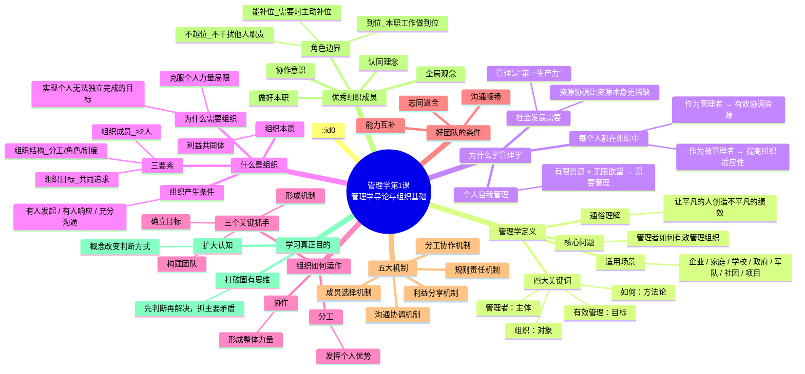
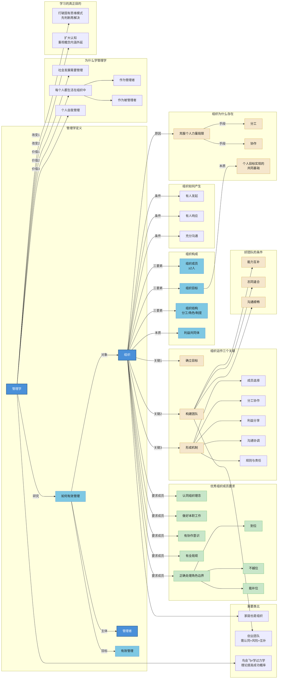
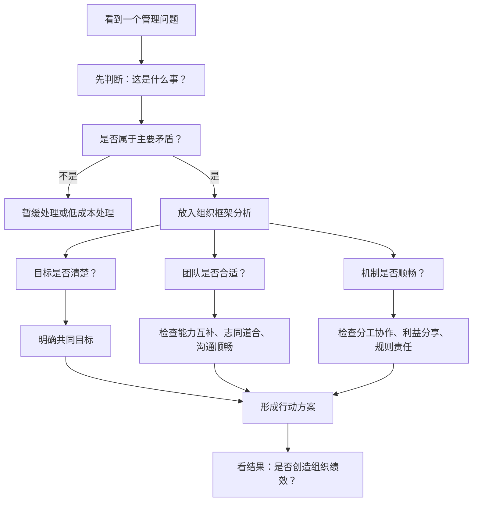

# C001 第 1 课：管理学导论与组织基础

## 一句话总结

管理学研究的是管理者如何有效管理组织，本质上是帮助一群普通人通过目标、团队和机制，创造出超越个人能力的组织绩效。

## 课程定位

本课是管理学前置课程的开篇。老师先说明为什么需要重新学习管理学：很多同学虽然参加过相关考试，但并没有真正系统理解管理学；如果没有管理学基础，后续学习经济、会计、组织、战略等课程时会缺少底层框架。

老师强调，这门前置课不是完整的 32 学时管理学课程，而是高度压缩后的复习和框架课。想系统学习，可以继续补充更完整的“管理概论”类课程。

## 管理学研究什么

管理学的核心问题可以概括为：

> 管理者如何有效地管理其组织。

这句话里有四个关键词：

| 关键词 | 含义 |
|---|---|
| 管理者 | 管理活动的主体 |
| 有效管理 | 管理活动追求的结果 |
| 组织 | 管理活动的对象 |
| 如何 | 管理学是一门方法论学科 |

更通俗地说，管理学研究的是：

> 如何让一群平凡的人创造出不平凡的组织绩效。

因此，管理学不只适用于企业，也适用于家庭、学校、政府、军队、社团、项目团队等各种组织。

## 为什么要学习管理学

### 1. 社会发展需要管理

社会中很多问题并不是资源完全不足，而是资源没有被有效协调和利用。老师提到，在中国当前的发展阶段，资金、人才、技术等资源越来越多，真正稀缺的是把这些资源有效组织起来的能力。

因此，管理在当代中国越来越像“第一生产力”。制度建设、治理能力现代化、企业成长、科研转化、项目推进，都离不开管理。

### 2. 每个人都生活在组织中

人几乎无法脱离组织而生活。家庭、学校、公司、医院、政府、社群、微信群，都是不同形式的组织。

每个人不是管理别人，就是被别人管理。学习管理学至少有两方面价值：

- 作为被管理者，可以理解组织目标、制度和管理者行为，提高组织适应性。
- 作为管理者，可以更有效地协调人和资源，带领团队创造绩效。

### 3. 管理学有助于个人自我管理

管理学不仅是组织管理，也能帮助个人处理“有限资源”和“无限欲望”的矛盾。

个人的人生也需要目标、资源配置、时间管理、健康管理和行动机制。学好管理学，可以提高个人做事效能，让人生过得更有意义、更有节奏。

## 学习的真正目的

老师提醒，学习不是为了“听过”，而是为了改变自己、提升自己。

学习管理学主要改变两件事：

### 1. 打破固有思维模式

没有学过管理学时，遇到问题往往马上想“怎么解决”。学过管理学后，会先退一步问：

- 这是一件什么事？
- 这个问题要不要解决？
- 它是不是主要矛盾？
- 什么时候解决、由谁解决、用什么方式解决？

管理不是见到问题就解决所有问题。有效管理要抓主要矛盾和主要问题，对很多非关键问题可以暂时容忍。

### 2. 扩大认知

概念会改变人的判断方式。比如，会计中“资产”和“负债”的概念会改变我们看待设备的方式：

- 正在创造价值的设备，才是真正的资产。
- 闲置不用、占用资金的设备，可能实际上是负担。

学管理学要重视概念，尤其要理解概念的内涵和外延。概念理解深了，面对同样的问题就会有更多视角和更好的行动选择。

## 什么是组织

组织不是简单的一群人。组织至少包含三个要素：

| 要素 | 说明 |
|---|---|
| 组织成员 | 两个或两个以上的人 |
| 组织目标 | 大家共同追求的目标 |
| 组织结构 | 分工、角色、规则、制度等系统化安排 |

因此，一群人在公交站等车，通常只是群体，不一定是组织。只有当这群人有共同目标、角色分工和规则安排时，才构成组织。

家庭也是组织，因为家庭中有成员、有共同目标，也有很多没有写下来但大家默认遵守的规则和角色分工。

## 为什么需要组织

组织存在的根本原因是：

> 克服个人力量的局限，实现靠个人力量无法实现或难以有效实现的目标。

如果一个人可以独立完成某件事，就没有必要为它建立组织。组织不是人越多越好，错误地组建组织反而可能造成低效和内耗。

组织目标的本质是：

> 实现组织中每个人个人目标的共同基础。

人加入组织，不是抽象地为了组织目标，而是因为组织目标实现后，个人目标也有机会实现。因此，个人想实现自己的目标，就必须为组织目标做贡献。

## 组织如何发挥作用

组织通过“分工与协作”来发挥超越个人的力量。

### 分工

分工让不同人的优势得到发挥。每个人负责自己擅长或应该承担的部分。

### 协作

协作让分散的个人力量形成整体力量。只分工、不协作，组织仍然是一盘散沙。

老师特别强调，很多组织的问题不是没有分工，而是缺少跨部门、跨角色的协作。

## 好团队的条件

不是任何人凑在一起都能形成有效组织。一个有效团队至少需要：

| 条件 | 含义 |
|---|---|
| 能力互补 | 你会的我不会，我会的你不会，组合起来更完整 |
| 志同道合 | 对目标、方向、价值有共同认可 |
| 沟通顺畅 | 能通过沟通判断是否合适，并持续协调行动 |

老师用婚姻和创业举例说明：只相似不一定适合长期合作，真正有效的组织需要互补。喜欢相似的人可以做朋友，但共同生活、共同创业更需要能力和角色上的互补。

## 组织运作的三个关键

组织管理中最重要的三件事：

1. 确立目标
2. 构建团队
3. 形成机制

机制包括：

- 成员选择机制
- 分工协作机制
- 利益分享机制
- 沟通协调机制
- 规则和责任机制

只要目标、团队、机制这三件事抓住了，不同类型组织的管理就有了基本抓手。

## 组织如何产生

组织产生通常需要三个条件：

| 条件 | 说明 |
|---|---|
| 有人发起 | 有人提出目标和方向 |
| 有人响应 | 有人愿意加入、贡献和合作 |
| 充分沟通 | 通过沟通形成共同目标、团队和规则 |

老师引用巴纳德关于组织形成的观点：组织需要相互交流的人、做出贡献的意愿和共同目标。这些条件既是组织最初成立的必要条件，也是充分条件。

## 组织的本质

组织本质上是一个利益共同体。

每个人加入组织，是希望通过组织实现自己的目标。但个人目标必须通过全体努力、在组织目标实现的基础上才能实现。

因此，组织成员不能只关心自己的岗位和局部利益，还要关心组织整体的发展。

## 成为优秀组织成员的要求

### 1. 认同组织理念

作为组织成员，需要认同组织的理念和基本规范。只想享受组织利益但不认同组织规则，不是真正合格的组织成员。

### 2. 做好本职工作

组织需要成员做出贡献，而贡献最终要看结果。不能只对“我做了”负责，还要对“做成了什么结果”负责。

责任包含两层含义：

- 应尽的义务
- 没有做到时愿意承担相应后果

### 3. 有协作意识

组织依靠分工协作运行，所以只做好自己的工作还不够，还要主动沟通、配合他人，从组织整体角度考虑问题。

### 4. 有全局观

优秀成员不是只从岗位说明书出发，而是从组织目标出发，理解自己的工作为什么存在、对整体有什么贡献。

### 5. 正确处理角色边界

老师给出三句话：

- 本职工作做到位
- 他人工作不越位
- 需要时主动补位

这三句话很好地概括了组织成员的角色意识：到位、不越位、能补位。

## 重要案例与类比

### 家庭是组织

家庭有成员、目标和规则，因此管理学也适用于家庭管理。家庭中的很多问题，本质上也是目标、分工、沟通和机制问题。

### 创业团队

创业团队不能只找“被梦想打动”的人，也不能只找追求短期回报的人。真正适合早期创业的人，需要认同理念、愿意承担风险，并且能力互补。

### 鸟会飞与学习力学

有人没有学过管理也能创业成功，就像鸟没有学过力学也会飞。但多数人没有这种天赋，学习理论可以帮助普通人掌握规律，提高成功概率。

## 易混点

| 易混点 | 正确认识 |
|---|---|
| 一群人就是组织 | 错。还要有共同目标和系统化结构 |
| 组织目标是每个人天然想要的 | 不完全是。组织目标是个人目标实现的共同基础 |
| 分工越细越好 | 不一定。没有协作的分工会造成割裂 |
| 管理就是解决问题 | 不完全是。管理要先判断问题是否重要 |
| 只做好本职工作就是优秀员工 | 不够。还要有协作意识和全局观 |
| 学管理只对管理者有用 | 错。被管理者、组织成员和个人自我管理都需要管理学 |

## 可直接记忆的核心句

- 管理学研究管理者如何有效管理其组织。
- 管理学是让一群平凡的人创造不平凡组织绩效的方法论。
- 组织由成员、目标和结构构成。
- 组织是为了克服个人力量局限而产生的。
- 组织目标是个人目标实现的共同基础。
- 组织通过分工与协作发挥功能。
- 管理的关键是目标、团队、机制。
- 优秀组织成员要做到：到位、不越位、能补位。

## 记忆导图

## 知识图谱

### 图谱节点表

| 一级节点 | 二级节点 | 关键含义 | 复习提示 |
|---|---|---|---|
| 管理学 | 管理者 | 管理活动的主体 | 谁在管理，是理解管理问题的起点 |
| 管理学 | 有效管理 | 管理活动追求的结果 | 管理不是做了什么，而是是否产生绩效 |
| 管理学 | 组织 | 管理活动的对象 | 企业只是组织的一种，不要把管理学等同于企业管理 |
| 管理学 | 方法论 | 回答“如何做” | 学管理学的重点是获得分析和行动框架 |
| 组织 | 组织成员 | 两个或两个以上的人 | 一个人不是组织，自动装置也不是组织 |
| 组织 | 组织目标 | 成员共同追求的目标 | 共同目标是个人目标实现的共同基础 |
| 组织 | 组织结构 | 分工、角色、规则、制度 | 没有结构的一群人只是群体 |
| 组织 | 利益共同体 | 成员通过组织实现个人目标 | 成员关心组织，是因为利益在组织中 |
| 组织功能 | 分工 | 发挥个人优势 | 没有互补，分工价值会下降 |
| 组织功能 | 协作 | 形成整体力量 | 只分工不协作，组织会割裂 |
| 团队 | 能力互补 | 不同成员补足彼此短板 | 创业、家庭、项目团队都适用 |
| 团队 | 志同道合 | 对目标和价值有共同认可 | 只相似不等于适合合作 |
| 团队 | 沟通顺畅 | 通过沟通形成理解和协调 | 沟通不足会导致组织分裂 |
| 机制 | 成员选择 | 让合适的人进入组织 | 双向选择优于简单行政安排 |
| 机制 | 分工协作 | 明确职责并保证配合 | 既要有边界，也要能补位 |
| 机制 | 利益分享 | 让贡献与回报匹配 | 利益机制影响成员持续投入 |
| 组织成员 | 到位 | 做好本职工作 | 该做的必须做好 |
| 组织成员 | 不越位 | 不干扰他人职责 | 避免角色混乱 |
| 组织成员 | 能补位 | 必要时主动补上空缺 | 体现协作意识和全局观 |

### 核心关系三元组

| 主体 | 关系 | 客体 |
|---|---|---|
| 管理学 | 研究 | 管理者如何有效管理组织 |
| 管理学 | 本质上属于 | 方法论学科 |
| 组织 | 由...构成 | 组织成员、组织目标、组织结构 |
| 组织 | 本质是 | 利益共同体 |
| 组织 | 产生于 | 个人力量局限 |
| 组织 | 用于实现 | 个人无法或难以有效实现的目标 |
| 组织目标 | 是 | 个人目标实现的共同基础 |
| 组织功能 | 依靠 | 分工与协作 |
| 分工 | 用于 | 发挥个人优势 |
| 协作 | 用于 | 形成群体力量 |
| 好团队 | 需要 | 能力互补、志同道合、沟通顺畅 |
| 组织运作 | 抓手是 | 目标、团队、机制 |
| 机制 | 包括 | 成员选择、分工协作、利益分享、沟通协调、规则责任 |
| 组织产生 | 需要 | 有人发起、有人响应、充分沟通 |
| 组织成员 | 应当 | 认同理念、承担责任、主动协作、具备全局观 |
| 角色边界 | 要做到 | 到位、不越位、能补位 |

### 学习路径图

### 应用检查清单

当你分析一个家庭、团队、公司、项目或社群时，可以按下面顺序提问：

1. 这个组织的共同目标是什么？
2. 成员的个人目标能否通过共同目标实现？
3. 组织成员是否能力互补？
4. 成员是否志同道合，是否认可基本规则？
5. 沟通是否顺畅，冲突能否被讨论？
6. 分工是否清楚，协作是否充分？
7. 利益分享是否合理，贡献和回报是否匹配？
8. 成员是否做到本职工作到位、他人工作不越位、需要时能补位？
9. 当前最大瓶颈是目标问题、团队问题，还是机制问题？
10. 如果只能改一件事，哪一件最能提升组织绩效？

## 复习题

1. 管理学研究的核心问题是什么？
2. 为什么说管理学是一门方法论学科？
3. 为什么管理学不只适用于企业？
4. 组织的三个构成要素是什么？
5. 一群人在公交站等车为什么通常不算组织？
6. 家庭为什么可以被看作一个组织？
7. 组织存在的根本原因是什么？
8. 如何理解“组织目标是个人目标实现的共同基础”？
9. 分工和协作分别解决什么问题？
10. 为什么只注重分工而缺少协作会导致组织低效？
11. 有效团队为什么既需要能力互补，也需要志同道合？
12. 组织运作最重要的三个关键词是什么？
13. 组织产生需要哪些条件？
14. 为什么说组织本质上是利益共同体？
15. 优秀组织成员应该如何处理“到位、越位、补位”的关系？

## 行动清单

- 回顾自己所在的一个组织，写出它的成员、目标和结构。
- 判断这个组织当前最大问题是目标不清、团队不合适，还是机制不顺。
- 找一个实际案例，分析其中的分工和协作是否匹配。
- 用“到位、不越位、能补位”检查自己在团队中的行为。
- 学习后续课程时，持续用“目标、团队、机制”这三个关键词做笔记。

## 待进一步追问

- 老师提到“企业生命周期理论”，后续可以补充其主要阶段和各阶段管理重点。
- “管理是第一生产力”这个判断，可以结合中国企业管理实践进一步展开。
- “组织利益优先”有前提边界，后续可以讨论组织利益和个人利益冲突时如何处理。
