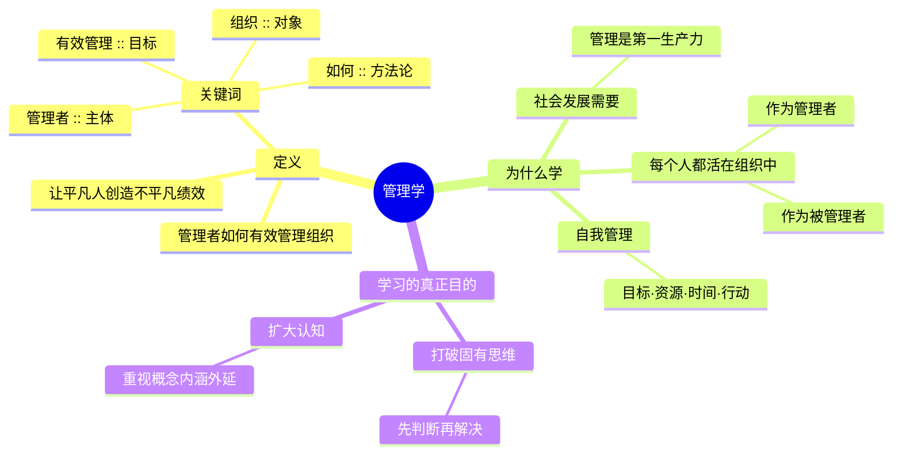
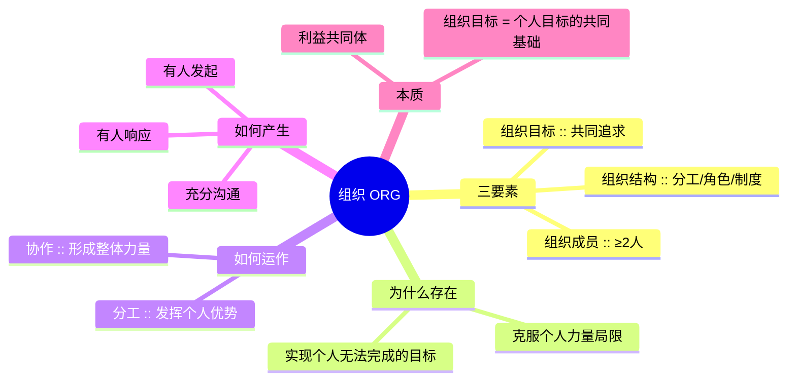
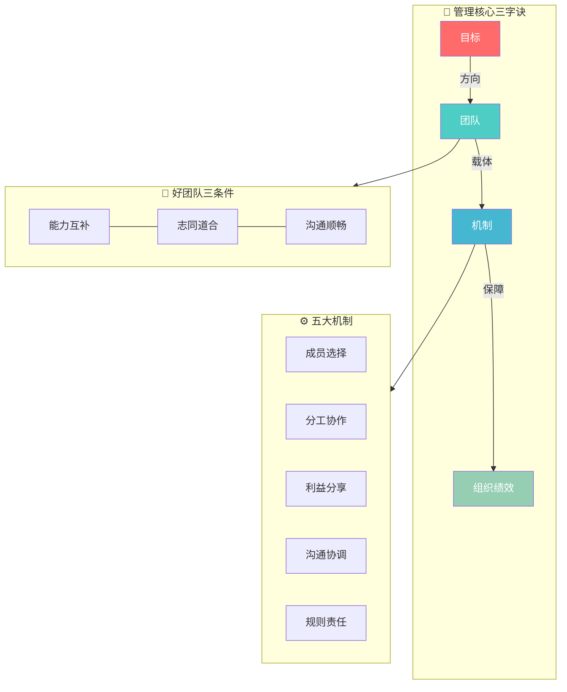
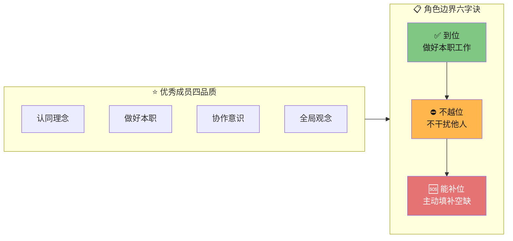
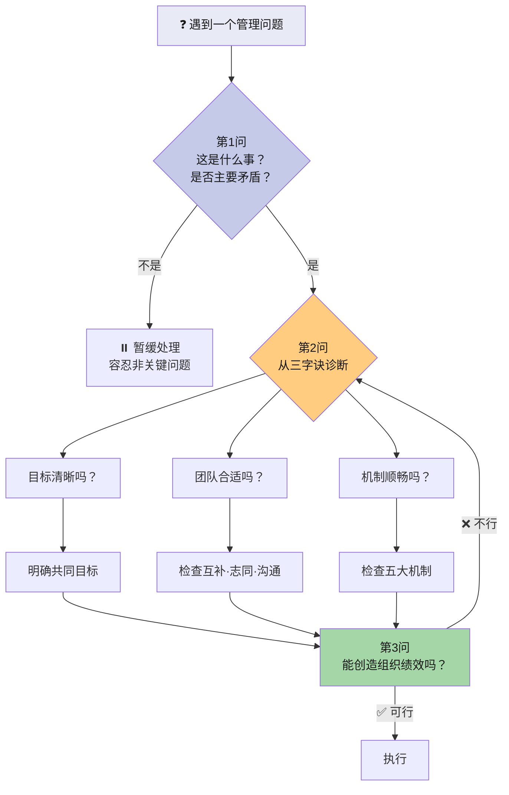
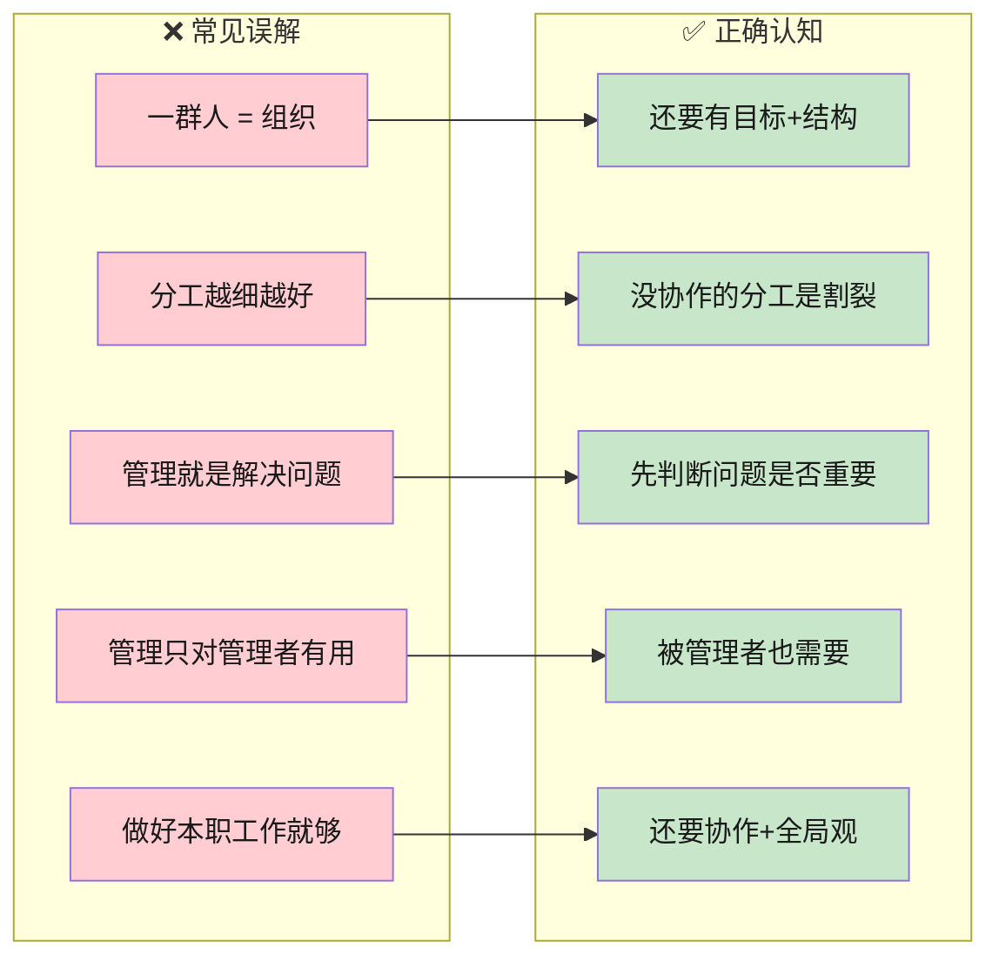
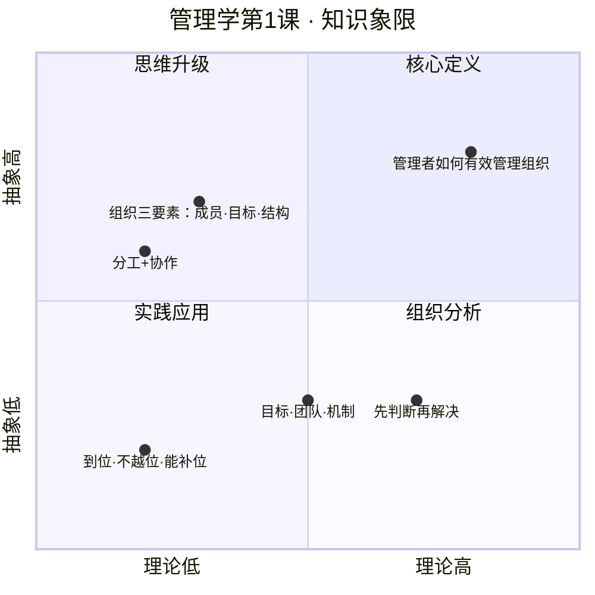

# C001 管理学第1课 · 记忆图

> 一张图记住管理学第1课全部核心内容

---

## 一、一图打尽 · 管理学核心框架

---

## 二、组织 · 一张图理解

---

## 三、管理三字诀 · 三个核心记忆锚

---

## 四、优秀成员 · 六个字 + 三条线

---

## 五、管理思维升级 · 遇到问题先问这3步

---

## 六、易混点 · 一表清

---

## 七、快速记忆卡 · 10秒回顾

---

## 八、记忆口诀

| 记忆点 | 口诀 | 解释 |
|---|---|---|
| 管理学定义 | **管有组如** | 管理者·有效管理·组织·如何（方法论） |
| 为什么要学 | **社会·个人·自我** | 社会发展·个人在组织中·自我管理 |
| 学习目的 | **破思维·扩认知** | 打破固有思维·扩大概念认知 |
| 组织三要素 | **成目结** | 成员·目标·结构 |
| 组织运作 | **目团机** | 目标·团队·机制 |
| 好团队 | **能志通** | 能力互补·志同道合·沟通顺畅 |
| 五大机制 | **成分工利规** | 成员选择·分工协作·利益分享·沟通协调·规则责任 |
| 优秀成员 | **认做协全** | 认同理念·做好本职·协作意识·全局观念 |
| 角色边界 | **到不补** | 到位·不越位·能补位 |
| 组织本质 | **利共体** | 利益共同体 |

---

## 九、故事记忆法 · 用一分钟记住整课

> **想象一家创业公司起步的场景：**
>
> 1. 三个人（**成员**）发现市场机会，约定一起干（**目标**），分工谁做产品、谁做销售、谁做运营（**结构**）→ **组织形成**
> 2. 他们不是超人，但组合起来能力互补（**克服个人局限**）
> 3. 各干各的不行，需要每天同步（**分工+协作**）
> 4. 走着走着发现目标不够清晰 → 重新对齐（**目标**）
> 5. 有人不合适 → 换人（**团队**）
> 6. 利益怎么分、谁说了算 → 定规则（**机制**）
> 7. 每个人做好自己的事（**到位**），不抢别人的活（**不越位**），同事请假主动顶（**能补位**）
>
> **合起来，就是管理学第一课的全部内容。**
