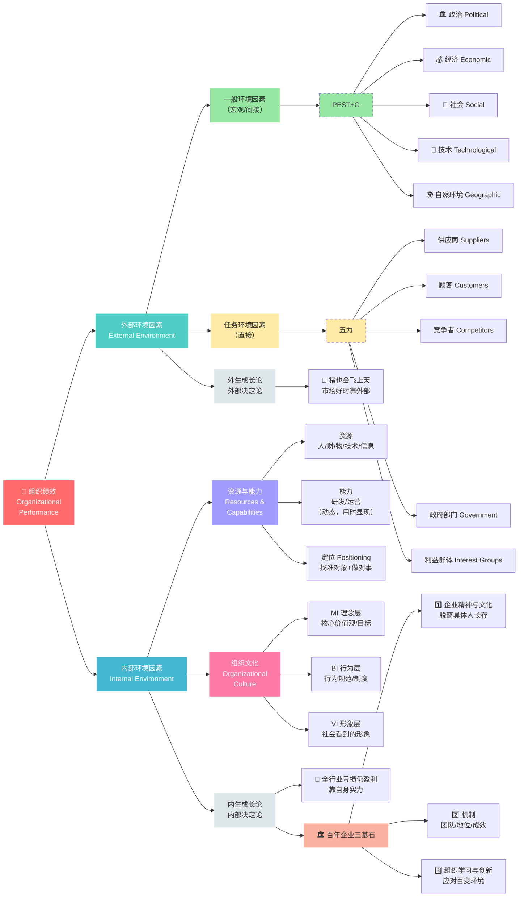

# C001 第 2 课：管理环境与组织绩效

## 一句话总结

一个组织的绩效同时受外部环境因素（宏观环境、任务环境）和内部环境因素（资源能力、组织文化）的共同影响，短期看外部，长期看内部——打铁还需自身硬。

## 课程定位

本课承接第 1 课"什么是组织、什么是管理"，进一步回答：一个组织做得好或不好，应该从哪些方面去分析？老师构建了一个"管理环境因素分析框架"，这是后续战略管理、SWOT 分析等方法论的底层模型。

## 管理环境因素的分类

影响组织绩效的各种力量和条件因素的总和，称为**管理环境**（管理环境因素）。

按照两个维度进行分类：

| 维度 | 分类 |
|---|---|
| 存在于组织内部还是外部 | 外部环境因素 / 内部环境因素 |
| 对绩效的影响是直接还是间接 | 一般环境因素 / 任务环境因素 / 组织文化因素 / 经营条件因素 |

最终形成四大类因素：

| 四大类 | 位置 | 影响方式 | 具体内容 |
|---|---|---|---|
| 一般环境因素（宏观环境） | 组织外部 | 间接影响 | 政治、经济、社会、技术、自然环境（PEST + G） |
| 任务环境因素 | 组织外部 | 直接影响 | 供应商、顾客、同行/竞争者、政府部门、利益群体 |
| 组织文化因素 | 组织内部 | 潜移默化 | 核心价值观、目标、经营理念、行为规范、规章制度 |
| 经营条件因素 | 组织内部 | 直接影响 | 资源与能力 |

## 外部环境因素详解

### 一般环境因素（PEST 分析）

- **政治因素**：政党的路线方针政策、政治力量对比 → 影响政府对组织的态度 + 政局稳定性
- **经济因素**：经济制度、经济发展水平、经济结构、物质资源状况 → 影响资源获取方式和价格 + 市场需求结构和消费水平
- **社会因素**：风俗习惯、道德法律、人口状况、文化教育水平 → 影响劳动力结构和需求结构
- **技术因素**：科技进步可能彻底改变经营方式和管理方式，甚至淘汰整个行业/岗位

### 任务环境因素

- **供应商**：主要供应者出现问题，组织运作马上减缓或终止（如芯片断供）
- **顾客/服务对象**：需求经常变化，组织随顾客增减而兴衰
- **同行/竞争者**：包括跨界竞争者，争夺资源和服务对象两头
- **政府部门**：出台政策，决定你可以做什么、不可以做什么
- **利益代表者**：工会、消费者协会、环保组织等

## 内部环境因素详解

### 资源与能力

- **资源**：人、财、物、技术、信息等，放在那里可以交易
- **能力**：动态的，只有使用时才能看出来（如研发能力、奔跑能力）
- 任何组织的资源和能力都是**有限的**
- 同样的资源和能力对不同的顾客，价值不同 → **找准对象、做对事**才能发挥最大价值
- 这就是**定位**的重要性：明确目标顾客 + 明确为顾客提供的价值

### 组织文化

- 以企业价值观为核心，包含三个层次：
  - **MI（理念）**：怎么想
  - **BI（行为）**：怎么做
  - **VI（形象）**：社会看到的形象
- 组织文化构建了"可以做什么、不可以做什么、应该怎么做"的规范
- 每个人进入组织首先要学习和了解组织文化
- 组织不仅是工作场所，还是**塑造人的场所**——管理者承担"育人"职责

> 组织文化尽管看不见摸不着，但它到处蔓延，并影响着组织中的一切行为。

## 外生成长论 vs 内生成长论

| 理论 | 核心观点 |
|---|---|
| 外生成长论 | 企业成长主要取决于外部因素（政府政策、市场机遇等） |
| 内生成长论 | 企业成长主要取决于内部因素，分为资源论、能力论、知识论 |

真实情况是**两者都有影响**。老师用生动例子说明：

- 市场好时"猪也会飞上天"——主要靠外部环境
- 全行业亏损时你还能盈利——靠自身实力
- 资源垄断型企业——靠政策和资源

**长期来看，内部因素才是决定性的**。要做百年企业，必须打造三样东西：
1. 企业精神和文化（生生不息，脱离具体的人长存）
2. 机制（保证团队构建、地位分配、成效发挥）
3. 组织学习和创新能力（应对百变环境）

> 外部环境大家都一样，为什么在同样的环境当中有的人做得好有的人做得不好？要改进，理念就是：**责任在我，从改变自己出发**。

## 重要提醒

判断一个因素是不是"管理环境因素"、是一般因素还是任务因素，取决于**组织目标的定位**。比如利率上扬，对银行是有利因素，对贷款企业是不利因素，对不用钱的组织可能根本不是影响因素。

## 核心框架

把这张图记住，就可以结构化地分析任何组织的绩效问题：

```
组织绩效 ← 外部环境（一般/任务） + 内部环境（文化/资源能力）
```

分析时可以面面俱到，但着手改变时只能把原因归结到自身。

---

## 知识图谱



### 分析口诀

| 维度 | 口诀 |
|---|---|
| 分析框架 | 外部看 PEST + 五力，内部看资源 + 文化 |
| 改进理念 | **责任在我** —— 分析时面面俱到，改变时从自己出发 |
| 长期 vs 短期 | 短期看外部，长期看内部 —— 打铁还需自身硬 |
| 因素判断 | 是利是弊、是一般还是任务，取决于**组织目标定位** |

---

## 核心概念

| 概念 | 定义 | 关键要点 |
|---|---|---|
| 管理环境 | 存在于组织内部和外部、影响组织绩效的各种力量和条件因素的总和 | 分为外部环境因素和内部环境因素 |
| 一般环境因素（宏观环境） | 存在于组织外部、对任何组织都有间接影响的因素 | PEST+G：政治、经济、社会、技术、自然环境 |
| 任务环境因素 | 存在于组织外部、对组织有直接影响的因素 | 供应商、顾客、竞争者、政府部门、利益群体 |
| 组织文化 | 以企业价值观为核心，包含 MI（理念）、BI（行为）、VI（形象）三个层次 | 构建了"可以做什么、不可以做什么、应该怎么做"的规范 |
| 经营条件因素 | 组织内部直接影响绩效的因素 | 资源（人财物技术信息）+ 能力（动态，用时才显现） |
| 定位 | 明确目标顾客 + 明确为顾客提供的价值 | 让有限资源和能力发挥最大价值 |
| 外生成长论 | 企业成长主要取决于外部因素（政策、市场机遇等） | 市场好时"猪也会飞上天" |
| 内生成长论 | 企业成长主要取决于内部因素（资源论、能力论、知识论） | 长期来看内部因素才是决定性的 |

## 老师重点强调

1. **责任在我是管理的核心思维**：外部环境大家都一样，为什么有人做得好有人做得不好？分析时可以面面俱到，但着手改变时只能从自己出发。
2. **短期看外部，长期看内部**：打铁还需自身硬。做百年企业必须打造三样东西——企业精神与文化、机制、组织学习与创新能力。
3. **因素判断取决于组织目标定位**：同一个因素（如利率上扬），对银行是有利因素，对贷款企业是不利因素，对不用钱的组织可能根本不是影响因素。
4. **组织文化潜移默化但影响一切**：组织不仅是工作场所，还是塑造人的场所。管理者承担"育人"职责。
5. **管理既要讲效率也要讲效益**：效率是投入产出比（怎么做），效益是产出满足需求的程度（做什么）。做对的事比做好事更重要。

## 关键例子

| 例子 | 说明 |
|---|---|
| 猪也会飞上天 | 市场好时，企业主要靠外部环境就能成功 |
| 全行业亏损仍盈利 | 全行业亏损时你还能盈利，说明靠的是自身实力 |
| 芯片断供 | 主要供应商出问题，组织运作马上减缓或终止——任务环境因素的直接影响 |
| 老龄化产业 | 社会因素（人口结构变化）→ 劳动力减少 + 老年消费需求爆发 → 养老产业空间巨大 |
| 利率上扬 | 对银行是有利因素，对贷款企业是不利因素——同一因素因组织目标定位不同而性质不同 |
| 加薪的三种方式 | 同是加薪10%：全员同比、按绩效分等、人均等额——不同方法适用于不同场景，管理要研究哪种最有效 |
| 创业者选择组织 | 加入一个组织首先要了解其文化，因为同样的行为在不同文化中被评价完全不同 |

## 易混/易错点

| 易混点 | 正确认识 |
|---|---|
| 管理环境因素 = 所有外部因素 | 错。也包括内部因素（组织文化、资源能力） |
| 一般环境因素和任务环境因素的区别 | 一般环境因素对所有组织都有间接影响；任务环境因素对特定组织有直接影响 |
| 效率 = 效益 | 效率是投入产出比（怎么做），效益是目标达成度（做什么）。两者都要，但效益优先 |
| 外生成长论和内生成长论是对立的 | 不是对立，而是各有道理。短期看外部，长期看内部。两者都有影响 |
| 组织文化只是"软的东西" | 错。它虽然看不见摸不着，但影响组织中的一切行为 |
| 资源 = 能力 | 资源是静态的（可交易），能力是动态的（用时才显现） |
| 分析问题和解决问题是一回事 | 分析时可以面面俱到（内外部都看），但着手改变时只能归结到自身 |

## 我的待解决问题

- 如何在实际工作中量化"组织文化"对绩效的影响？
- 百年企业的"机制"具体包括哪些？如何进行机制设计？
- PEST分析在具体行业中的应用案例，后续可以在战略管理中深入学习。
- 资源论、能力论、知识论的具体区别和代表人物是哪些？

## 复习题

1. 管理环境的四大类因素分别是什么？
2. PEST分析中每个字母代表什么？
3. 一般环境因素和任务环境因素的根本区别是什么？
4. 为什么说"同样的资源和能力对不同的顾客，价值不同"？
5. 组织文化的三个层次（MI/BI/VI）分别是什么？
6. 外生成长论和内生成长论的核心观点分别是什么？
7. 为什么说"长期来看，内部因素才是决定性的"？
8. 做百年企业需要打造哪三样东西？
9. 效率和效益的区别是什么？哪个更重要？
10. 为什么判断一个因素是不是管理环境因素，取决于组织目标的定位？

## 行动清单

- 选择一个你熟悉的组织，用 PEST + 五力框架分析其外部环境。
- 分析该组织的内部资源和能力，判断其核心竞争力。
- 观察该组织的文化（MI/BI/VI），思考文化如何影响员工行为。
- 用"责任在我"的思维复盘最近一次工作中的问题，找出自己可以改进的地方。
- 关注一个行业的宏观环境变化（如技术趋势、人口结构），预测其对行业的影响。
