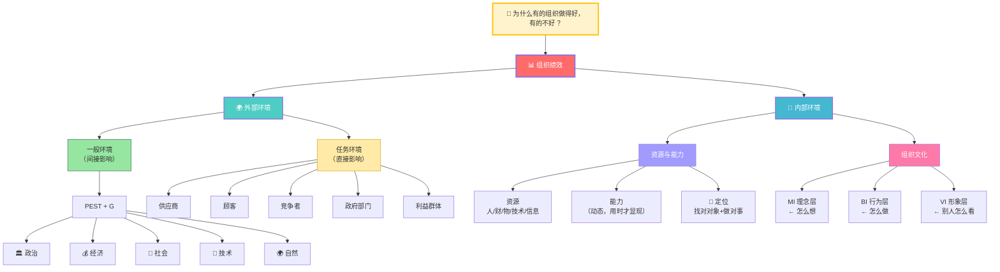
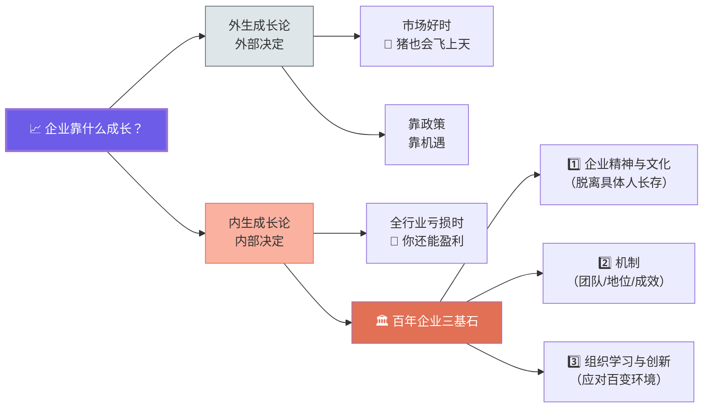
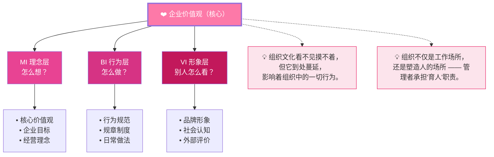
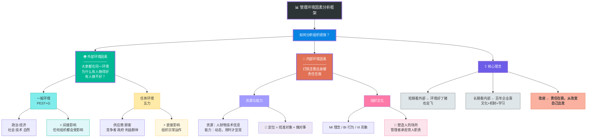

# 管理学第2课 — 记忆图

> 专为快速回忆设计的四层结构图：**一个框架 → 两大维度 → 四类因素 → 核心理念**

---

## 🧭 总览：管理环境因素分析框架



---

## 🧠 记忆口诀

```
分析框架 → 外部看 PEST+G + 五力，内部看资源+文化
             （一般环境间接影响，任务环境直接影响）

短期 vs 长期 → 短期看外部，长期看内部 —— 打铁还需自身硬

改进理念   → 责任在我 —— 分析时面面俱到，改变时从自己出发

判断依据   → 是利是弊？取决于组织目标定位
```

---

## 📈 外生 vs 内生成长论



---

## 🔄 组织文化三层结构



---

## 🎯 一图记全部：管理环境分析框架（全景图）



---

## ⚡ 速查卡片

| 你要分析什么？ | 看哪类因素 | 具体看什么 |
|---|---|---|
| 宏观趋势、行业大环境 | 一般环境（外部/间接） | PEST+G |
| 日常经营中谁在影响你 | 任务环境（外部/直接） | 供应商/顾客/竞争者/政府/利益群体 |
| 能不能干成事 | 经营条件（内部/直接） | 资源（有什么）+ 能力（会什么）+ 定位（做什么） |
| 团队为什么这么做 | 组织文化（内部/潜移默化） | MI 理念 → BI 行为 → VI 形象 |

> 🎓 **老师金句记忆**：
> - "分析时面面俱到，改变时从自己出发"
> - "短期看外部，长期看内部"
> - "猪也会飞上天，但要做百年企业还得靠自身硬"
> - "组织不仅是工作场所，更是塑造人的场所"
