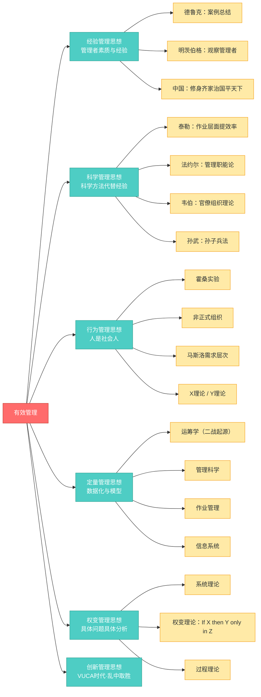

# C001 第 3 课：管理思想的发展

## 一句话总结

西方管理思想按"要素论"演进：从经验→科学方法→人的行为→数量化→环境权变，每一种思想关注不同要素，各有适用场景，真正的运用是结合自身实际来判断采用什么方法。

## 课程定位

本课承接前两课"什么是管理"，回答"怎么样有效管理"。系统梳理了西方管理思想的发展脉络。老师特别指出：中国管理思想侧重管理者自身修养（修身养性），西方管理思想侧重管理工具和方法（要素论），两者研究方式不同。

## 管理思想演变的总体脉络

```
工业革命 → 经验管理思想 → 科学管理思想 → 行为管理思想 → 定量管理思想 → 权变管理思想 → 创新管理思想（当代）
```

## 五大管理思想详解

### 1. 经验管理思想

**核心观点**：管理的有效性取决于管理者个人的素质和经验。

- **代表**：德鲁克（通过案例总结提炼）、明茨伯格（通过观察管理者实际做什么）
- **特点**：管理是一种实践，重在"行"而不在"知"；学校培养不出合格的管理者
- **中国传统的体现**：修身→齐家→治国→平天下，强调管理者自身修炼
- **局限**：只能师父带徒弟，难以传授和推广

### 2. 科学管理思想（1911 年起）

**核心观点**：不能仅依赖经验，要用科学方法来管理。

| 代表人物 | 研究重点 | 主要贡献 |
|---|---|---|
| 泰勒（Taylor） | 作业层面：如何提高工作效率 | 科学管理原理，用科学方法代替经验 |
| 法约尔（Fayol） | 管理层面：管理者应该干什么 | 管理职能论（计划、组织、指挥、协调、控制），14 条管理原则 |
| 韦伯（Weber） | 组织层面：什么组织最高效 | 官僚组织理论，6 条基本原则（现代公务员制度的基础） |

**中国对应**：孙武《孙子兵法》——非常严谨严密的方法论

**共同特点**：
- 研究重点都是**提高效率**
- 主张用**科学方法代替经验**
- 使管理学成为一门**可以学习、传播、教学**的学科
- 管理从此走向**专业化和职业化**

### 3. 行为管理思想

**核心观点**：人不仅是"经济人"，还是"社会人"，劳动生产率受社会、心理和群体因素影响。

**起源**：霍桑实验（Hawthorne Experiment）
- 最初目的：找最佳照明亮度与生产效率的关系
- 意外发现：无论灯光亮暗，效率变化不大——因为"你们都在看着我"，员工通过积极性调动克服了恶劣环境
- 启示：正式组织之外还存在**非正式组织**，会产生强大的群体压力

**发展**：
- 马斯洛需求层次理论
- X 理论和 Y 理论
- 从人的需求、动机、相互关系和社会环境等方面研究管理

**特点**：
- 改变了管理的思考方法
- 把人看作宝贵的资源
- 强调处理好人与人之间的关系，协调人的目标，激发人的主动性和积极性

### 4. 定量管理思想

**核心观点**：管理最重要的在于"度"的把握，要把握正确的度，数量化必不可少。

**起源**：二战中的运筹学应用（诺曼底登陆的物资调度、雷达配置等），战后这批科学家转入企业

**应用领域**：
- 管理科学（运筹学）：数学和统计学用于管理决策
- 作业管理：数据数字在企业中的运用
- 信息系统：信息技术在管理中的运用

**核心理念**：减少决策中个人艺术性成分，建立科学决策的数学模型，寻求最优答案。**Management by Data** 是主流方向。

### 5. 权变管理思想（20 世纪 70 年代起）

**核心观点**：世界上不存在普遍适用的最佳管理理论和方法。每一种管理理论都有其适用范围。

**公式表达**：
- 传统理论：If X then Y
- 权变理论：If X then Y **only in Z**（只有在 Z 条件下才成立）

**三大分支**：
- **系统理论**：从整体角度看各理论的相互关系
- **权变理论**：根据不同前提组合相应理论
- **过程理论**：按计划→组织→领导→控制的过程来整合

**本质**：**实事求是，具体问题具体分析**

## 如何运用这些管理思想

回到一个案例：A 经理关注人（行为管理思想），B 经理关注机制（科学管理思想），两人都成功了。

**原因**：A 适用行为管理思想 → 适合高科技/互联网企业（靠员工创造力）；B 适用科学管理思想 → 适合传统制造型企业（靠规则和流程）。关键是要**匹配**。

> 我们真正的运用，就是要了解人类所有的这些想法，然后结合我们自身的实际，来判断此时此刻采用什么样的方法才是合适的。

## 1980 年代之后的续写

如果继续续写管理思想演变：
- 9/11 → 环境走向"乌卡"（VUCA，易变/不确定/复杂/模糊）
- 需要研究**乱中取胜之道**
- 当前主流：**创新管理思想**

## 总结

管理思想经历了：经验→科学方法→人的行为→数量化→环境权变。各思想关注的重点分别是：**实践经验、科学方法的运用、人的重要性、数量化、管理环境的影晌**。从要素论角度看，哪个都对。现实中要把它们整合运用。

---

## 核心概念

| 概念 | 定义 | 代表人物/来源 |
|---|---|---|
| 经验管理思想 | 管理的有效性取决于管理者个人的素质和经验 | 德鲁克、明茨伯格；中国传统：修身→齐家→治国→平天下 |
| 科学管理思想 | 用科学方法代替经验来提高效率 | 泰勒（作业层面）、法约尔（管理职能）、韦伯（官僚组织）、孙武（兵法） |
| 行为管理思想 | 人不仅是"经济人"，还是"社会人"，受社会、心理和群体因素影响 | 霍桑实验 → 梅奥；马斯洛需求层次；X/Y 理论 |
| 定量管理思想 | 管理最重要的在于"度"的把握，数量化必不可少 | 二战运筹学 → 管理科学、作业管理、信息系统 |
| 权变管理思想 | 不存在普遍适用的最佳管理理论，每种理论都有其适用范围 | If X then Y only in Z；系统理论、权变理论、过程理论 |
| VUCA | 易变、不确定、复杂、模糊的环境特征 | 9/11 后时代特征 → 创新管理思想 |

## 老师重点强调

1. **中西管理思想的研究方式不同**：中国侧重管理者自身修养（修身养性），西方侧重管理工具和方法（要素论）。
2. **科学管理思想使管理学成为一门可以学习、传播、教学的学科**：管理从此走向专业化和职业化。
3. **霍桑实验的重大启示**：正式组织之外还存在非正式组织，会产生强大的群体压力，影响劳动生产率。
4. **Management by Data 是主流方向**：定量管理思想的核心是减少决策中的个人艺术性成分，用数据和模型寻求最优解。
5. **权变管理的本质就是"实事求是，具体问题具体分析"**：每一种管理理论都有其适用场景，关键在于匹配。
6. **A 经理和 B 经理都成功的案例**：A（行为管理）适合高科技/互联网企业，B（科学管理）适合传统制造型企业——关键看是否与组织场景匹配。

## 关键例子

| 例子 | 说明 |
|---|---|
| 霍桑实验 | 最初想找最佳照明亮度与生产效率的关系，结果发现无论灯光亮暗效率变化不大——因为"你们都在看着我"。揭示了非正式组织和社会心理因素的影响 |
| A 经理 vs B 经理 | A 关注人（行为管理），B 关注机制（科学管理），两人都成功——因为各自匹配了不同的组织类型 |
| 诺曼底登陆 | 二战中运筹学的经典应用——物资调度、雷达配置等，战后科学家转入企业，催生了定量管理思想 |
| 分工越细效率反而下降 | 科学管理认为分工提高效率，但过度分工会导致效率下降——权变思想的体现：If X then Y only in Z |
| 修身→齐家→治国→平天下 | 中国传统管理思想的典型脉络，强调管理者自身修炼 |

## 易混/易错点

| 易混点 | 正确认识 |
|---|---|
| 经验管理思想 = 过时了 | 错。经验管理思想至今仍然存在且有价值，只是不能仅依赖经验 |
| 科学管理 = 只要方法不要人 | 错。科学管理是强调用科学方法代替纯经验，但不否定人的作用 |
| 行为管理 = 只要人际关系不要制度 | 错。行为管理是补充了对人的关注，并不否定制度和规则 |
| 定量管理 = 只要数据不要判断 | 错。定量管理是辅助决策的工具，最终判断仍需要管理者的智慧 |
| 权变管理 = 没有原则、怎么做都行 | 错。权变是有前提条件的灵活运用，不是无原则的随意 |
| 五大思想是替代关系 | 错。它们是互补关系，各自关注不同要素，现实中要整合运用 |

## 知识图谱



## 我的待解决问题

- 五种管理思想在不同行业中的具体应用案例有哪些？
- 中国传统的管理思想（儒家、法家、道家、兵家）如何与西方管理思想融合？
- 创新管理思想的具体理论框架是什么？有哪些代表性学者？
- 在同一个组织中，如何判断应该侧重哪种管理思想？

## 复习题

1. 五大管理思想分别是什么？它们的核心观点各是什么？
2. 中国和西方管理思想的研究方式有什么不同？
3. 科学管理思想的三个代表人物分别从哪个层面研究管理？
4. 霍桑实验的意外发现是什么？它带来了什么启示？
5. 定量管理思想起源于什么？它的三大应用领域是什么？
6. 权变管理思想的公式表达是什么？
7. 为什么 A 经理（关注人）和 B 经理（关注机制）都成功了？
8. 1980 年代之后管理思想的发展方向是什么？
9. "乌卡"（VUCA）是什么意思？
10. 从要素论角度，五大管理思想为什么"哪个都对"？

## 行动清单

- 对比自己所在组织，判断当前更适用哪种管理思想。
- 查阅霍桑实验的详细过程，理解非正式组织对管理的影响。
- 找一个"管理失败"的案例，用权变思想分析：是不是方法用错了场景？
- 思考：在自己的工作中，哪些决策可以用数据来辅助，而不是仅凭经验？
