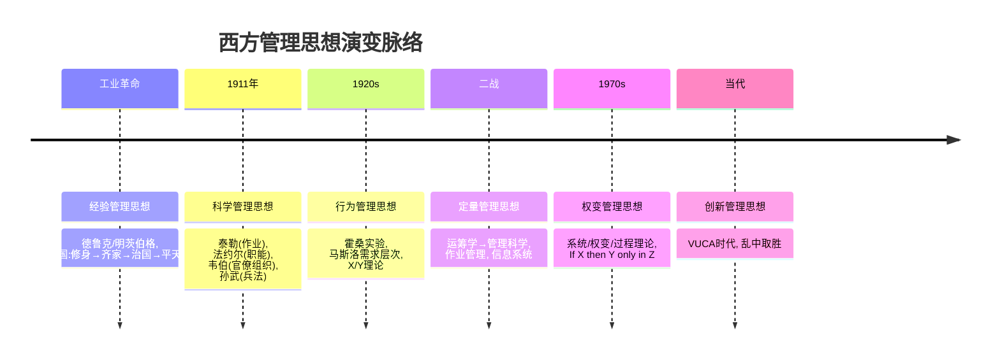
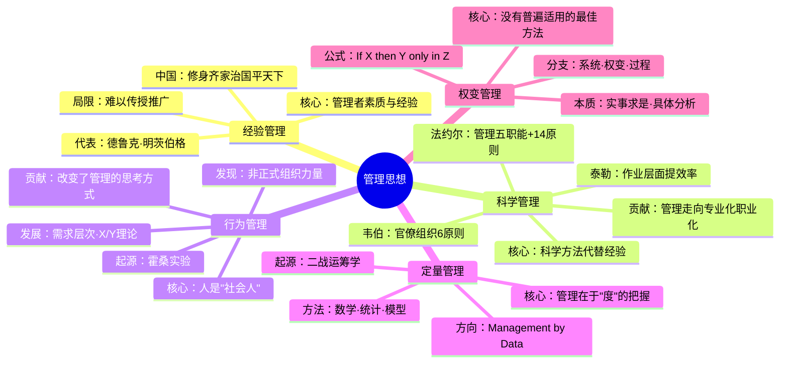
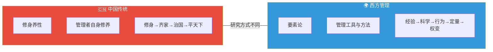
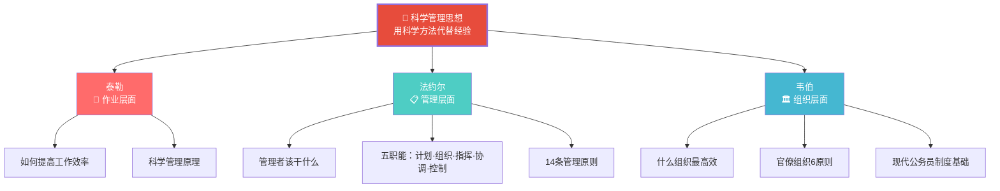
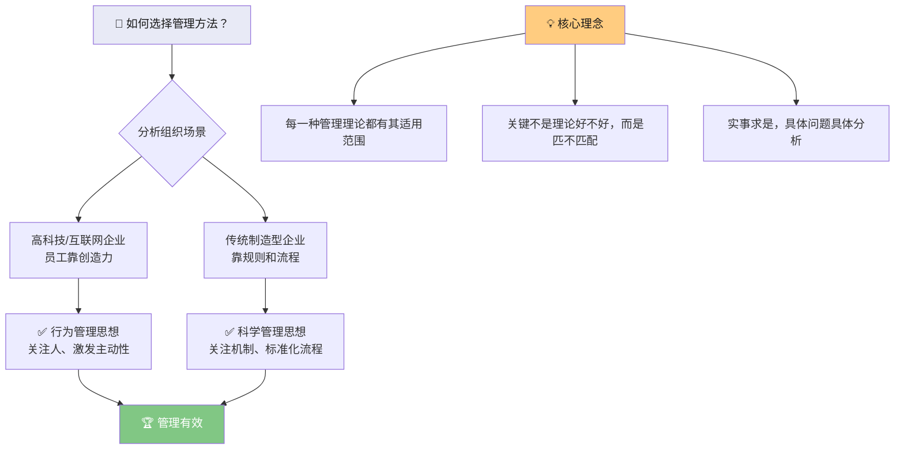
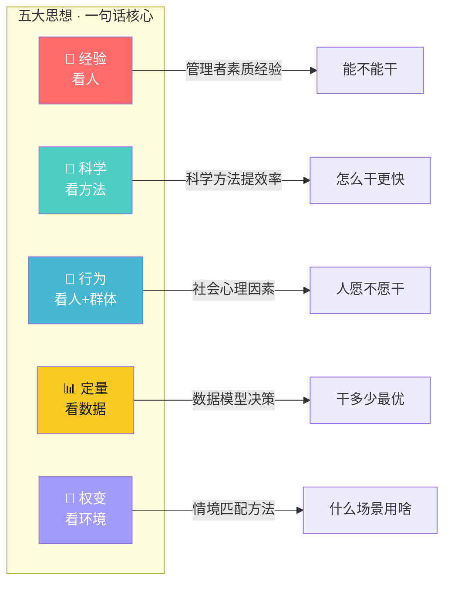

# C001 管理学第3课 · 记忆图

> 一张图记住西方管理思想五大流派的演变脉络与核心要义

---

## 一、管理思想演变 · 全景时间线

---

## 二、五大思想 · 一张图对比

---

## 三、中西管理思想对比

---

## 四、科学管理思想 · 三大代表人物

---

## 五、权变管理 · 核心逻辑

---

## 六、一句话记住每种思想

---

## ⚡ 速查卡片

| 思想流派 | 关注要素 | 一句话核心 | 代表人物 |
|----------|----------|-----------|----------|
| 经验管理 | 管理者素质 | 管理靠经验积累 | 德鲁克、明茨伯格 |
| 科学管理 | 方法与效率 | 用科学代替经验 | 泰勒、法约尔、韦伯 |
| 行为管理 | 人的社会性 | 人不是机器 | 梅奥（霍桑）、马斯洛 |
| 定量管理 | 数据与模型 | Management by Data | 二战运筹学家 |
| 权变管理 | 环境匹配 | 具体问题具体分析 | 系统/权变/过程学派 |

> 🎓 **老师金句记忆**：
> - "中国重修身，西方重工具——研究方式不同，各有价值"
> - "科学管理使管理学成为可学、可教、可传播的学科"
> - "霍桑实验告诉我们：非正式组织的力量不可忽视"
> - "权变 ≠ 没原则，权变 = 有前提条件的灵活运用"
