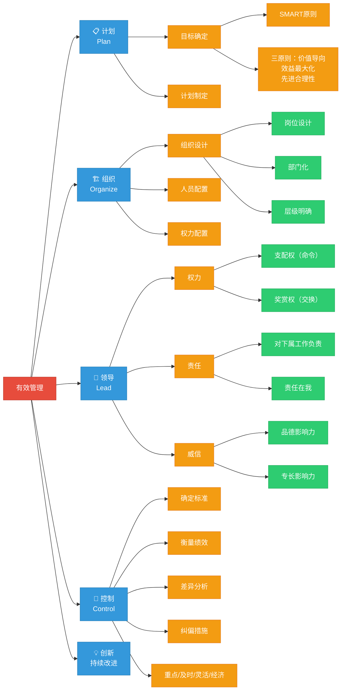

# C001 第 4 课：管理过程——计划、组织、领导、控制

## 一句话总结

有效的管理是通过做好计划、组织、领导、控制四项基本工作，以有限资源实现组织目标的过程——计划是首要职能，目标是基本出发点。

## 课程定位

本课讲的是"管理者所要做的事情"，即管理的四大职能（计划→组织→领导→控制），这是管理学操作层面的核心框架。老师结合大量实际案例，讲了每一项职能的关键要点和常见误区。

---

## 一、计划工作

### 为什么计划是管理的首要职能

计划工作 = 制定必要的行动方针以实现目标。包括两块：**目标确定** + **计划制定**。

### 目标

**目标**：在未来一段时间内要达成的结果。

**目标的重要性**（贯穿管理全过程）：
- **决策的准则**：目标不同，选择的方案也不同
- **行动的依据**：知道要做到什么程度
- **协调的基础**：目标分解图一出来，就知道为什么要配合
- **激励因素**：有明确前景的组织才能让人规划自己的职业
- **控制的标准**：目标达成度是衡量贡献大小的标准

> 目标本身也是一种管理手段。目标不是目的，目标后面的**目的（宗旨/使命）**才是我们真正看重的。

**目标管理的智慧（以共产党为例）**：
- **长远目标**：实现共产主义 → 凝聚人心、组织长久存在
- **短期目标**：翻身做主人 → 实现小康 → 走向富强 → 现代化
- **核心理念**：把短期目标长期化，把长期目标短期化。既有台阶可跨，又不至于跨上一个台阶后就失去方向。

### 目标制定的三原则

| 原则 | 内容 |
|---|---|
| 价值导向原则 | 有社会价值吗？经得起政治、法律、伦理的审查吗？ |
| 效益最大化原则 | 有限资源用于最重要的事情，分析实力、竞争力、效益 |
| 先进合理性原则 | 目标值：从愿景出发（先进性），从现状出发（合理性） |

**关于先进性**：
- 传统观念：跳一跳能够实现
- 21 世纪新观念：这可能是**落后**的！应该从愿景出发倒推
  - 这个目标能让我们兴奋吗？
  - 在行业中处于什么位置？
  - 我们可以利用哪些创新和社会资源？
- 管理的艺术：**构建胆大包天的目标，形成强大无比的驱动力**

### 目标的 SMART 原则

- **S**pecific：明确的、不含糊的
- **M**easurable：可衡量的、可检验的
- **A**ttainable：可实现的（高而合理）
- **R**elevant：与使命愿景价值观相关联的
- **T**ime-bound：有时限要求的

### 计划的作用

**为什么人们不做计划？**
- "计划不如变化快" → 错！正因为有变化才需要计划
- "做了也实现不了" → 原因可能是制定能力不行或执行坚定性不够
- "计划=完全按计划执行" → 错！有时不按计划行动，才是计划发挥了作用

**计划的真正作用**：
> 计划是一种生存策略。它总是让我们把有限的时间用于处理最重要的事情上。

- 明确方向、目标、路径、方法、责任和衡量方法
- 减少不确定性，提高效率
- 增强压力和责任感，提高积极性
- 让自己体会进步和成就感
- **计划是有效的沟通手段**（向上级呈现计划可以获得资源支持）

---

## 二、组织工作

### 组织工作的三大内容

1. **设计组织模式**（结构设计）
2. **人员配置**（获得专业化优势）
3. **权力配置**（协调相互关系，形成整体）

### 组织设计的三个层次

| 层次 | 内容 | 方式 |
|---|---|---|
| 岗位设计 | 把一组工作变成一个人能完成 | 专门化 / 扩大化 / 丰富化 |
| 部门化 | 把岗位按逻辑编成组织单元 | 职能 / 产品 / 地区 / 顾客 |
| 层级明确 | 确定管理层次 | 取决于管理幅度 |

### 组织的五部分构成

```
高层管理 → 中层管理 → 业务执行系统（一线部门）
              ↓
        行政支持部门 + 业务支持部门
```

---

## 三、领导工作

### 管理者的权力来源

| 权力类型 | 来源 | 特点 |
|---|---|---|
| 支配权（强制权） | 职位赋予 | 下属事先知道不服从的后果且害怕该后果时才有效 |
| 奖赏权 | 职位赋予 | 建立在交换原则之上，用于额外工作 |
| 影响权（威信） | 个人素质 | 品德的魅力 + 专长的魅力 |

### 权力的局限

- 权力并不总是有效的，取決于**下属的接受程度**
- 强制权只能在"下属没有履行应尽职责"时使用
- 额外工作只能用奖赏权
- 平时尽量少用支配权，多用引导方式

### 威信（影响权）的来源

- **品德影响力**：人品好→榜样的力量；感情好→不忍伤害彼此感情
- **专长影响力**：能力强→跟着他多一份成功的希望；知识广博→产生崇拜和信赖
- 威信是相对的，要保持威信只有**不断提开自己**

### 管理者的责任

- 拥有指挥他人的权力，也负有对下属工作负责的**额外责任**（领导责任）
- 下属出现问题，一定是管理者没有履行好计划、组织、领导、控制职责
- 对外述职时，只能把责任揽到自己身上："**责任在我**"

### 领导理论的发展

- **品质理论**：寻找优秀领导者的画像（结果发现画不出来）
- **行为理论**：研究什么样的领导行为/风格最好（民主型、任务导向型等）
- **权变理论**：每种领导方式只适用于某些场合

### 现代领导者的角色转变

当代下属可能能力比你还强，领导方式需要转变：
1. **沟通**：平等的交流中引导
2. **服务**：帮下属协调、解决问题
3. **赋能（解缚）**：帮下属解除束缚、充分发挥才华

---

## 四、控制工作

### 控制的基本前提

- **有计划**：有明确的计划依据
- **有组织**：有专门负责控制职能的组织架构（监督部门）
- **有领导**：有顺畅的信息反馈渠道（社会控制、舆论监督）

### 控制的基本过程

```
确定控制标准 → 衡量实际绩效 → 差异分析 → 采取纠偏措施
```

**最大误区**：绩效评估完→发钱→结束。真正重要的是**绩效改进**，不是绩效评价本身。

**纠偏措施的三种方向**：
1. 改进工作方式（最常见）
2. 调整计划目标
3. 修正原定目标

### 控制的原则

| 原则 | 说明 |
|---|---|
| 重点原则 | 抓关键和重点，纲举目张 |
| 客观及时原则 | 发现问题要快，采取措施要看时机 |
| 灵活性原则 | 制定方案留有余地，有多套方案 |
| 经济性原则 | 控制需要成本，只有有利可图时才加以控制 |

## 总结

> 管理 = 管"事" + 理"人"。计划和控制主要管事，组织和领导主要理人。

有效管理的完整体系：**决策 + 计划 → 组织 → 领导 → 控制 + 创新（动态持续改进）**

---

## 核心概念

| 概念 | 定义 | 关键要点 |
|---|---|---|
| 计划工作 | 制定必要的行动方针以实现目标的过程 | 包括目标确定 + 计划制定，是管理的首要职能 |
| 目标 | 在未来一段时间内要达成的结果 | 目标本身是管理手段，目标后面的宗旨/使命才是目的 |
| SMART 原则 | 好目标的五个标准 | Specific, Measurable, Attainable, Relevant, Time-bound |
| 组织工作 | 设计组织结构、配置人员、分配权力 | 岗位设计→部门化→层级明确 |
| 管理幅度 | 一个管理者能直接有效管辖的下属数量 | 决定组织层级数量 |
| 支配权 | 职位赋予的指挥命令权 | 只在工作职责范围内有效 |
| 奖赏权 | 通过奖励诱使下属服从 | 建立在交换原则之上，用于额外工作 |
| 影响权（威信） | 来自个人素质的影响力 | 品德影响力 + 专长影响力 |
| 控制 | 监督、检查、纠偏以确保目标实现 | 前提：有计划、有组织、有领导 |
| 绩效改进 | 控制的真正目的 | 最大误区：绩效评估完→发钱→结束，忘了改进 |

## 老师重点强调

1. **计划是管理的首要职能**：有效的计划是一切成功的秘诀。不做计划的理由（"计划不如变化快"等）全都不成立——正因为有变化才需要计划。
2. **目标不是目的，宗旨/使命才是**：目标是管理手段，目标后面的"为什么"才是真正重要的。
3. **21 世纪的先进性：从愿景出发倒推，而非"跳一跳能够实现"**：构建胆大包天的目标，形成强大无比的驱动力。
4. **管理的艺术：把短期目标长期化，把长期目标短期化**（以共产党为例：共产主义远大理想 + 阶段性目标）。
5. **权力并不总是有效的，取决于下属的接受程度**：强制权只能在"下属未履行应尽职责"时使用；额外工作只能用奖赏权；平时尽量用引导而非命令。
6. **控制的真正目的是绩效改进，不是绩效评价**：评估完→发钱→结束是最大误区。
7. **有时不按计划行动，才是计划发挥了作用**：计划让我们始终把有限时间用于最重要的事。
8. **管理 = 管"事" + 理"人"**：计划和控制主要管事，组织和领导主要理人。

## 关键例子

| 例子 | 说明 |
|---|---|
| 共产党目标管理 | 长远目标（共产主义）凝聚人心 + 阶段性目标（翻身→小康→富强→现代化）持续推进——把短期目标长期化，把长期目标短期化 |
| 兔子与乌龟 | 兔子睡觉是表达对管理者（让它跟乌龟比赛）的抗议；乌龟拼命跑是因为能力不行只能以勤补拙——管理者创造了什么样的组织环境决定了成员行为 |
| 加薪的三种方式 | 全员同比、按绩效分等、人均等额——不同方法适用于不同场景，管理学要研究哪种最有效 |
| 计划是有效的沟通手段 | 向上级呈现计划：列出所有任务→排优先级→让领导看到你有多忙→领导主动帮你减负 |
| "责任在我" | 对外述职时，只能把责任揽到自己身上。下属出问题 = 管理者没履行好计划、组织、领导、控制职责 |

## 易混/易错点

| 易混点 | 正确认识 |
|---|---|
| 目标 = 目的 | 目标是手段，宗旨/使命才是目的。目标是用来指引实现目的的 |
| "计划不如变化快"所以不做计划 | 错！正因为有变化才需要计划。计划是应对变化的生存策略 |
| 计划 = 完全按计划执行 | 错！有时不按计划行动，才是计划发挥了作用 |
| 支配权（命令权）= 强制权（惩罚权） | 不同。支配权是命令指挥，强制权是威胁惩罚。两者适用条件不同 |
| 绩效评估 = 绩效管理 | 错！评估只是手段，改进才是目的。评估完发钱就结束是最大误区 |
| 控制 = 不信任 | 错。控制是为了确保目标实现和持续改进，不是对人的不信任 |
| 管理只对管理者有用 | 错。计划、组织、领导、控制的思维对每个人都适用 |
| "跳一跳能够实现"就是好目标 | 21 世纪可能是落后的！应该从愿景出发倒推，利用创新和社会资源 |

## 知识图谱



## 我的待解决问题

- 如何在实际工作中设定"胆大包天的目标"而不会让团队失去信心？
- 管理幅度多大才是最优的？有哪些因素影响管理幅度？
- 不同层级管理者（高/中/基）的技术技能、人际技能、概念技能比例如何变化？
- 控制的经济性原则在具体场景中如何权衡？
- 现代组织中"互為管理者"的情况越来越普遍，这对传统管理职能有什么挑战？

## 复习题

1. 为什么说计划是管理的首要职能？
2. 目标的 SMART 原则分别代表什么？
3. 目标制定的三原则是什么？
4. "跳一跳能够实现"的目标为什么在 21 世纪可能是落后的？
5. 为什么人们不做计划？这些理由成立吗？
6. 组织设计的三个层次是什么？
7. 管理者的三种权力分别适用于什么情况？
8. 权力为什么并不总是有效的？
9. 威信（影响权）的两个来源是什么？
10. 控制的基本过程是什么？最大误区是什么？
11. 控制的四个基本原则是什么？
12. 为什么说"管理 = 管事 + 理人"？

## 行动清单

- 为自己制定一份下周的工作计划，用 SMART 原则检查目标是否清晰。
- 按"到位、不越位、能补位"检查自己在团队中的角色行为。
- 下次领导布置任务时，用"计划沟通法"列出所有任务并排优先级。
- 观察自己所在组织的控制机制：是否只做了评估而忽略了改进？
- 思考自己在团队中更多使用哪种权力（支配/奖赏/威信），以及是否需要调整。
