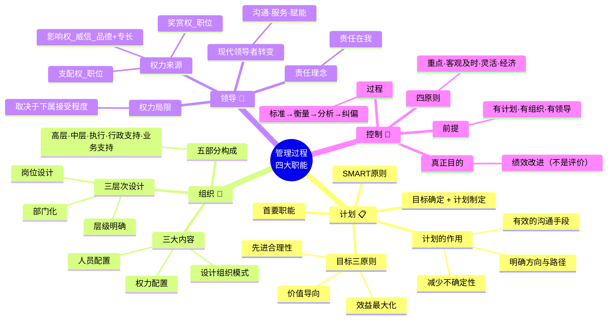
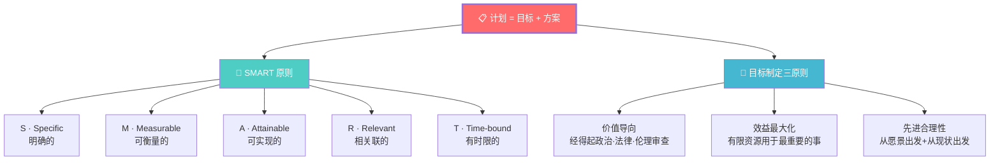
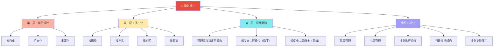
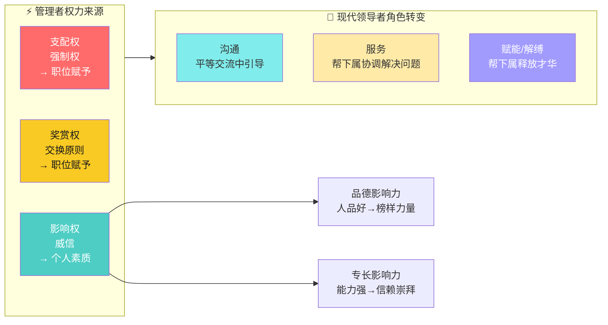
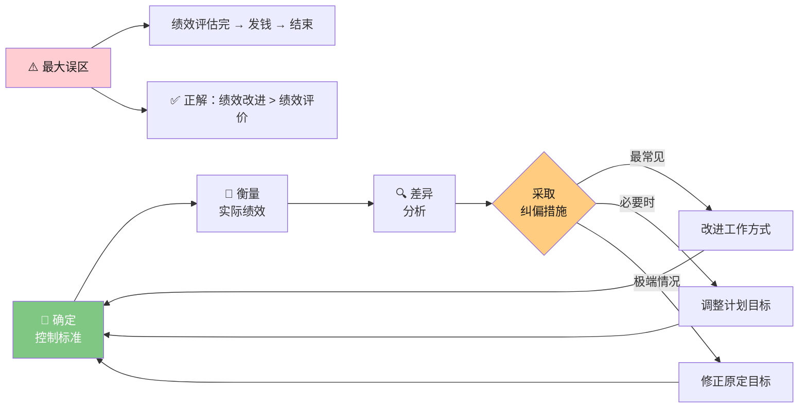
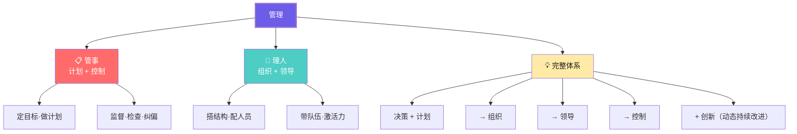

# C001 管理学第4课 · 记忆图

> 一张图记住管理四大职能：计划（定方向）→ 组织（搭结构）→ 领导（带队伍）→ 控制（保结果）

---

## 一、管理四职能 · 全景框架

---

## 二、计划 · SMART 原则 + 目标三原则

---

## 三、组织 · 三层设计 + 五部分构成

---

## 四、领导 · 三种权力 + 三维转变

---

## 五、控制 · 四步闭环 + 四种纠偏

---

## 六、管理 = 管事 + 理人

---

## ⚡ 速查卡片

| 职能 | 核心问题 | 关键工具/概念 | 常见误区 |
|------|----------|--------------|---------|
| 计划 | 要做什么？做到什么程度？ | SMART、目标三原则 | "计划不如变化快"→错！有变化更需要计划 |
| 组织 | 谁做什么？怎么配合？ | 岗位→部门→层级、管理幅度 | 只分工不协作 |
| 领导 | 如何让人愿意跟着干？ | 支配权/奖赏权/影响权、威信 | 滥用强制权、不培养威信 |
| 控制 | 做对了吗？怎么改进？ | 标准→衡量→分析→纠偏 | 只评价不改进 |

> 🎓 **老师金句记忆**：
> - "目标本身是管理手段，目标后面的宗旨/使命才是目的"
> - "责任在我——下属出问题，根子在管理者"
> - "控制的真正目的是绩效改进，不是绩效评价"
> - "管理 = 管事 + 理人"
