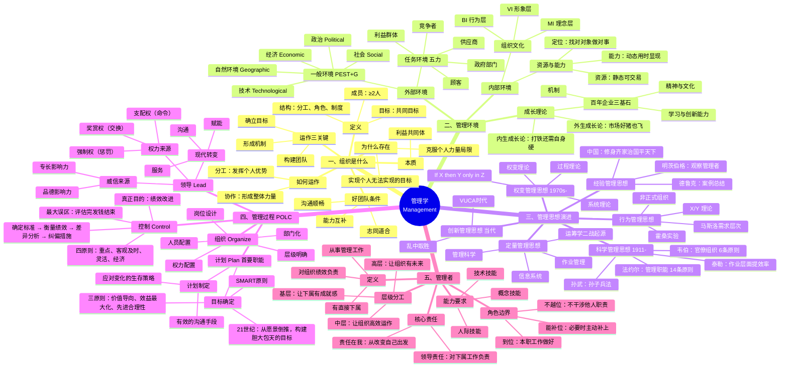

# 管理学知识汇总

> 基于 C001 管理学 4 课笔记与课程转录稿整合而成，涵盖管理学前置课程全部核心内容。

---

## 总览：管理学知识体系思维脑图



---

## 模块一：组织与管理的本质

### 1.1 管理学研究的核心问题

> **管理者如何有效地管理其组织。**

| 关键词 | 含义 |
|---|---|
| 管理者 | 管理活动的主体 |
| 有效管理 | 管理活动追求的结果 |
| 组织 | 管理活动的对象 |
| 如何 | 管理学是一门方法论学科 |

更通俗的表述：**如何让一群平凡的人创造出不平凡的组织绩效。**

### 1.2 什么是组织

组织的三个构成要素：

| 要素 | 说明 |
|---|---|
| 组织成员 | 两个或两个以上的人 |
| 组织目标 | 大家共同追求的目标 |
| 组织结构 | 分工、角色、规则、制度等系统化安排 |

**关键判断**：一群人在公交站等车 ≠ 组织（缺少系统化结构）。只有当这群人有共同目标、角色分工和规则安排时，才构成组织。家庭也是组织。

### 1.3 组织为什么存在

> 克服个人力量的局限，实现靠个人力量无法实现或难以有效实现的目标。

如果一个人可以独立完成，就没有必要建立组织。

### 1.4 组织目标的本质

> **组织目标是实现组织中每个人个人目标的共同基础。**

人加入组织不是为了抽象的组织目标，而是因为组织目标实现后，个人目标也有机会实现。因此，想实现个人目标，就必须为组织目标做贡献。

### 1.5 组织的运作机制

组织通过**分工与协作**发挥超越个人的力量：

- **分工**：让不同人的优势得到发挥
- **协作**：让分散的个人力量形成整体力量

> 很多组织的问题不是没有分工，而是缺少跨部门、跨角色的协作。

### 1.6 好团队的三个条件

| 条件 | 含义 |
|---|---|
| 能力互补 | 你会的我不会，我会的你不会，组合起来更完整 |
| 志同道合 | 对目标、方向、价值有共同认可 |
| 沟通顺畅 | 能通过沟通判断是否合适，并持续协调行动 |

### 1.7 组织运作的三个关键

1. **确立目标**：确保组织有清楚的共同目标
2. **构建团队**：选什么样的人、用什么样的人、怎么组合
3. **形成机制**：包括成员选择、分工协作、利益分享、沟通协调、规则责任

### 1.8 组织产生的条件

| 条件 | 说明 |
|---|---|
| 有人发起 | 有人提出目标和方向 |
| 有人响应 | 有人愿意加入、贡献和合作 |
| 充分沟通 | 通过沟通形成共同目标、团队和规则 |

### 1.9 优秀组织成员的五个要求

1. **认同组织理念**：认同组织的理念和基本规范
2. **做好本职工作**：对"做成了什么结果"负责，而非仅对"我做了"负责
3. **有协作意识**：主动沟通、配合他人，从组织整体角度考虑
4. **有全局观**：理解自己的工作为什么存在、对整体有什么贡献
5. **正确处理角色边界**：
   - **到位**：本职工作做到位
   - **不越位**：他人工作不越位
   - **能补位**：需要时主动补位

---

## 模块二：管理环境与组织绩效

### 2.1 管理环境的四大因素

影响组织绩效的各种力量和条件因素的总和，称为**管理环境**。

| 四大类 | 位置 | 影响方式 | 具体内容 |
|---|---|---|---|
| 一般环境因素（宏观） | 组织外部 | 间接影响 | 政治、经济、社会、技术、自然环境（PEST + G） |
| 任务环境因素 | 组织外部 | 直接影响 | 供应商、顾客、竞争者、政府部门、利益群体 |
| 组织文化因素 | 组织内部 | 潜移默化 | 核心价值观、目标、经营理念、行为规范、规章制度 |
| 经营条件因素 | 组织内部 | 直接影响 | 资源与能力 |

### 2.2 一般环境因素（PEST 分析）

| 因素 | 核心影响 |
|---|---|
| 政治 Political | 政党路线方针政策 → 政府态度 + 政局稳定性 |
| 经济 Economic | 经济制度、发展水平 → 资源获取方式和价格 + 市场需求结构 |
| 社会 Social | 风俗习惯、人口状况、文化教育 → 劳动力结构 + 需求结构 |
| 技术 Technological | 科技进步可能彻底改变经营方式，甚至淘汰整个行业/岗位 |
| 自然环境 Geographic | 资源禀赋、地理条件等 |

### 2.3 任务环境因素

| 主体 | 影响方式 |
|---|---|
| 供应商 | 主要供应者出问题 → 组织运作减缓或终止 |
| 顾客/服务对象 | 需求经常变化，组织随顾客增减而兴衰 |
| 同行/竞争者 | 包括跨界竞争者，争夺资源和服务对象 |
| 政府部门 | 出台政策，决定可以做什么、不可以做什么 |
| 利益代表者 | 工会、消费者协会、环保组织等 |

### 2.4 内部环境因素

**资源与能力**：

- **资源**：人、财、物、技术、信息——静态、可交易
- **能力**：研发能力、运营能力等——动态、用时才显现
- **定位**：明确目标顾客 + 明确为顾客提供的价值 → 让有限资源发挥最大价值

**组织文化**（MI / BI / VI）：

| 层次 | 内容 | 核心问题 |
|---|---|---|
| MI 理念层 | 核心价值观、目标、经营理念 | 怎么想 |
| BI 行为层 | 行为规范、规章制度 | 怎么做 |
| VI 形象层 | 社会看到的形象 | 呈现什么 |

> 组织文化尽管看不见摸不着，但它到处蔓延，并影响着组织中的一切行为。组织不仅是工作场所，还是塑造人的场所。

### 2.5 外生成长论 vs 内生成长论

| 理论 | 核心观点 | 典型现象 |
|---|---|---|
| 外生成长论 | 企业成长主要取决于外部因素 | 市场好时"猪也会飞上天" |
| 内生成长论 | 企业成长主要取决于内部因素 | 全行业亏损时你还能盈利 |

**真实情况**：两者都有影响。但**长期来看，内部因素才是决定性的**。

### 2.6 百年企业的三基石

1. **企业精神与文化**：生生不息，脱离具体的人长存
2. **机制**：保证团队构建、地位分配、成效发挥
3. **组织学习和创新能力**：应对百变环境

### 2.7 核心分析框架

```
组织绩效 ← 外部环境（一般/任务） + 内部环境（文化/资源能力）
```

- 分析时可以面面俱到
- 着手改变时只能把原因归结到自身——**责任在我，从改变自己出发**

### 2.8 因素判断关键

判断一个因素是不是"管理环境因素"、是一般因素还是任务因素，取决于**组织目标的定位**。例如利率上扬：对银行是有利因素，对贷款企业是不利因素，对不用钱的组织可能根本不是影响因素。

---

## 模块三：管理思想的演进

### 3.1 总体脉络

```
工业革命 → 经验管理思想 → 科学管理思想 → 行为管理思想 → 定量管理思想 → 权变管理思想 → 创新管理思想（当代）
```

> 中西差异：中国管理思想侧重管理者自身修养（修身养性），西方管理思想侧重管理工具和方法（要素论）。

### 3.2 五大管理思想详解

#### （1）经验管理思想

| 维度 | 内容 |
|---|---|
| 核心观点 | 管理的有效性取决于管理者个人的素质和经验 |
| 代表人物 | 德鲁克（案例总结提炼）、明茨伯格（观察管理者实际做什么） |
| 中国对应 | 修身 → 齐家 → 治国 → 平天下 |
| 局限 | 只能师父带徒弟，难以传授和推广 |

#### （2）科学管理思想（1911 年起）

| 代表人物 | 研究层面 | 主要贡献 |
|---|---|---|
| 泰勒 Taylor | 作业层面 | 科学管理原理，用科学方法代替经验 |
| 法约尔 Fayol | 管理层面 | 管理职能论（计划、组织、指挥、协调、控制），14 条管理原则 |
| 韦伯 Weber | 组织层面 | 官僚组织理论，6 条基本原则（现代公务员制度的基础） |
| 孙武 | 方法层面 | 《孙子兵法》——严谨严密的方法论 |

**共同特点**：
- 研究重点都是**提高效率**
- 主张用**科学方法代替经验**
- 使管理学成为一门**可以学习、传播、教学**的学科
- 管理从此走向**专业化和职业化**

#### （3）行为管理思想

| 维度 | 内容 |
|---|---|
| 核心观点 | 人不仅是"经济人"，还是"社会人"，劳动生产率受社会、心理和群体因素影响 |
| 起源 | 霍桑实验：最初想找最佳照明亮度与生产效率的关系，意外发现无论灯光亮暗效率变化不大——因为"你们都在看着我" |
| 关键发现 | 正式组织之外还存在**非正式组织**，会产生强大的群体压力 |
| 后续发展 | 马斯洛需求层次理论、X 理论和 Y 理论 |
| 特点 | 改变了管理的思考方法，把人看作宝贵的资源 |

#### （4）定量管理思想

| 维度 | 内容 |
|---|---|
| 核心观点 | 管理最重要的在于"度"的把握，数量化必不可少 |
| 起源 | 二战运筹学应用（诺曼底登陆物资调度、雷达配置等） |
| 应用领域 | 管理科学（运筹学）、作业管理、信息系统 |
| 核心理念 | 减少决策中个人艺术性成分，建立科学决策的数学模型，寻求最优解 |
| 当代方向 | **Management by Data** 是主流方向 |

#### （5）权变管理思想（20 世纪 70 年代起）

| 维度 | 内容 |
|---|---|
| 核心观点 | 世界上不存在普遍适用的最佳管理理论和方法，每种理论都有其适用范围 |
| 公式表达 | If X then Y **only in Z** |
| 三大分支 | 系统理论、权变理论、过程理论 |
| 本质 | **实事求是，具体问题具体分析** |

### 3.3 如何运用这些管理思想

**案例**：A 经理关注人（行为管理思想），B 经理关注机制（科学管理思想），两人都成功了。

**原因**：A 适合高科技/互联网企业（靠员工创造力），B 适合传统制造型企业（靠规则和流程）。关键是**与组织场景匹配**。

### 3.4 1980 年代之后的续写

- 9/11 → 环境走向"乌卡"（VUCA：易变、不确定、复杂、模糊）
- 需要研究**乱中取胜之道**
- 当前主流：**创新管理思想**

### 3.5 总结

各思想关注的重点分别是：**实践经验、科学方法的运用、人的重要性、数量化、管理环境的影响**。从要素论角度看，哪个都对。现实中要把它们整合运用。

---

## 模块四：管理过程——计划、组织、领导、控制

> 管理 = 管"事" + 理"人"。计划和控制主要管事，组织和领导主要理人。

### 4.1 计划工作（Plan）——管理的首要职能

#### 目标

**目标**：在未来一段时间内要达成的结果。

**目标的重要性**（贯穿管理全过程）：

| 作用 | 说明 |
|---|---|
| 决策的准则 | 目标不同，选择的方案也不同 |
| 行动的依据 | 知道要做到什么程度 |
| 协调的基础 | 目标分解图一出来，就知道为什么要配合 |
| 激励因素 | 有明确前景的组织才能让人规划自己的职业 |
| 控制的标准 | 目标达成度是衡量贡献大小的标准 |

> 目标本身也是一种管理手段。目标不是目的，目标后面的**目的（宗旨/使命）**才是我们真正看重的。

**目标管理的智慧**（以共产党为例）：
- **长远目标**：实现共产主义 → 凝聚人心、组织长久存在
- **短期目标**：翻身做主人 → 实现小康 → 走向富强 → 现代化
- **核心理念**：把短期目标长期化，把长期目标短期化——既有台阶可跨，又不至于跨上一个台阶后就失去方向。

#### 目标制定的三原则

| 原则 | 内容 |
|---|---|
| 价值导向原则 | 有社会价值吗？经得起政治、法律、伦理的审查吗？ |
| 效益最大化原则 | 有限资源用于最重要的事情，分析实力、竞争力、效益 |
| 先进合理性原则 | 目标值：从愿景出发（先进性），从现状出发（合理性） |

> 21 世纪新观念："跳一跳能够实现"可能是**落后**的！应该从愿景出发倒推——构建胆大包天的目标，形成强大无比的驱动力。

#### SMART 原则

| 字母 | 含义 |
|---|---|
| S - Specific | 明确的、不含糊的 |
| M - Measurable | 可衡量的、可检验的 |
| A - Attainable | 可实现的（高而合理） |
| R - Relevant | 与使命愿景价值观相关联的 |
| T - Time-bound | 有时限要求的 |

#### 计划的作用

> 计划是一种生存策略。它总是让我们把有限的时间用于处理最重要的事情上。

**常见不做计划的理由（均不成立）**：
- "计划不如变化快" → 错！正因为有变化才需要计划
- "做了也实现不了" → 原因可能是制定能力不行或执行坚定性不够
- "计划=完全按计划执行" → 错！有时不按计划行动，才是计划发挥了作用

**计划的额外价值**：计划是有效的沟通手段——向上级呈现计划可以获得资源支持。

---

### 4.2 组织工作（Organize）

#### 三大内容

1. **设计组织模式**（结构设计）
2. **人员配置**（获得专业化优势）
3. **权力配置**（协调相互关系，形成整体）

#### 组织设计的三个层次

| 层次 | 内容 | 方式 |
|---|---|---|
| 岗位设计 | 把一组工作变成一个人能完成 | 专门化 / 扩大化 / 丰富化 |
| 部门化 | 把岗位按逻辑编成组织单元 | 职能 / 产品 / 地区 / 顾客 |
| 层级明确 | 确定管理层次 | 取决于管理幅度 |

#### 组织的五部分构成

```
高层管理 → 中层管理 → 业务执行系统（一线部门）
              ↓
        行政支持部门 + 业务支持部门
```

---

### 4.3 领导工作（Lead）

#### 管理者的权力来源

| 权力类型 | 来源 | 适用条件 |
|---|---|---|
| 支配权（命令权） | 职位赋予 | 工作职责范围内，下属必须服从 |
| 强制权（惩罚权） | 职位赋予 | 下属事先知道不服从的后果且害怕该后果时才有效；仅在下属未履行应尽职责时使用 |
| 奖赏权 | 职位赋予 | 建立在交换原则之上，用于额外工作 |
| 影响权（威信） | 个人素质 | 品德魅力 + 专长魅力 |

> 权力并不总是有效的，取决于**下属的接受程度**。平时尽量少用支配权，多用引导方式。

#### 威信（影响权）的来源

| 来源 | 作用机制 |
|---|---|
| 品德影响力 | 人品好 → 榜样的力量；感情好 → 不忍伤害彼此感情 |
| 专长影响力 | 能力强 → 跟着他多一份成功的希望；知识广博 → 产生崇拜和信赖 |

> 威信是相对的，要保持威信只有**不断提升自己**。

#### 管理者的责任

- 拥有指挥他人的权力，也负有对下属工作负责的**额外责任**（领导责任）
- 下属出现问题，一定是管理者没有履行好计划、组织、领导、控制职责
- 对外述职时，只能把责任揽到自己身上：**"责任在我"**

#### 领导理论的发展

| 阶段 | 核心问题 | 结论 |
|---|---|---|
| 品质理论 | 优秀领导者的画像是什么？ | 画不出来 |
| 行为理论 | 什么样的领导行为/风格最好？ | 民主型、任务导向型等各有适用场景 |
| 权变理论 | 每种领导方式适用于什么场合？ | 没有普遍适用的最佳领导方式 |

#### 现代领导者的角色转变

当代下属可能能力比你还强，领导方式需要转变：

1. **沟通**：在平等的交流中引导
2. **服务**：帮下属协调、解决问题
3. **赋能（解缚）**：帮下属解除束缚、充分发挥才华

---

### 4.4 控制工作（Control）

#### 控制的基本前提

- **有计划**：有明确的计划依据
- **有组织**：有专门负责控制职能的组织架构
- **有领导**：有顺畅的信息反馈渠道

#### 控制的基本过程

```
确定控制标准 → 衡量实际绩效 → 差异分析 → 采取纠偏措施
```

> **最大误区**：绩效评估完 → 发钱 → 结束。真正重要的是**绩效改进**，不是绩效评价本身。

**纠偏措施的三种方向**：
1. 改进工作方式（最常见）
2. 调整计划目标
3. 修正原定目标

#### 控制的原则

| 原则 | 说明 |
|---|---|
| 重点原则 | 抓关键和重点，纲举目张 |
| 客观及时原则 | 发现问题要快，采取措施要看时机 |
| 灵活性原则 | 制定方案留有余地，有多套方案 |
| 经济性原则 | 控制需要成本，只有有利可图时才加以控制 |

---

### 4.5 管理过程总结

有效管理的完整体系：

```
决策 + 计划 → 组织 → 领导 → 控制 + 创新（动态持续改进）
```

| 职能 | 管事/理人 | 核心任务 |
|---|---|---|
| 计划 | 管事 | 有限资源的合理配置 |
| 组织 | 理人 | 分工与协作关系的建立 |
| 领导 | 理人 | 积极性的调动和大方向的把握 |
| 控制 | 管事 | 监督检查、纠正偏差 |

---

## 模块五：管理者

### 5.1 管理者的定义

> 在组织中从事管理工作、有直接下属、并对组织绩效负责的人。

三个特征：
1. 是组织中的一个角色（与组织相关联）
2. 从事管理工作（计划、组织、领导、控制）
3. 有直接下属，负责指挥下属开展工作

### 5.2 管理者的层级与分工

| 层级 | 核心使命 | 关注重点 |
|---|---|---|
| 高层管理者 | **让组织有未来** | 效益——做正确的事 |
| 中层管理者 | **让组织高效运作** | 效率——把事做好 |
| 基层管理者 | **让下属有成就感** | 任务完成 |

### 5.3 管理者的角色边界

> **到位、不越位、能补位**

| 常见错位 | 表现 |
|---|---|
| 高层越位 | 越级指挥，把下属的活干了 |
| 下层越位 | 整天考虑公司大政方针，自己的活没干好 |
| 中层失职 | 停留在"上传下达"而非"承上启下" |

### 5.4 管理者应具备的技能

| 技能 | 含义 | 重要层级 |
|---|---|---|
| 技术技能 | 专业领域的技术能力 | 基层最重要 |
| 人际技能 | 与人沟通、协调、激励的能力 | 各层都重要 |
| 概念技能 | 透过现象抓本质、把复杂问题简单化、举一反三的能力 | 高层最重要 |

### 5.5 管理者的核心责任

> **责任在我**——当所在部门的工作没有达到预定绩效时，管理者只能把责任揽到自己身上。

原因：下属出问题 = 管理者没有履行好计划、组织、领导、控制职责。

管理者的根本任务：**在给定的条件（多变的环境 + 短缺的资源）下求解**——创造和维护一种环境，使身处其间的人们能够在组织里协调地开展工作，克服环境的不确定性和资源短缺所带来的困难，有效实现组织目标。

---

## 跨模块主题：管理学的核心思维

### 1. 打破固有思维模式

| 没学管理学 | 学了管理学 |
|---|---|
| 碰到问题马上想"怎么解决" | 先问：这是一件什么事？这个问题要不要解决？是不是主要矛盾？ |
| 什么问题都想解决 | 抓住主要矛盾和主要问题，对非关键问题可以暂时容忍 |

### 2. 扩大认知

> 概念会改变人的判断方式。学管理学要重视概念，尤其要理解概念的内涵和外延。

### 3. 三招五式

**三招（思维方式）**：
1. 具体问题具体分析——首先学会说"很难说"
2. 目标导向、兼容并蓄——不是非此即彼，而是鱼和熊掌兼得
3. 关键在自身——从认识自己、改变自己着手

**五式（基本原则）**：
1. 目标导向——以目标为中心开展一切工作
2. 以人为本——一切为了人，一切依靠人
3. 创新为要——持续改进
4. 系统思维——从整体看问题
5. 责任在我——改变从自己出发

### 4. 效率与效益

| 概念 | 定义 | 关注点 |
|---|---|---|
| 效率 | 投入产出比 | 怎么做（方式方法） |
| 效益 | 产出满足需求的程度 | 做什么（价值取向） |

> **做对的事比做好事更重要。** 但两者都要兼顾。

### 5. 管理的本质

> 管理是通过综合运用人力资源和其他资源，以有效实现目标的过程。

- 输入：有限的资源
- 转换：科学方法的运用
- 输出：更多或更高目标的实现
- 管理本身是**手段**，不是**目的**——不能为了管理而管理

---

## 附录

### 附录A：核心概念词汇表

| 概念 | 定义 |
|---|---|
| 管理 | 通过综合运用人力资源和其他资源，以有效实现目标的过程 |
| 组织 | 人们为了实现某一特定目的而形成的系统结合（成员 + 目标 + 结构） |
| 管理环境 | 存在于组织内部和外部、影响组织绩效的各种力量和条件因素的总和 |
| 组织文化 | 以企业价值观为核心，包含 MI（理念）、BI（行为）、VI（形象）三个层次 |
| 目标 | 在未来一段时间内要达成的结果 |
| SMART 原则 | 好目标的五个标准：Specific, Measurable, Attainable, Relevant, Time-bound |
| 计划 | 制定必要的行动方针以实现目标的过程 |
| 管理幅度 | 一个管理者能直接有效管辖的下属数量 |
| 支配权 | 职位赋予的指挥命令权 |
| 强制权 | 通过威胁惩罚迫使下属服从的权力 |
| 奖赏权 | 通过奖励诱使下属服从的权力 |
| 影响权（威信） | 来自个人素质的影响力（品德 + 专长） |
| 控制 | 监督、检查、纠偏以确保目标实现的过程 |
| 效率 | 投入产出比 |
| 效益 | 产出满足需求的程度（目标达成度） |
| 定位 | 明确目标顾客 + 明确为顾客提供的价值 |
| PEST 分析 | 宏观环境分析框架：政治、经济、社会、技术 |
| VUCA | 易变（Volatile）、不确定（Uncertain）、复杂（Complex）、模糊（Ambiguous） |
| 权变管理 | If X then Y only in Z——每种管理理论都有其适用范围 |

### 附录B：易混概念辨析

| 易混点 | 正确认识 |
|---|---|
| 一群人 = 组织 | 错。还要有共同目标和系统化结构 |
| 组织目标是每个人天然想要的 | 组织目标是个人目标实现的共同基础 |
| 分工越细越好 | 不一定。没有协作的分工会造成割裂 |
| 管理就是解决问题 | 不完全是。管理要先判断问题是否重要 |
| 只做好本职工作 = 优秀员工 | 不够。还要有协作意识和全局观 |
| 学管理只对管理者有用 | 错。被管理者、组织成员和个人自我管理都需要管理学 |
| 目标 = 目的 | 目标是手段，宗旨/使命才是目的 |
| "计划不如变化快"所以不做计划 | 错。正因为有变化才需要计划 |
| 绩效评估 = 绩效管理 | 错。评估只是手段，改进才是目的 |
| 控制 = 不信任 | 错。控制是为了确保目标实现和持续改进 |
| 经验管理思想 = 过时了 | 错。经验管理思想至今仍然存在且有价值 |
| 五大管理思想是替代关系 | 错。它们是互补关系，现实中要整合运用 |
| 权变管理 = 怎么做都行 | 错。权变是有前提条件的灵活运用 |
| 效率 = 效益 | 效率是投入产出比（怎么做），效益是目标达成度（做什么） |
| 资源 = 能力 | 资源是静态的（可交易），能力是动态的（用时才显现） |
| 支配权 = 强制权 | 不同。支配权是命令指挥，强制权是威胁惩罚 |

### 附录C：核心关系汇总

| 主体 | 关系 | 客体 |
|---|---|---|
| 管理学 | 研究 | 管理者如何有效管理组织 |
| 管理学 | 本质上属于 | 方法论学科 |
| 组织 | 由...构成 | 组织成员、组织目标、组织结构 |
| 组织 | 本质是 | 利益共同体 |
| 组织 | 产生于 | 个人力量局限 |
| 组织功能 | 依靠 | 分工与协作 |
| 组织目标 | 是 | 个人目标实现的共同基础 |
| 好团队 | 需要 | 能力互补、志同道合、沟通顺畅 |
| 组织运作 | 抓手是 | 目标、团队、机制 |
| 组织绩效 | 受制于 | 外部环境 + 内部环境 |
| 长期绩效 | 取决于 | 内部因素（打铁还需自身硬） |
| 百年企业 | 需要 | 精神文化 + 机制 + 学习创新能力 |
| 管理过程 | 包括 | 计划 → 组织 → 领导 → 控制 |
| 计划 | 是 | 管理的首要职能 |
| 管理 | 本质是 | 一种手段（不能为了管理而管理） |
| 权变管理 | 本质是 | 实事求是，具体问题具体分析 |

### 附录D：管理思想演进对照表

| 阶段 | 核心关注 | 关键人物 | 核心贡献 |
|---|---|---|---|
| 经验管理 | 个人素质与经验 | 德鲁克、明茨伯格 | 管理是一种实践 |
| 科学管理（1911-） | 提高效率 | 泰勒、法约尔、韦伯 | 使管理成为可学习的科学 |
| 行为管理 | 人的社会心理因素 | 梅奥、马斯洛 | 发现非正式组织，关注人的需求 |
| 定量管理 | 数量化与模型 | 运筹学派 | Management by Data |
| 权变管理（1970s-） | 环境匹配 | — | If X then Y only in Z |
| 创新管理（当代） | VUCA 应对 | — | 乱中取胜之道 |

### 附录E：应用检查清单

分析任何组织（家庭、团队、公司、项目、社群）时，按以下顺序提问：

1. 这个组织的共同目标是什么？
2. 成员的个人目标能否通过共同目标实现？
3. 组织成员是否能力互补？
4. 成员是否志同道合，是否认可基本规则？
5. 沟通是否顺畅，冲突能否被讨论？
6. 分工是否清楚，协作是否充分？
7. 利益分享是否合理，贡献和回报是否匹配？
8. 成员是否做到：到位、不越位、能补位？
9. 当前最大瓶颈是目标问题、团队问题，还是机制问题？
10. 外部环境（PEST + 五力）对组织有何影响？
11. 如果只能改一件事，哪一件最能提升组织绩效？

---

> **文档说明**：本文档整合了 C001 管理学 4 课的笔记与课程转录稿，按知识体系重新组织，便于系统复习和快速查阅。每课详细内容请参见对应的单课笔记文件。
