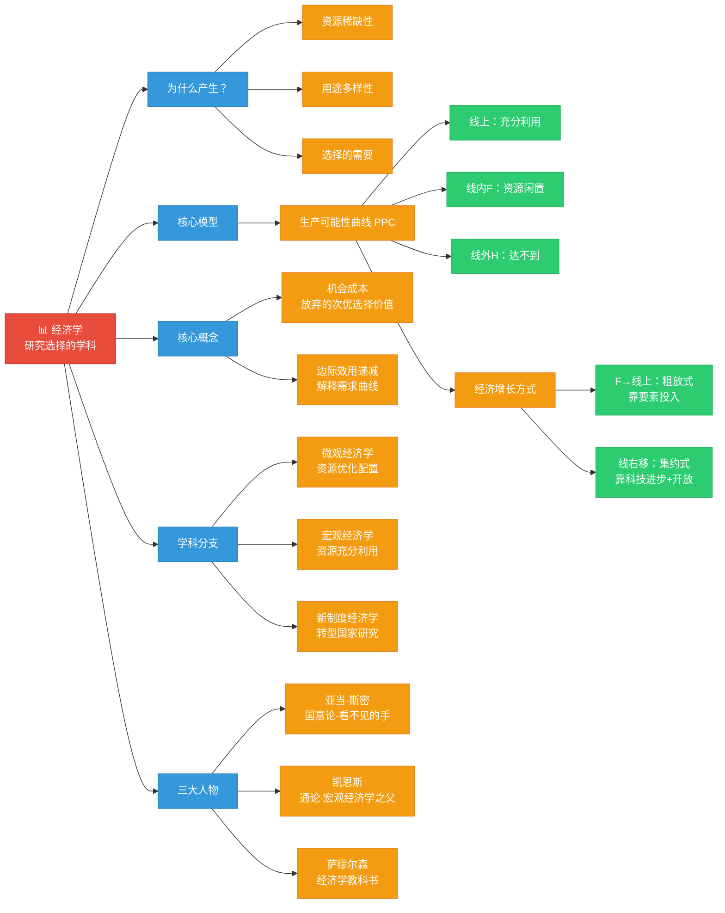

# C002 第 1 课：经济学原理导论

## 一句话总结

经济学是一门研究"选择"的学科——源于资源稀缺性 + 用途多样性，核心概念是机会成本，用生产可能性曲线模型可以直观理解资源配置、经济增长方式等根本问题。

## 课程定位

这是经济学原理的前置课程开篇。老师说明：正常本科要两个长学期（微观 + 宏观各 48 学时），现在被压缩到一天 8 节课串讲。课程分四部分：导论 → 微观经济学概述 → 宏观经济学概述 → 当下宏观经济形势分析。

## 经济学是什么

**通俗定义**：经济学是一门研究**选择**的学科。

选择无处不在——作为普通人每天做选择，作为企业家每时每刻做选择。因此经济学应用度极高。

**完整定义**：经济学是一门研究人和社会如何将具有多种用途的资源有效配置，以生产商品和劳务，来最大限度满足人类现在和将来各种需要的科学。

### 经济学为什么产生

三大原因：
1. **资源的稀缺性**：资源/要素是有限的，能生产出来的商品和劳务也是有限的
2. **资源用途的多样性**：一种资源在被使用之前有很多种用途，一旦做出选择，就必须放弃其他用途
3. **由此引起的选择的需要**

### 人的欲望为什么是无限的

马斯洛需求层次理论：
```
自我价值实现
    ↑
自尊和尊重他人
    ↑
社会需要（亲情、友情、爱情）
    ↑
安全需要
    ↑
生存需要（最基本）
```
每满足一层就上升到更高一层，每一层都需要更多资源来满足 → 欲望无穷。

## 核心模型：生产可能性曲线（PPC）

假设一个社会所有资源只能生产两种商品：
- **黄油**（代表最低层次的生存需要/消费品）
- **大炮**（代表安全需要/资本品）

```
大炮 ↑
 OA ┤╲
    ┤ ╲
    ┤  ╲  B (Y₁黄油, X₁大炮)
    ┤   ╲
    ┤    ╲ C (Y₂黄油, X₂大炮)
    ┤     ╲
    ┤  F   ╲
    ┤       ╲
    └──────────→ 黄油
    O         OD
```

**曲线含义**：
- **A-B-C-D 线**：生产可能性曲线 —— 所有资源充分利用后，能生产的两类产品最大数量组合的连线
- **线上的点**（B、C）：资源充分利用
- **线内的点**（F）：资源未被充分利用，存在浪费
- **线外的点**（H）：现有资源下达不到

### 模型的应用

**F 点 → B/C 点的移动**：把没有利用的资源充分利用 → **粗放式经济增长**（靠要素投入追加）

**整条线向右移动（实现 H 点）**：
- 靠**科技进步** → **集约式经济增长**（高质量发展）
- 靠**对外开放**（如"一带一路"：利用国际国内两大市场、两大资源）

**B 点到 C 点的移动**：多生产 ΔX 黄油就必须减少 ΔY 大炮 → **机会成本**

| 国家类比 | 点位 |
|---|---|
| 朝鲜 | B 点附近（大炮多，黄油少——先军政治） |
| 改革开放后的中国 | C 点附近（越来越多老百姓需要的产品） |

## 核心概念：机会成本

> 用一定资源生产 X 商品的机会成本，就是所放弃的 Y 产品的数量。

**当资源有多种用途时**：最优选择的机会成本 = 次优选择本来应该获得的收益（放弃的用途中代价最高的那一个）。

### 机会成本的应用

**投资决策**：不能只看 A 项目的成本和收益，还要看如果投到 B 项目、C 项目会怎样。如果 B 项目的净收益更大，那 A 项目的选择就不是最优的。

## 经济学的基本问题

在给定资源和充分就业的前提下，**哪一个组合是最优选择？**

答案：**全社会总效用最大**（全社会所有人在消费这个商品组合时带来的总满足感/福利水平最大）的组合就是最优的。

## 关键启示

1. **舍得**：有舍才有得，舍掉 ΔY 大炮才得到 ΔX 黄油
2. **机会成本是经济学最具穿透力的概念之一**——它改变了我们看问题的方式
3. **生产可能性曲线是一个可以无限延伸的分析工具**——可以用来分析经济增长方式、国家战略选择等宏观问题

## 与后续课程的衔接

- 微观经济学：研究个体（消费者、企业）如何做出最优选择
- 宏观经济学：研究整个经济体的运行规律
- 本课搭建了一个"选择"的分析框架，后续课程将填充具体内容

---

## 核心概念

| 概念 | 定义 | 关键要点 |
|---|---|---|
| 经济学 | 一门研究"选择"的学科 | 源于资源稀缺性 + 用途多样性 + 选择的需要 |
| 稀缺性 | 资源/要素是有限的，能生产出来的商品和劳务也是有限的 | 经济学产生的最根本原因 |
| 资源用途多样性 | 一种资源在被使用前有很多种用途，一旦做出选择就必须放弃其他用途 | 与稀缺性共同导致选择的需要 |
| 机会成本 | 用一定资源生产 X 商品的机会成本 = 所放弃的 Y 产品的数量 | 多种用途时 = 次优选择本应获得的收益（放弃的用途中代价最高的） |
| 生产可能性曲线（PPC） | 所有资源充分利用后，能生产的两类产品最大数量组合的连线 | 线上 = 充分利用；线内 = 浪费；线外 = 达不到 |
| 粗放式经济增长 | 靠要素投入追加实现增长（F 点向线上移动） | 把没利用的资源用起来 |
| 集约式经济增长 | 靠科技进步实现增长（整条线向右移动） | 高质量发展 |
| 边际效用递减 | 随着消费量增加，每增加一单位消费带来的满足感递减 | 解释需求曲线向右下方倾斜 |

## 老师重点强调

1. **经济学是一门研究选择的学科**——选择无处不在，因此经济学应用度极高。
2. **机会成本是经济学最具穿透力的概念之一**：它改变了我们看问题的方式——做决策不能只看一个选项的收益，还要看放弃的选项中最好的那个。
3. **生产可能性曲线是可以无限延伸的分析工具**：可以分析经济增长方式（粗放 vs 集约）、国家战略选择（先军政治 vs 民生）、对外开放（一带一路）等宏观问题。
4. **舍得**：有舍才有得，从 B 点到 C 点必须放弃一些大炮才能得到更多黄油。
5. **经济学三大人物的贡献**：亚当·斯密（国富论→市场经济理论）、凯恩斯（通论→宏观经济学）、萨缪尔森（经济学教科书→微观宏观综合）。
6. **西方经济学假定完善的市场经济制度**：中国是转型国家，所以新制度经济学对理解中国特别有价值。
7. **经济学分析的核心方法**：供需分析 + 成本收益分析。遇到任何问题先想"需求是什么？供给是什么？"

## 关键例子

| 例子 | 说明 |
|---|---|
| 黄油与大炮模型 | 黄油代表生存需要（消费品），大炮代表安全需要（资本品）。整条 PPC 上的每个点都是资源充分利用的最大组合 |
| 朝鲜 vs 中国 | 朝鲜在 B 点（大炮多、黄油少）；改革后的中国在 C 点（更多老百姓需要的产品） |
| 一带一路 | 利用国内国际两大市场、两大资源 → 推动 PPC 向右移动 → 经济增长 |
| 投资决策 | 不能只看 A 项目的成本和收益，还要看 B/C 项目的净收益——这就是机会成本思维 |
| 10万元三种用途 | 炒股收益 3 万、买债券 1 万、存银行 2500——选择炒股的机会成本是放弃的 1 万（次优选择中代价最高的） |
| "舍得" | 多生产 ΔX 黄油就必须放弃 ΔY 大炮——机会成本的直观体现 |

## 易混/易错点

| 易混点 | 正确认识 |
|---|---|
| 稀缺性 = 贫穷 | 错。稀缺性是相对的——人的欲望无穷而资源有限，即使富裕社会也存在稀缺性 |
| 机会成本 = 放弃的所有选项的价值之和 | 错！只等于放弃的用途中代价最高的那一个（次优选择的价值） |
| 生产可能性曲线上的点 = 都是最优的 | 错。线上所有点都是资源充分利用，但只有全社会总效用最大的那个组合才是最优的 |
| 粗放式增长 = 不好 | 不一定。当一个经济体中存在大量闲置资源时，粗放式增长是有意义的（F 点→B/C 点） |
| 经济学只研究金钱和商业 | 错。经济学研究的是"选择"——任何涉及权衡取舍的决策都是经济学的研究范围 |
| 微观经济学和宏观经济学是割裂的 | 错。两者互为前提、相互补充：微观假设资源充分利用来研究优化配置；宏观假设优化配置来研究充分利用 |

## 知识图谱



## 我的待解决问题

- 机会成本在个人职业选择中如何具体量化？
- 生产可能性曲线的形状为什么是向外凸的（凹向原点）？这背后的经济学含义是什么？
- 新制度经济学中的交易费用理论如何解释企业的边界？
- 中国经济当前处于 PPC 的什么位置？向 H 点移动的主要障碍是什么？

## 复习题

1. 经济学的通俗定义和完整定义分别是什么？
2. 经济学产生的三大原因是什么？
3. 什么是生产可能性曲线？线上、线内、线外的点分别代表什么？
4. F 点向 B/C 点移动代表什么经济增长方式？整条线右移代表什么？
5. 什么是机会成本？当资源有多种用途时如何计算机会成本？
6. 为什么说"全社会总效用最大"的组合就是最优选择？
7. 亚当·斯密、凯恩斯、萨缪尔森各自的贡献是什么？
8. 微观经济学和宏观经济学的区别与联系是什么？
9. 为什么说"舍得"是经济学最基本的智慧？
10. 经济学有哪些基本的分析方法？（均衡分析、边际分析、静态/比较静态/动态分析、实证/规范分析）

## 行动清单

- 用机会成本思维重新审视自己最近的一个决策（时间分配、消费选择等）。
- 画一张中国经济的生产可能性曲线图，标注你认为当前中国所处的位置。
- 找一篇经济新闻，尝试用"供需分析"框架来理解其中的价格变动。
- 关注一个经济指标（如 GDP 增长率、CPI），养成追踪宏观经济数据的习惯。
- 思考：你自己的"生产可能性边界"是什么？（时间、精力、技能的约束下，你最优的选择组合是什么？）
