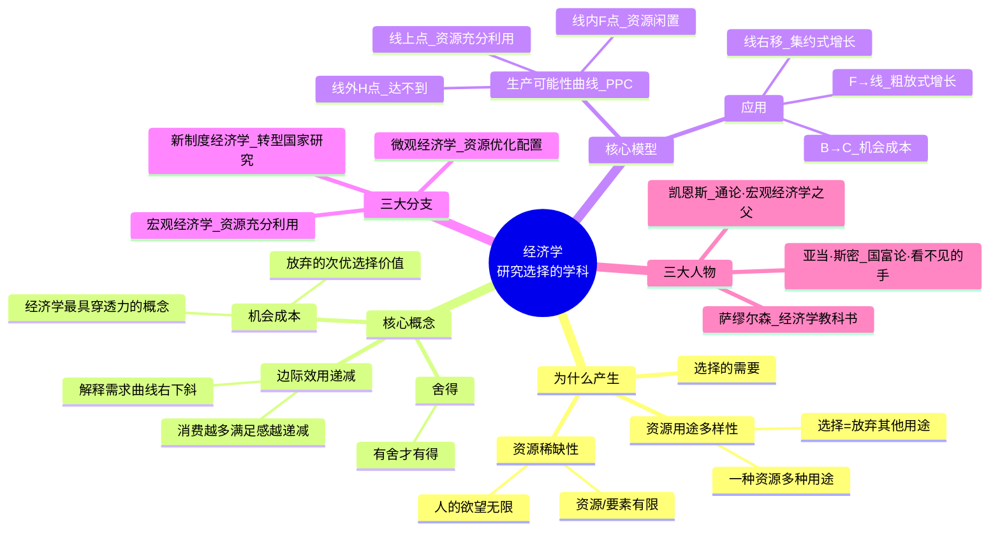
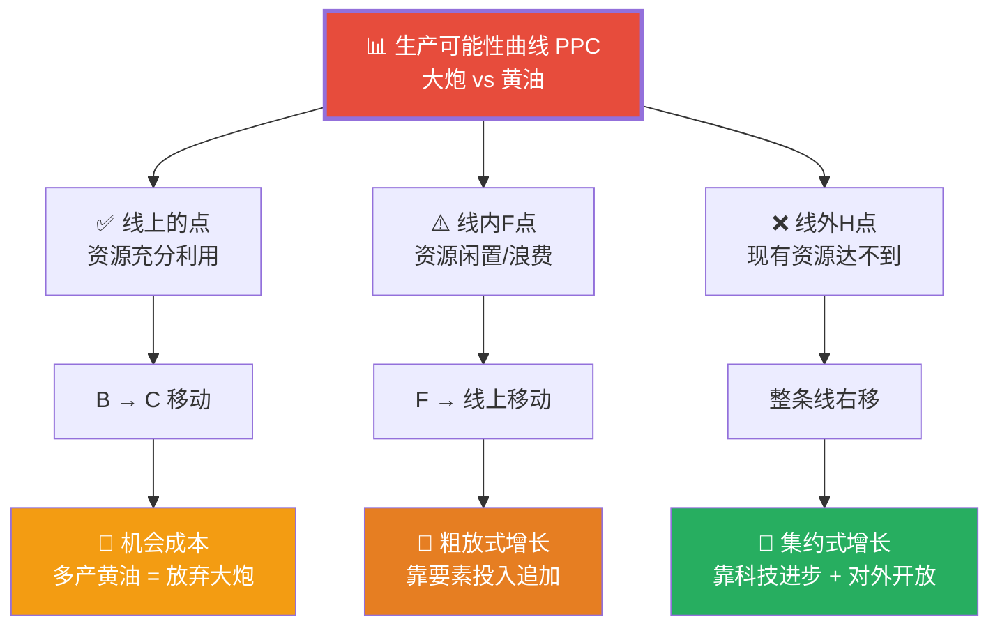
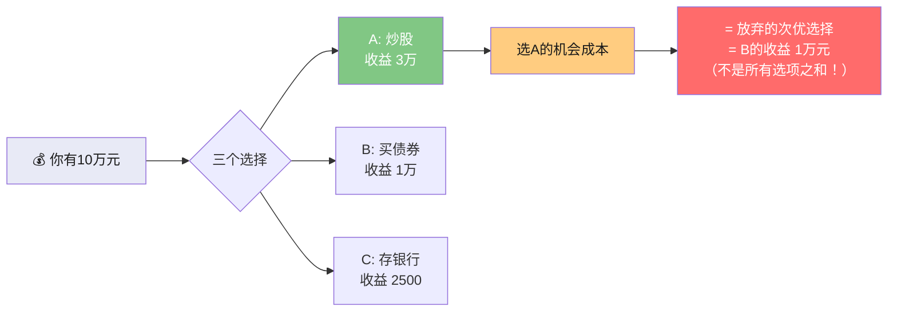
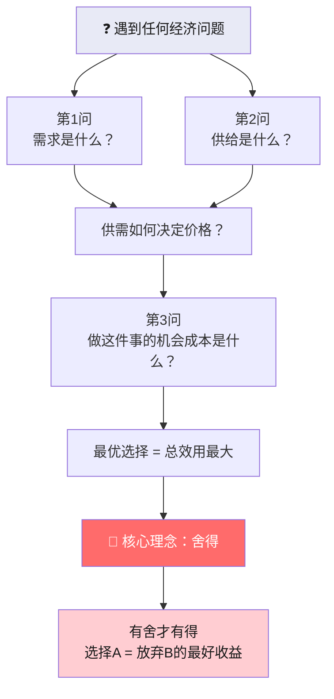

# C002 经济学原理第1课 · 记忆图

> 一张图记住经济学三大基石：稀缺性 → 选择 → 机会成本，用生产可能性曲线（PPC）串起全部核心概念

---

## 一、经济学全景 · 一张图理解

---

## 二、生产可能性曲线（PPC）· 核心分析工具

---

## 三、机会成本 · 决策思维升级

---

## 四、经济增长两种方式

---

## 五、经济学分析心法

---

## ⚡ 速查卡片

| 概念 | 一句话 | 易错提醒 |
|------|--------|---------|
| 稀缺性 | 欲望无穷 vs 资源有限 | ≠ 贫穷，富裕社会也稀缺 |
| 机会成本 | 放弃的次优选择价值 | ≠ 所有放弃选项之和！ |
| PPC线上点 | 资源充分利用 | 不一定最优，需看总效用最大 |
| PPC线内点 | 资源闲置 | 粗放增长有意义（把闲置用起来） |
| PPC线外点 | 现有资源达不到 | 靠科技进步+开放才能实现 |
| 边际效用递减 | 消费越多满足越少 | 解释需求曲线向下倾斜 |

> 🎓 **老师金句记忆**：
> - "经济学是一门研究选择的学科——选择无处不在"
> - "机会成本是经济学最具穿透力的概念"
> - "舍得——有舍才有得"
> - "供需分析 + 成本收益分析 = 经济学的核心分析方法"
