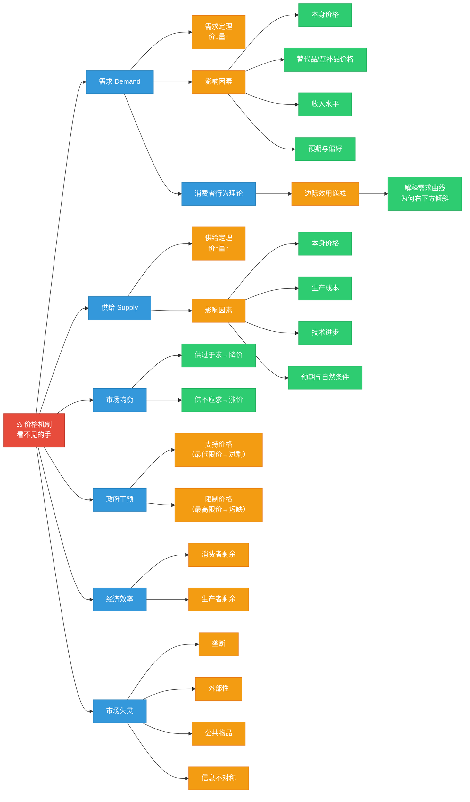

# C002 第 2 课：微观经济学概述——供求与市场机制

## 一句话总结

微观经济学的核心是价格机制——需求与供给两种力量在市场中的相互作用决定价格，价格反过来引导资源配置，回答"生产什么、如何生产、为谁生产"三大基本问题。

## 课程定位

本课是经济学原理第二课，承接第 1 课的导论框架（稀缺性→选择→机会成本），进入微观经济学的具体内容。老师用一上午的时间串讲了微观经济学的主要理论板块，重点围绕"均衡价格理论"展开。

## 微观经济学的三大基本问题

| 问题 | 计划经济下的答案 | 市场经济下的答案 |
|---|---|---|
| 生产什么？ | 计划者根据对社会需要的理解来决定 | 价格信号引导——什么赚钱就生产什么 |
| 如何生产？ | 按计划分配的资源和方式 | 企业自主选择（劳动密集型 vs 资本技术密集型） |
| 为谁生产？ | 按票证、按工分等配给制度 | 按要素提供量和要素价格决定报酬 |

> 中国从计划经济向市场经济转型，转型的核心就是从计划配置资源转向让市场机制在资源配置中起决定性作用。

---

## 微观经济学的整体框架

```
需求 + 供给 → 均衡价格理论（价格机制）
    ↓
深入需求背后 → 消费者行为理论（效用论）
深入供给背后 → 企业生产与成本理论
    ↓
产品市场结构 → 完全竞争 / 垄断竞争 / 寡头垄断 / 完全垄断
    ↓
要素市场 → 劳动（工资）、土地（地租）、资本（利息）、企业家才能（正常利润）
    ↓
一般均衡 → 所有市场同时均衡 → 帕累托最优
    ↓
市场失灵 → 垄断、外部性、公共物品、信息不对称 → 微观规制
```

---

## 一、需求（Demand）

### 需求的定义

消费者在某一时间内、每一价格水平上**愿意**且**能够**购买的商品数量。

> 两个条件缺一不可：购买意愿 + 购买能力。有欲望没钱不算需求（如 1998 年老百姓想买车买房但买不起）。

### 需求定理

在其他条件不变时，商品价格越高，需求量越少；价格越低，需求量越多。需求曲线**向右下方倾斜**。

> 特例：炫耀型商品（价格越高越买），但多数商品符合需求定理。

### 影响需求的因素

| 因素 | 影响方向 |
|---|---|
| 商品本身价格 | 价格↑ → 需求量↓（沿需求曲线移动 = 需求量的变动） |
| 替代品价格 | 替代品价格↑ → 本商品需求↑ |
| 互补品价格 | 互补品价格↑ → 本商品需求↓ |
| 消费者收入 | 正常商品：收入↑ → 需求↑；低档商品：收入↑ → 需求↓ |
| 消费者预期 | 预期涨价→现在多买；预期跌价→现在少买 |
| 消费者偏好 | 偏好越强 → 需求越大 |
| 人口/政策等 | 人口增加、消费券等 → 需求增加 |

### 需求量的变动 vs 需求的变动

| | 需求量的变动 | 需求的变动 |
|---|---|---|
| 原因 | 商品本身价格变化 | 价格以外其他因素变化 |
| 图形表现 | 沿同一需求曲线移动 | 整条需求曲线平移 |
| 方向 | 价格↓→需求量↑ | 需求增加→曲线右移；需求减少→曲线左移 |

---

## 二、供给（Supply）

### 供给的定义

生产者在某一时间内、每一价格水平上**愿意**且**能够**提供的商品数量。

> 两个条件：供给意愿 + 供给能力。两者可以分离——微笑曲线中，耐克只管研发设计和品牌营销，生产全部外包。

### 供给定理

价格越高，供给量越多；价格越低，供给量越少。供给曲线**向右上方倾斜**。

### 影响供给的因素

| 因素 | 影响方向 |
|---|---|
| 商品本身价格 | 价格↑ → 供给量↑（沿供给曲线移动） |
| 生产成本 | 成本↑ → 供给↓ |
| 技术进步 | 技术进步→成本↓→供给↑ |
| 生产者预期 | 预期行情好→扩大供给；预期萎缩→缩减供给 |
| 自然条件 | 风调雨顺→农产品供给↑ |

---

## 三、市场均衡与价格机制

### 均衡价格的形成

需求曲线与供给曲线的交点决定**均衡价格**和**均衡数量**。

- 价格 **高于** 均衡价格 → 供过于求（过剩）→ 企业降价 → 回到均衡
- 价格 **低于** 均衡价格 → 供不应求（短缺）→ 价格上涨 → 回到均衡

> **价格机制的核心要义**：当产品价格偏离均衡价格时，它会自动回到均衡价格水平。这就是"看不见的手"。

### 均衡价格的变动（供求定理）

| 变动来源 | 对均衡价格的影响 | 对均衡数量的影响 |
|---|---|---|
| 需求增加（曲线右移） | 价格↑ | 数量↑ |
| 需求减少（曲线左移） | 价格↓ | 数量↓ |
| 供给增加（曲线右移） | 价格↓ | 数量↑ |
| 供给减少（曲线左移） | 价格↑ | 数量↓ |

**两句话记忆**：
- 需求的变动引起均衡价格与均衡数量**同方向**变动
- 供给的变动引起均衡价格**反方向**变动、均衡数量**同方向**变动

### 供需同时变动

| 情况 | 价格 | 数量 |
|---|---|---|
| 需求↑ + 供给↑ | 不确定 | 增加 |
| 需求↓ + 供给↓ | 不确定 | 减少 |
| 需求↑ + 供给↓ | 上升 | 不确定 |
| 需求↓ + 供给↑ | 下降 | 不确定 |

---

## 四、政府干预：支持价格与限制价格

### 支持价格（最低限价）

政府规定的高于均衡价格的最低价格。如粮食保护价。

- **结果**：供过于求，出现过剩
- **应对**：政府收购过剩产品 → 储存、出口或援助
- **激励效应**：农民有动力提高单产 → 农业成为技术进步最快的部门之一

### 限制价格（最高限价）

政府规定的低于均衡价格的最高价格。如住房限价。

- **结果**：供不应求，出现短缺
- **连锁反应**：抢购 → 排队 → 配给标准（如社保年限） → 黑市
- **中国历史**：计划经济时代是典型的短缺经济 → 票证制度

---

## 五、经典案例分析

### 房价为什么涨？（2003 年至今）

用供需模型分析：
- **需求大幅增加**：收入增长 + 城镇化率从 17.8% → 64.7%（大量人口进城需要住房）
- **供给也增加，但增幅小于需求**：土地供给受计划控制
- **结果**：需求增幅 > 供给增幅 → 房价上涨

> 判断房价三要素：短期看政策、中期看土地（供给）、长期看人口（需求）

### 手机价格为什么跌？

- 需求增加（人人都用手机）
- 但供给增加更多（技术进步使成本大幅下降、产量暴增）
- 供给增幅 > 需求增幅 → 价格下降

---

## 六、消费者行为理论（效用论）

### 效用

消费者从消费商品中获得的满足感。

- **总效用**：消费一定量商品得到的总满足感
- **边际效用**：每增加一单位消费带来的额外满足感

### 边际效用递减规律

随着消费量的增加，每增加一单位消费带来的边际效用是**递减**的。

> 举例：吃第一个包子满足感最强，第二个下降，第三个更低……这解释了为什么需求曲线向右下方倾斜——消费者愿意支付的价格取决于边际效用的大小。

### 对管理学的启发

- 收入越高的人，最后一元钱的边际效用越低
- 因此对不同收入层次的员工，激励方式（奖励力度）应该是分层的

### 消费者均衡

消费者在收入约束下实现效用最大化的条件：
> 每一种商品的边际效用与价格之比相等 = 单位货币的边际效用

---

## 七、经济效率：消费者剩余与生产者剩余

在均衡价格下，全社会总经济剩余（消费者剩余 + 生产者剩余）最大。任何偏离均衡价格的行为（如政府限价）都会造成经济福利损失。

| 概念 | 含义 |
|---|---|
| 消费者剩余 | 消费者愿意支付但实际没有支付的价格（降价有利于消费者） |
| 生产者剩余 | 生产者实际收益超过其最低要求补偿的部分 |

---

## 八、市场失灵与微观规制

### 市场失灵的四种情况

| 类型 | 表现 | 应对 |
|---|---|---|
| 垄断 | 垄断者不会自己反垄断 | 反垄断法、政府监管 |
| 外部性 | 私人行为给他人带来成本（污染）或收益 | 征税（庇古税）、排污权交易、产权界定 |
| 公共物品 | 非排他性 + 非竞争性 → 私人不愿提供 | 政府提供（税收→公共服务） |
| 信息不对称 | 买方和卖方拥有不对等的信息 | 信息披露制度、信号传递 |

---

## 核心概念

| 概念 | 定义 |
|---|---|
| 需求 | 消费者愿意且能够购买的商品数量 |
| 供给 | 生产者愿意且能够提供的商品数量 |
| 需求定理 | 价格↑→需求量↓（其他条件不变） |
| 供给定理 | 价格↑→供给量↑（其他条件不变） |
| 均衡价格 | 需求与供给相等时的价格 |
| 替代品 | 交替使用满足同一需要的商品（如猪肉和牛肉） |
| 互补品 | 搭配使用满足同一需要的商品（如汽车和汽油） |
| 正常商品 | 收入增加需求增加的商品 |
| 低档商品 | 收入增加需求减少的商品 |
| 边际效用 | 每增加一单位消费带来的额外满足感 |
| 边际效用递减 | 消费越多，每单位带来的满足感越少 |
| 消费者剩余 | 消费者愿意支付但实际未支付的价格 |
| 帕累托最优 | 不使别人变坏就不能使自己变好的状态 |
| 市场失灵 | 市场机制不能有效配置资源的情况 |

---

## 老师重点强调

1. **价格机制是市场经济的核心**：当价格偏离均衡时，会自动回归——这就是"看不见的手"。
2. **需求 = 购买意愿 + 购买能力**，两者缺一不可。
3. **短期看政策，中期看土地，长期看人口**——这是分析房价的经典框架。
4. **微观经济学不是只研究企业**：也研究消费者、政府、市场之间的关系。
5. **转型国家的特殊性**：中国是计划经济向市场经济转型的国家，新制度经济学对此有特殊解释力。
6. **微笑曲线**：研发设计和品牌营销处于高附加值两端，加工制造处于低附加值中间——转型就是向两端走。

---

## 关键例子

| 例子 | 说明 |
|---|---|
| 房价为什么涨 | 需求增幅（收入+城镇化）> 供给增幅（土地计划控制）→ 房价上涨 |
| 手机价格为什么跌 | 技术进步→成本大幅下降→供给暴增→价格下降 |
| 猪肉涨价对牛肉需求的影响 | 替代品：猪肉价涨→多买牛肉（需求增加） |
| 汽油涨价对汽车需求的影响 | 互补品：汽油价涨→汽车需求减少 |
| 粮食保护价 | 支持价格→供过于求→政府收购储存 |
| 住房限价 | 限制价格→短缺→抢购、排队、社保年限排序 |
| 微笑曲线 | 耐克不生产一双鞋，只抓研发设计和品牌营销→获取90%利润 |
| 吃包子的边际效用 | 第一个满足感最强，逐次递减→边际效用递减 |

---

## 易混/易错点

| 易混点 | 正确认识 |
|---|---|
| 需求量的变动 vs 需求的变动 | 前者沿曲线移动（本身价格变），后者整条曲线平移（其他因素变） |
| 替代品与互补品 | 替代品：替换关系（肉与肉）；互补品：搭配关系（车与油） |
| 正常商品 vs 低档商品 | 因人而异、因收入变化而异——收入提高后自行车从正常品变低档品 |
| 支持价格与限制价格 | 支持价格高于均衡价→过剩；限制价格低于均衡价→短缺 |
| 需求定理的特例 | 炫耀型商品（越贵越买），但绝大多数商品符合需求定理 |
| 边际效用递减不成立？ | 成瘾品（毒品、抖音）看似边际效用递增，但获得同样满足需要更大剂量，本质仍是递减 |
| 涨价一定对消费者不利？ | 不一定。如果是供给减少导致的涨价确实不利；但需求增长驱动的涨价往往伴随经济发展 |

---

## 知识图谱



### 分析口诀

| 场景 | 口诀 |
|---|---|
| 任何价格问题 | 先画供需两条线，找均衡点，再看哪条线移动、移动多少 |
| 房价分析 | 短期看政策、中期看土地、长期看人口 |
| 经济转型 | 从微笑曲线中间（制造）向两端（研发+品牌）走 |
| 政府干预 | 支持价→过剩需收购；限制价→短缺必有黑市 |

---

## 我的待解决问题

- 弹性（需求价格弹性、收入弹性、交叉弹性）的具体计算方法和应用场景？
- 不同市场结构（完全竞争、垄断竞争、寡头、完全垄断）下企业的定价策略有何不同？
- 帕累托最优在现实中真的能达到吗？"非帕累托改进"的改革如何推进？
- 新制度经济学中的交易费用理论如何具体解释企业边界？

---

## 复习题

1. 微观经济学的三大基本问题是什么？市场如何回答这些问题？
2. 需求定理和供给定理分别是什么？
3. 需求量的变动和需求的变动有什么区别？
4. 替代品和互补品的价格变化如何影响需求？
5. 均衡价格是如何形成的？
6. 供求定理的两句话是什么？
7. 支持价格和限制价格分别会导致什么结果？
8. 为什么房价长期上涨？用供需模型解释。
9. 什么是边际效用递减规律？它如何解释需求曲线向右下方倾斜？
10. 消费者均衡的条件是什么？
11. 市场失灵有哪四种情况？各有什么应对措施？
12. 什么是消费者剩余和生产者剩余？

---

## 行动清单

- 选一个你关心的商品（如房价、油价、某股票），用供需模型分析其价格走势。
- 思考自己最近一次消费决策，是否可以用"边际效用递减"来解释你为何没有买更多？
- 关注一项政府价格干预政策（如粮食保护价、住房限价），分析其实际效果。
- 理解微笑曲线后，思考你所在企业的核心竞争力在曲线的哪个位置？
- 预习宏观经济学部分：GDP 是如何核算的？
