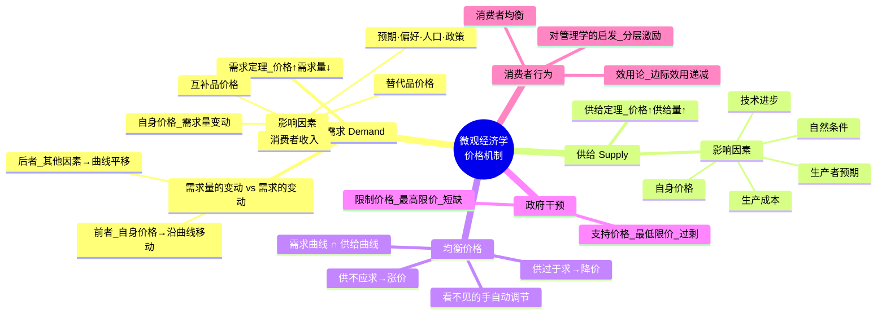
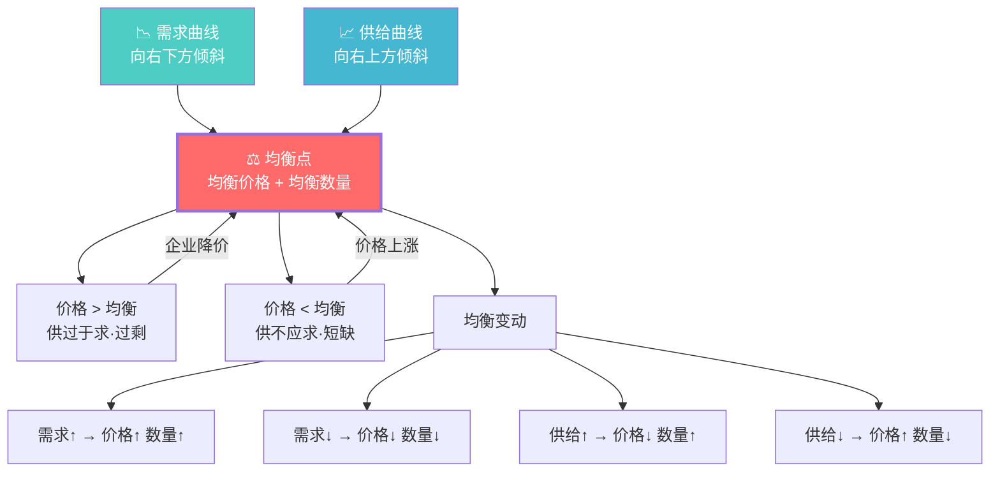
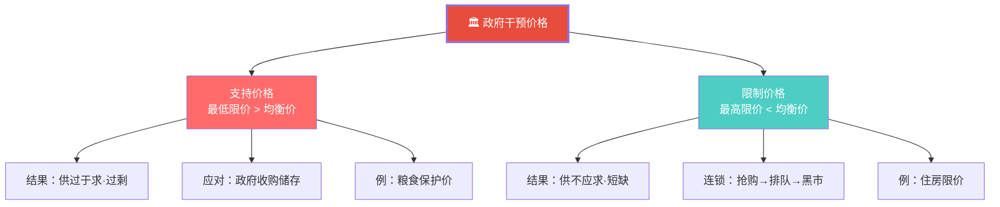
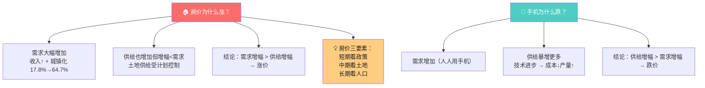
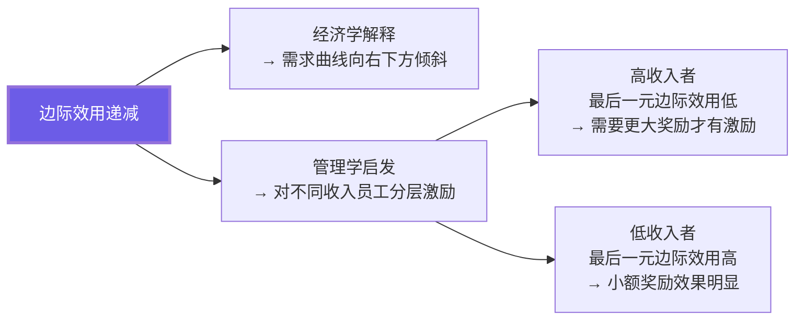

# C002 经济学原理第2课 · 记忆图

> 一张图记住微观经济学核心：需求 + 供给 → 均衡价格 → "看不见的手"自动调节市场

---

## 一、微观经济学全景框架

---

## 二、供需均衡 · 核心动力图

---

## 三、需求量的变动 vs 需求的变动

---

## 四、政府干预的两种价格

---

## 五、经典案例 · 供需分析

---

## 六、效用论与管理学启发

---

## ⚡ 速查卡片

| 要判断什么？ | 看什么指标 | 口诀 |
|-------------|-----------|------|
| 需求量变还是需求变？ | 原因是不是自身价格 | 自身价格→沿曲线；其他→平移 |
| 均衡价涨还是跌？ | 供需谁变动更大 | 需求同向、供给反向 |
| 支持价格 vs 限制价格 | 高于还是低于均衡价 | 支持高→过剩；限制低→短缺 |
| 替代品涨价影响 | 本商品需求增加 | 替代品贵了→买我的 |
| 互补品涨价影响 | 本商品需求减少 | 互补品贵了→少买我的 |

> 🎓 **老师金句记忆**：
> - "价格机制：看不见的手自动调节市场"
> - "需求的变动引起均衡价格与数量同方向变动"
> - "供给的变动引起均衡价格反方向、数量同方向变动"
> - "房价三要素：短期看政策、中期看土地、长期看人口"
