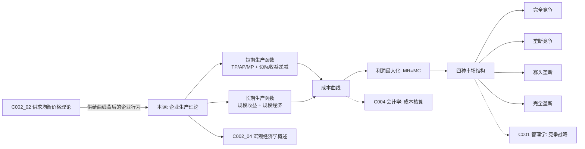

# C002 第 3 课：企业生产理论与市场结构

## 一句话总结

企业是经济学的"生产函数"——投入要素、产出产品，在边际收益等于边际成本时实现利润最大化；而市场结构（完全竞争→垄断竞争→寡头→完全垄断）决定了企业定价权和竞争策略。

## 课程定位

本课是经济学原理第三课，承接第 2 课的供求均衡价格理论，深入供给背后的企业生产行为分析（生产函数、成本、利润最大化），然后展开四种市场结构的比较，最后引入宏观经济学的框架概述。

---

## 一、企业生产理论：短期分析

### 经济学研究企业的视角

经济学把企业看作一个**生产函数**：投入→产出。至于"如何从投入到产出"这个黑箱过程，是管理学研究的领域。

### 短期生产函数

短期：至少有一种要素固定不变，另一种要素可变。

```
Q = f(K̄, L)  或  Q = f(K, L̄)
```

- 传统行业：资本（K）难变，劳动（L）易变
- 高科技行业（风投发达）：资本易得，但创业者（L）稀缺

### 总产量、平均产量、边际产量

| 指标 | 公式 | 含义 |
|---|---|---|
| 总产量 TP | TP = f(L) | 一定劳动投入下的总产出 |
| 平均产量 AP | AP = TP / L | 每单位劳动的平均产出 |
| 边际产量 MP | MP = ΔTP / ΔL | 增加一单位劳动所增加的产出 |

**三者关系**（图形要点）：
- MP 先升后降（倒 U 型），在 A 点（拐点）达到最大值
- AP 也是倒 U 型，在 E 点达到最高
- **E 点处：MP = AP**（平均产量最高时，边际产量等于平均产量）

> 类比：前 4 门课平均 80 分，第 5 门（边际）考 90 → 平均分上升；第 5 门考 70 → 平均分下降。

### 边际收益递减规律

**内容**：短期中，技术和其它要素给定，不断追加一种可变要素，边际产量最终必然递减。

> 反证法：一亩地不断追加劳动力，如果边际产量不递减，一亩地就能养活 14 亿人——这不可能。

**知识经济中的特例**：基础知识研究可能带来边际收益递增，引发革命性科技变革（蒸汽机→电力→计算机→互联网→生命科学）。

### 企业合理投入区间

| 追求目标 | 对应劳动投入量 |
|---|---|
| 劳动生产效率最高 | L₁（MP 最大，成本最低） |
| 产量最大 | L₃（TP 最大） |
| 利润最大 | L₁ 到 L₃ 之间（需结合价格） |

> 合理区间内，边际产量处于递减阶段——这就是**边际收益递减规律**的体现。

---

## 二、企业生产理论：长期分析

### 规模收益（Returns to Scale）

所有要素同比例扩大时，产量增加的幅度：

| 阶段 | 含义 | 例子 |
|---|---|---|
| 规模收益递增 | 产量增幅 > 要素投入增幅 | 投入翻倍，产出 2.2 倍 |
| 规模收益不变 | 产量增幅 = 要素投入增幅 | 投入翻倍，产出翻倍 |
| 规模收益递减 | 产量增幅 < 要素投入增幅 | 投入翻倍，产出 1.5 倍 |

### 柯布-道格拉斯生产函数

$$Q = A \cdot L^\alpha \cdot K^\beta$$

- $\alpha + \beta > 1$ → 规模收益递增
- $\alpha + \beta = 1$ → 规模收益不变
- $\alpha + \beta < 1$ → 规模收益递减

> 例：$Q = 0.5L^{0.5}K^{0.6}$，$\alpha+\beta=1.1>1$ → 处于规模收益递增阶段。

### 规模经济（Economies of Scale）

| 概念 | 含义 |
|---|---|
| 规模经济 | 规模扩大 → 平均成本下降 |
| 规模不经济 | 规模扩大 → 平均成本上升 |
| 最优规模 | 平均成本最低时对应的规模 |

> 应用：教室大小、高校是否越大越好、城市规模——都有最优规模。

### 城市规模经济的两大效应

| 效应 | 含义 |
|---|---|
| 集聚效应（引力效应） | 规模足够大才能吸引人才、技术、资金 |
| 辐射效应 | 向周边扩散，带动周边发展 |

> 杭州人口从 10 年前的几百万到如今 1200 万+，未来可能 2000 万——这就是规模经济效应。

### 最优要素组合（等产量曲线分析）

长期中所有要素可调，企业选择最佳劳动-资本组合：

**条件**：$$\frac{MP_L}{w} = \frac{MP_K}{r}$$

即：每种要素的边际产量与价格之比相等。

---

## 三、利润最大化原则

### 利润最大化条件

$$MR = MC$$

**边际收益 = 边际成本**

文字解释：
- 若 MR > MC：多生产一单位还能增加利润 → 继续生产
- 若 MR < MC：多生产一单位反而亏损 → 减少生产
- 当 MR = MC：利润达到最大

### 价格等于边际成本（完全竞争下）

若价格不随销量变化（价格接受者），则 $P = MR$，利润最大化条件变为：

$$P = MC$$

**应用——飞机票定价**：杭州到北京航班有空位，两人愿出 300 元/人（正常票价 1000）。边际成本接近 0，边际收益 = 600 → 应该让他们上飞机。

> 航空公司动态调价，目的就是"满员"→ 收益最大化。

---

## 四、供给曲线为什么向右上方倾斜？

**根本原因**：短期边际成本曲线在停止营业点以上的部分是上升的，而 $P = MC$，所以价格与供给量同向变动。

### 停止营业点与盈亏平衡点

| 关键点 | 含义 |
|---|---|
| E 点（停止营业点） | P = AVC 最低点，全部收益恰好弥补全部可变成本，亏损额 = 全部固定成本 |
| F 点（盈亏平衡点） | P = ATC 最低点，不盈不亏 |

| 价格区间 | 企业决策 |
|---|---|
| P < AVC 最低点 | 停产（连可变成本都收不回） |
| AVC 最低点 < P < ATC 最低点 | 生产（虽亏损，但能弥补部分固定成本） |
| P = ATC 最低点 | 盈亏平衡 |
| P > ATC 最低点 | 盈利 |

---

## 五、四种市场结构

### 划分标准

| 市场结构 | 厂商数量 | 产品特征 | 进出难度 | 定价权 |
|---|---|---|---|---|
| 完全竞争 | 众多 | 同质（标准化） | 自由 | 价格接受者 |
| 垄断竞争 | 较多 | 有差别 | 较易 | 有一定影响力 |
| 寡头垄断 | 少数几家 | 可有可无差别 | 较难 | 相互依存 |
| 完全垄断 | 一家 | 无替代品 | 极高壁垒 | 价格制定者 |

### 1. 完全竞争市场

**四大条件**：众多买卖者 + 产品同质 + 要素自由流动 + 信息充分

- 厂商是价格接受者
- 短期均衡：$P = MC$
- 长期均衡：$P = MC = AC$（零经济利润）
- 贴近案例：农产品市场、专业市场（义乌小商品）、完备的股票市场

> 中国股市最大问题：第 4 个条件——信息不充分。

### 2. 垄断竞争市场

**核心特征**：产品差别化（同种产品之间的差别）

- 厂商数目较多，有一定定价权
- 产品差别：质量、型号、包装、售后服务等
- 技术进步使差别保持更久 → 垄断地位更持久
- 案例：洗发水、服装、鞋袜、日用消费品

> 产品同质 → 只剩价格竞争（恶性）；产品差别化 → 品牌即定价话语权。

### 3. 寡头垄断市场

**核心特征**：厂商相互依存

- 寡头 = 实力雄厚的大企业（大亨）
- 可能相互勾结（像一家垄断），也可能翻脸（两败俱伤）
- 无统一模型解释价格产量决定
- 案例：汽车、家电、钢铁、石油、航空、外卖平台（美团 + 饿了么 > 95%）

### 4. 完全垄断市场

**垄断形成原因**：
- 规模经济（自然垄断）
- 巨额资本投入门槛
- 掌握最新技术（专利保护）
- 政府特许（如烟草专卖）
- 资源垄断（如楼外楼的地理位置）
- 创新垄断

> 反垄断反的不是垄断本身，而是不正当竞争行为和动机。创新带来的垄断是国家鼓励的。

---

## 六、中国市场经济结构演变

```
计划经济（政府全管）
    ↓ 放开
完全竞争（市场化初期）
    ↓ 竞争
垄断竞争（产品差别化）
    ↓ 集中
寡头垄断（头部企业做大）
    ↓ 打破垄断
反垄断 → 更多竞争
```

> 当前中国最普遍的两种市场：垄断竞争 + 寡头垄断。

---

## 七、宏观经济学概述

### 宏观经济学三大基本问题

| 问题 | 内容 |
|---|---|
| 宏观经济如何运行？ | 理论模型解释（不同体制、不同时期运行方式不同） |
| 运行中出现什么问题？ | 失业、通胀、经济周期性波动、经济停滞 |
| 如何调控？ | 财政政策、货币政策、产业政策、收入分配政策等 |

### 宏观调控的核心变量

- 力度：为什么 2008 年投 4 万亿，2022 年投 12 万亿？
- 时机、方式、技巧
- 调控的副作用：4 万亿 → 产能过剩 → 供给侧结构性改革（三去一降一补）

### 宏观经济理论模型体系

```
有效需求决定模型（45度线）
    ↓ 假设物价不变、利率不变
IS-LM 模型（利率与产出同时决定）
    ↓ 假设物价不变、利率可变
AD-AS 模型（物价与产出同时决定）
    ↓ 最贴近现实
宏观经济短期波动分析 → 宏观政策
```

### 流派纷争

宏观经济学不像微观经济学那样有统一框架——不同学派对同一问题有不同解释。

---

## 核心概念

| 概念 | 定义 |
|---|---|
| 生产函数 | 投入要素与产出之间的技术关系 |
| 边际产量 | 增加一单位可变要素所增加的总产量 |
| 边际收益递减规律 | 短期中不断追加一种要素，边际产量最终递减 |
| 规模收益递增 | 产量增幅超过要素投入增幅 |
| 规模经济 | 规模扩大带来平均成本下降 |
| 利润最大化条件 | MR = MC（边际收益 = 边际成本） |
| 停止营业点 | P = AVC 最低点，生产与不生产亏损相同 |
| 完全竞争 | 众多买卖者、产品同质、自由进出、信息充分 |
| 垄断竞争 | 产品有差别、厂商较多 |
| 寡头垄断 | 少数大企业相互依存 |
| 完全垄断 | 一家企业代表一个行业 |
| IS-LM 模型 | 产品市场与货币市场同时均衡 |
| AD-AS 模型 | 总需求与总供给决定物价和产出 |

---

## 老师重点强调

1. **利润最大化条件 $MR = MC$** 是经济学最核心的决策原则。
2. **边际收益递减规律**在短期中必然成立，长期靠技术进步突破。
3. **规模经济**解释了为什么各行业集中度越来越高——充分竞争后头部企业越做越大。
4. **产品差别化**是摆脱价格竞争的唯一出路——品牌即定价话语权。
5. **反垄断不反垄断本身**，反的是不正当竞争行为和动机。
6. **宏观政策是艺术**——讲究时机、力度、方式方法，副作用不可忽视。
7. **宏观经济学流派纷争**，不像微观那样统一。

---

## 关键例子

| 例子 | 说明 |
|---|---|
| 飞机票动态定价 | 边际成本 ≈ 0，低价让乘客上飞机仍能增加利润 |
| 外卖平台集中度 | 美团+饿了么 > 95%，充分竞争的结果 |
| 三个和尚没水吃 | 规模不经济的典型 |
| 三个人成虎 / 三个臭皮匠顶诸葛亮 | 规模经济的典型 |
| 永康保温杯 | 技术含量低 → 产品差别保持短 → 利润迅速被模仿者侵蚀 |
| 可口可乐配方 | 技术含量高 → 垄断地位持久 |
| 杭州人口增长 | 城市规模经济效应（集聚+辐射） |
| 四万亿后遗症 | 宏观政策副作用 → 产能过剩 → 供给侧改革 |

---

## 易混/易错点

| 易混点 | 正确认识 |
|---|---|
| 边际收益递减 ≠ 总产量减少 | 递减的是增量，不是总量 |
| 规模收益递减 ≠ 企业亏损 | 只是产量增幅小于投入增幅 |
| 规模经济 ≠ 越大越好 | 超过最优规模 → 规模不经济 |
| 零经济利润 ≠ 不赚钱 | 各要素都获得了应有回报（会计上有利润） |
| 边际收益递减规律有前提 | 技术不变 + 其它要素不变 + 只追加一种要素 |
| 垄断本身无好坏 | 关键在于是否滥用垄断地位 |

---

## 知识图谱



---

## 我的待解决问题

- IS-LM 模型的具体推导过程和使用方法？
- AD-AS 模型如何用于分析中国经济形势？
- 不同市场结构下企业的具体定价策略有何数学推导？
- 四种市场结构在实际中各占多大比例？

---

## 复习题

1. 短期中，总产量、平均产量、边际产量三者关系是什么？
2. 什么是边际收益递减规律？为什么说它在短期中必然成立？
3. 规模收益递增/不变/递减如何用柯布-道格拉斯函数判断？
4. 利润最大化的条件是什么？为什么？
5. 供给曲线为什么向右上方倾斜？
6. 停止营业点和盈亏平衡点各有什么含义？
7. 四种市场结构的主要特征分别是什么？
8. 垄断竞争与完全竞争的关键区别是什么？
9. 宏观经济学有哪三大基本问题？
10. 宏观经济学的三大模型（有效需求、IS-LM、AD-AS）之间的关系是什么？

---

## 行动清单

- 用 $MR = MC$ 原则分析一个企业的定价决策案例。
- 观察你所在行业属于哪种市场结构，判断竞争程度和定价权。
- 思考规模经济在你所在企业是否已经发挥到最优。
- 关注宏观经济新闻中的财政政策和货币政策，识别属于扩张还是紧缩。
- 预习第 4 课：GDP 核算方法和宏观政策分析。
