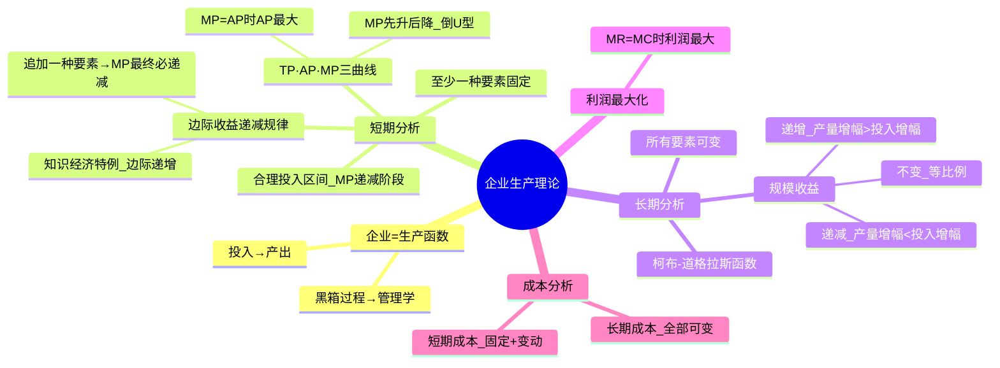
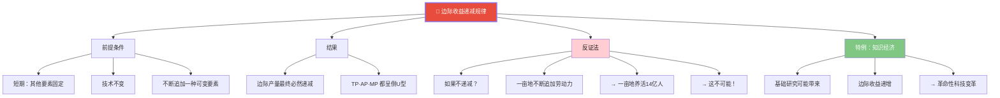
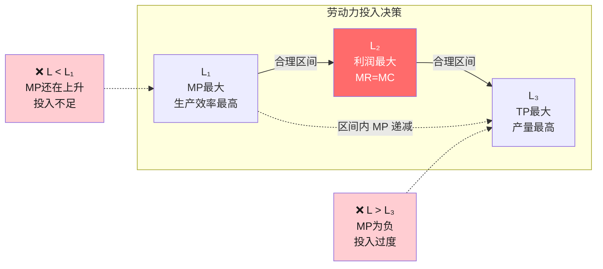
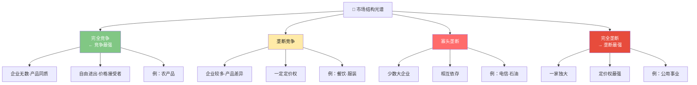
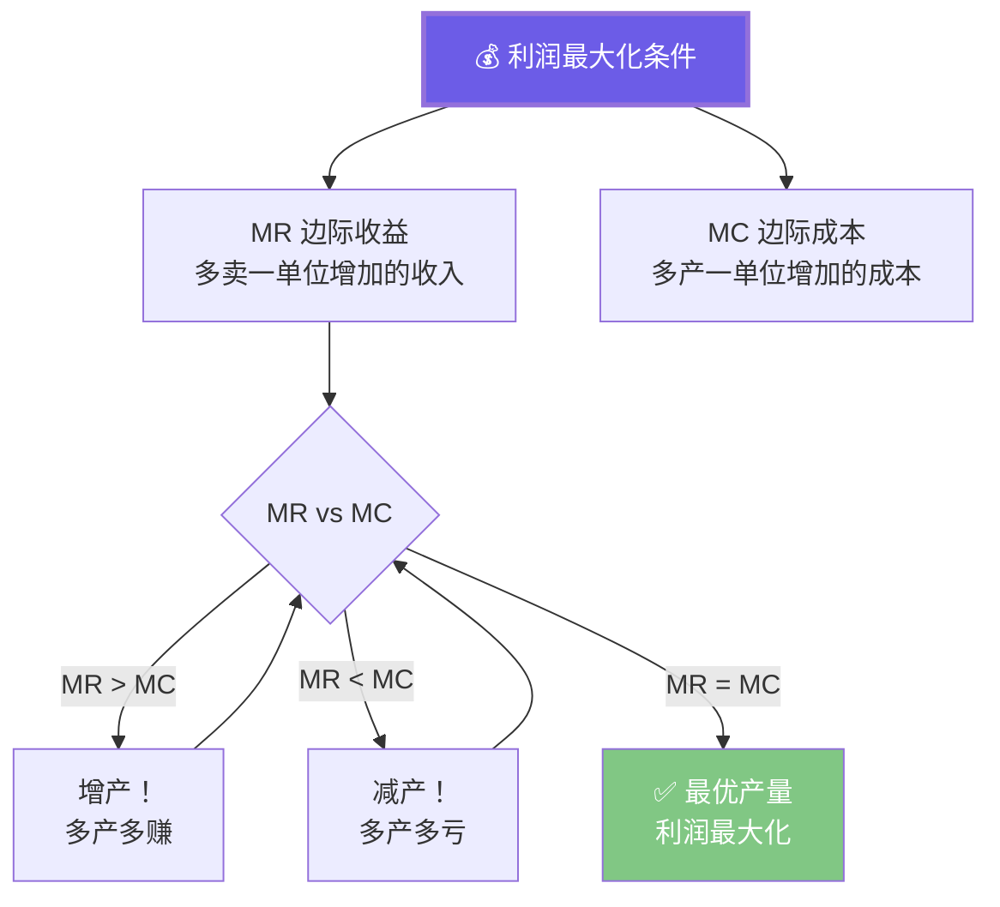

# C002 经济学原理第3课 · 记忆图

> 一张图记住企业生产理论（短期边际递减 + 长期规模收益）与四种市场结构的核心区别

---

## 一、企业生产理论全景

---

## 二、边际收益递减规律 · 核心图解

---

## 三、合理投入区间

---

## 四、四种市场结构对比

---

## 五、利润最大化核心公式

---

## ⚡ 速查卡片

| 分析维度 | 核心概念 | 一句话口诀 |
|----------|----------|-----------|
| 短期生产 | 边际收益递减 | 追加必有极限 |
| 长期生产 | 规模收益 | 翻倍投入看产出增幅 |
| 利润最大化 | MR = MC | 边际收益 = 边际成本 |
| 市场结构 | 竞争→垄断光谱 | 企业越多越竞争，越少越垄断 |
| 成本分类 | 固定 vs 变动 | 短期有固定，长期全变动 |

> 🎓 **老师金句记忆**：
> - "企业是经济学中的生产函数——投入→产出"
> - "边际收益递减：一亩地养不活14亿人"
> - "知识经济可能带来边际收益递增"
> - "MR = MC 时利润最大——多赚一分钱的代价超过一分钱就不干了"
