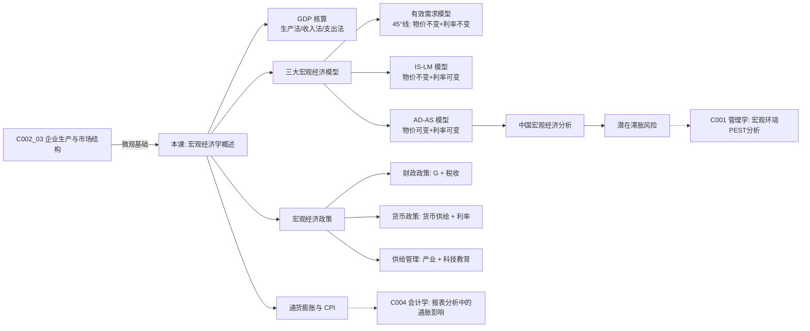

# C002 第 4 课：宏观经济学概述——GDP、通胀与宏观经济政策

## 一句话总结

宏观经济学通过 GDP（总产出）和 CPI（物价水平）两大核心指标衡量经济运行，用 AD-AS 模型解释经济波动，并依靠财政与货币政策进行调控——而中国面临的核心挑战是"经济增速下滑与通胀压力并存，潜在滞胀风险不容忽视"。

## 课程定位

本课是经济学原理第四课（最后一课），从微观进入宏观，系统讲解 GDP 核算、通胀衡量、有效需求决定模型、IS-LM 模型、AD-AS 模型，并用 AD-AS 模型分析中国宏观经济形势——最终落脚于滞胀风险与转型方向。

---

## 一、GDP（国内生产总值）

### GDP 的定义

一定时期内，在一个国家或地区范围内，生产要素所生产的**全部最终产品和服务**的市场价格总额。

### GDP 的五个关键特征

| 特征 | 说明 |
|---|---|
| ① 流量而非存量 | 一段时期内的变化量（年/季/月） |
| ② 生产而非销售 | 今年生产没卖掉也计入；去年生产今年卖掉不计入 |
| ③ 最终产品而非中间产品 | 用**增加值法**区分：各环节增加值之和 = 最终产品价值 |
| ④ 不包含非市场交易 | 自产自销、家务劳动不计入 |
| ⑤ 国土原则（非国民原则） | 在一国领土内生产的全计入，不管谁生产的 |

### 增加值法示例

| 环节 | 价值 | 增加值 |
|---|---|---|
| 棉花 | 100 亿 | 100 |
| 棉纱 | 200 亿 | 100 |
| 棉布 | 500 亿 | 300 |
| 服装 | 1000 亿 | 500 |
| **GDP** | | **1000 亿** |

> 第一产业增加值 + 第二产业增加值 + 第三产业增加值 = GDP
> 
> 中国 2021 年产业结构：第一产业 7.3%，第二产业 39.3%，第三产业 53.3%

### GDP 的三种核算方法

| 方法 | 思路 | 别名 |
|---|---|---|
| 生产法（部门法） | 各产业增加值求和 | "生产了什么" |
| 收入法 | 全部要素报酬求和（工资+利息+租金+利润+税收+折旧） | "谁拿到了什么" |
| 支出法 | 最终产品的去向：C + I + G + (X - M) | "三驾马车" |

### 三驾马车

$$\text{GDP} = \underbrace{C}_{\text{消费}} + \underbrace{I}_{\text{投资}} + \underbrace{G}_{\text{政府购买}} + \underbrace{(X-M)}_{\text{净出口}}$$

> 三种方法算出来的结果不一样，以**支出法**最重要——生产的东西最终要卖出去。

---

## 二、GDP vs GNP

| 指标 | 原则 | 含义 |
|---|---|---|
| GDP | 国土原则 | 在一国领土内创造的产值 |
| GNP | 国民原则 | 一国国民在世界范围内创造的产值 |

> "温州经济不行了，但温州人经济还行"——温州经济 = GDP，温州人经济 = GNP。

---

## 三、GDP 的局限与补充指标

| 局限 | 补充指标 |
|---|---|
| 不能反映福利水平 | 人均 GDP（中国约 1.25 万美元，接近发达国家门槛） |
| 遗漏地下经济 | 地下经济估算（现钞增减法、收支差异法） |
| 遗漏非市场交易 | — |
| 不同货币不可比 | 购买力平价 PPP（中国 PPP 约 4:1 美元，汇率约 6.x:1） |
| 名义 GDP 受物价影响 | 实际 GDP = 名义 GDP ÷ GDP 平减指数 |
| 不反映资源利用程度 | 潜在 GDP（资源充分利用时的最大产出） |

---

## 四、通货膨胀与 CPI

### 通货膨胀

在信用货币制度下，流通中货币超过经济增长所需量，引起货币贬值和价格水平**全面持续**上涨。

### 物价指数类型

| 指数 | 关注对象 |
|---|---|
| CPI（消费物价指数） | 老百姓生活相关的一篮子消费品 |
| PPI（生产物价指数） | 企业关注的工业品价格 |
| RPI（零售物价指数） | 零售环节 |
| GDP 平减指数 | 全部最终产品和服务的价格（更全面） |

### 通胀率计算

$$\text{通胀率} = \frac{\text{本期物价指数} - \text{上期物价指数}}{\text{上期物价指数}} \times 100\%$$

---

## 五、有效需求决定模型（凯恩斯 45° 线模型）

### 两部门经济循环

```
居民 ←→ 厂商
居民提供要素 → 厂商支付报酬
厂商提供产品 → 居民消费支出
```

银行中介解决信息不对称：居民储蓄 → 银行贷款 → 企业投资。

### 四部门经济

两部门 → 加入政府（税收 + 政府购买 + 转移支付）→ 加入国外（进出口）。

### 有效需求

**有效需求** = 总需求与总供给相等时的总需求。在 45° 线模型中，均衡总产出 $Y$ 与有效需求 $AD$ 同时决定。

### 凯恩斯对失业的解释

| 概念 | 含义 |
|---|---|
| 周期性失业 | 经济衰退/萧条时的失业（凯恩斯针对 1929-33 大危机提出） |
| 自然失业 | 摩擦性、结构性、季节性、自愿失业 |

**逻辑链**：
$$周期失业 \xleftarrow{原因} 实际产出Y_0 < 充分就业产出Y_F \xleftarrow{原因} 实际需求AD_0 < 充分就业需求AD_F \xleftarrow{原因} 有效需求不足$$

### 有效需求不足的原因

| 需求类型 | 不足的原因 |
|---|---|
| 消费需求不足 | 边际消费倾向递减（收入↑但消费比例↓） |
| 投资需求不足 | 投资边际效率递减 + 利率下降到一定程度不再下降（流动性陷阱） |

---

## 六、流动性陷阱与货币政策局限

### 货币需求

| 类型 | 动机 | 与利率关系 |
|---|---|---|
| 交易性货币需求 | 交易 + 预防 | 无关（只与收入有关） |
| 投机性货币需求 | 持有债券/股票 vs 持有现金 | 负相关 |

### 流动性陷阱

当利率降到极低时，人们预期利率只会上涨，债券价格只会下跌 → 所有人都愿持有现金 → 投机性货币需求无限大 → **货币政策失效**（增发货币无法降低利率）。

> 因此凯恩斯主张**财政政策**而非货币政策。

---

## 七、三大宏观经济模型

| 模型 | 假设 | 决定变量 |
|---|---|---|
| 有效需求模型（45°线） | 物价不变 + 利率不变 | 总产出 Y |
| IS-LM 模型 | 物价不变 + 利率可变 | Y 和利率 r 同时决定 |
| AD-AS 模型 | 物价可变 + 利率可变 | Y 和物价 P 同时决定 |

### 模型推导链

```
产品市场均衡 → IS 曲线（Y 与 r 的关系）
货币市场均衡 → LM 曲线（Y 与 r 的关系）
IS ∩ LM → IS-LM 模型 → 推导出 AD 曲线
劳动力市场 + 生产函数 → AS 曲线
AD ∩ AS → 均衡 Y 和 P
```

---

## 八、AD-AS 模型与中国宏观经济分析

### AS 曲线的三段

| 阶段 | 形状 | 含义 |
|---|---|---|
| 水平段 | 水平线 | 资源充裕，增产不涨价 |
| 上升段 | 正斜率 | 资源逐渐稀缺，增产伴随涨价 |
| 垂直段 | 垂直线 | 资源充分利用，潜在 GDP |

### 四种典型状态

| 状态 | AD | AS | 物价 P | 产出 Y | 现实对应 |
|---|---|---|---|---|---|
| ① AD↑ | 右移 | 不动 | ↑ | ↑ | 改革开放 20 年需求释放；WTO 后出口拉动；4 万亿刺激 |
| ② AD↓ | 左移 | 不动 | ↓ | ↓ | 经济衰退（如 97-98 年） |
| ③ AS↑ | 不动 | 右移 | ↓ | ↑ | **最佳模式**：90 年代美国"两低一高"（低失业低通胀高增长） |
| ④ AS↓（滞胀） | 不动 | 左上移 | ↑ | ↓ | 70 年代石油危机；**当前全球风险** |

### 最佳模式——两低一高

90 年代美国依靠计算机互联网信息革命 → AS 右移 → 低失业 + 低通胀 + 高增长。

> **关键驱动**：技术创新 + 转型升级。

### 中国的战略：空间换时间

- 把超发货币引导到房地产市场（先"腾着"）
- 争取时间加速转型升级，推动 AS 曲线右移
- 最终实现物价稳定 + 经济增长双目标

### 当前核心判断

> **经济增速下滑 + 通胀压力并存 → 潜在滞胀风险不容忽视**

这不是中国独有的问题，也是当今全球经济的现实。

---

## 九、宏观经济政策工具

### 需求管理政策

| 政策 | 扩张 | 紧缩 |
|---|---|---|
| 财政政策 | 增加 G、减税 | 减少 G、增税 |
| 货币政策 | 增加货币供给、降息 | 减少货币供给、加息 |

### 供给管理政策

- 产业政策（产业结构 + 产业组织）
- 科技教育政策（创新的前端是技术，技术的前端是科学，科学的前端是**教育**）
- 收入分配政策

### 中国政府的政策组合（新常态以来）

**积极财政政策 + 稳健货币政策** = 扩张财政 + 紧缩货币 = 理论上是对付**滞胀**的组合拳。

---

## 十、中国宏观经济周期规律

从 1978-2021 年数据看：
- 周期长度拉长，波动幅度下降——经济趋于稳定
- 99 年之前：经济高增长 → 次年高通胀（两条线交错）
- 99 年之后：两条线几乎不再交错——通胀被"关进笼子"（行政+经济手段并用）

---

## 核心概念

| 概念 | 定义 |
|---|---|
| GDP | 一国一定时期内生产的全部最终产品和服务市场价值 |
| GNP | 一国国民在全球范围内创造的生产总值 |
| 增加值 | 各生产环节新增价值，增加值之和 = 最终产品价值 |
| 三驾马车 | 消费、投资、出口 |
| CPI | 消费者物价指数 |
| 通货膨胀 | 货币超发 → 货币贬值 → 物价全面持续上涨 |
| 有效需求 | 总需求 = 总供给时的总需求 |
| 周期性失业 | 经济衰退期因有效需求不足导致的失业 |
| 流动性陷阱 | 利率极低时，货币需求无限大，货币政策失效 |
| 潜在 GDP | 资源充分利用时的最大产出 |
| 滞胀 | 经济停滞 + 高失业 + 高通胀并存 |

---

## 老师重点强调

1. **GDP 统计的是生产而非销售**——今年生产没卖掉也算。
2. **三驾马车**（消费+投资+出口）是分析中国经济的基本框架。
3. **有效需求不足**是凯恩斯解释经济衰退的核心理论。
4. **AD-AS 模型**是最贴近现实的分析工具——物价和产出同时决定。
5. **技术创新的关键**：不是举国体制能解决的，靠企业家+市场+金融配合。
6. **滞胀风险是真实的**：连续多年"积极财政+稳健货币"本身就是对付滞胀的组合。
7. **经济学学习的目的**："经世济民，学以致用"——认识世界，提高解释能力。

---

## 关键例子

| 例子 | 说明 |
|---|---|
| 今年生产没卖掉 | 仍计入今年 GDP |
| 去年建好今年卖掉的房子 | 不计入今年 GDP（但交易税费计入） |
| 面粉是最终产品还是中间产品？ | 取决于谁买——个人买是最终，面包店买是中间 |
| 4 万亿刺激 | 保了 9% 增长，后遗症是产能过剩 → 供给侧改革 |
| 12 万亿（2022） | 力度远超 4 万亿，因为经济下行压力更大 |
| 美国 90 年代"两低一高" | 互联网革命 → AS 右移 → 最佳增长模式 |
| 芯片卡脖子 | 技术创新的举国体制局限性：目标确定型 vs 探索不确定型 |
| 华为断臂求生（卖荣耀） | 技术受制于人的典型案例 |

---

## 易混/易错点

| 易混点 | 正确认识 |
|---|---|
| GDP vs GNP | GDP = 国土原则，GNP = 国民原则 |
| 流量 vs 存量 | GDP 是流量（一段时期），资产是存量（某时点） |
| 名义 GDP vs 实际 GDP | 实际 GDP = 名义 GDP ÷ GDP 平减指数 |
| 有效需求 ≠ 任意需求 | 有效需求 = 总供给 = 总需求时的需求（有支付能力支撑） |
| 充分就业 ≠ 零失业 | 仍有自然失业（摩擦性+结构性+季节性+自愿） |
| 滞胀 ≠ 普通通胀 | 通胀 + 经济停滞 + 失业同时出现 |

---

## 知识图谱



---

## 我的待解决问题

- IS-LM 模型和 AD-AS 模型的具体数学推导？
- 财政政策与货币政策的乘数效应如何计算？
- 中国 M2 超过 GDP 两倍多为什么没有引发严重通胀？
- 购买力平价 PPP 与汇率之间的差距说明了什么？

---

## 复习题

1. GDP 的定义和五个关键特征是什么？
2. GDP 的三种核算方法分别是什么？
3. GDP 和 GNP 有什么区别？
4. GDP 有哪些局限性？如何用补充指标修正？
5. 什么是通货膨胀？如何计算通胀率？
6. 有效需求不足的原因是什么？
7. 什么是流动性陷阱？为什么它使货币政策失效？
8. IS 曲线和 LM 曲线分别代表什么？
9. AD-AS 模型的四种典型状态分别是什么？
10. 什么是滞胀？当前全球经济是否存在滞胀风险？
11. "三驾马车"分别是什么？
12. 为什么说中国"经济增速下滑+通胀压力并存，潜在滞胀风险不容忽视"？

---

## 行动清单

- 查阅最新中国 GDP、CPI 数据，用 AD-AS 模型分析当前经济形势。
- 对比 2008 年 4 万亿和 2022 年 12 万亿刺激政策的背景和效果。
- 关注中国人民银行和财政部的政策动向，判断是扩张还是紧缩。
- 思考你所在行业受宏观经济周期影响的程度。
- 经济学部分学完后，开始会计学基础的学习。
