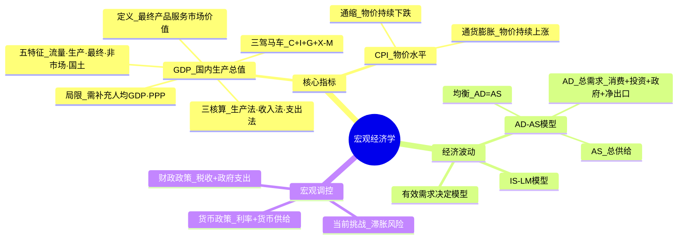
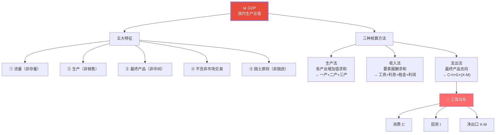
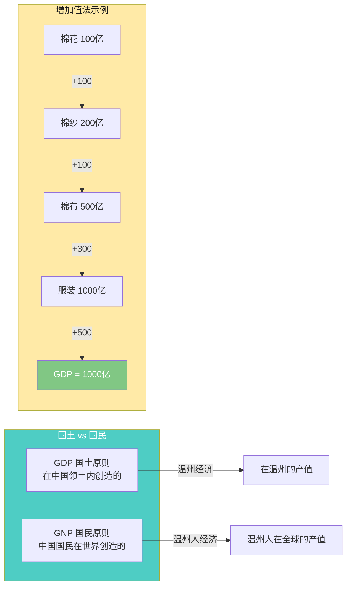
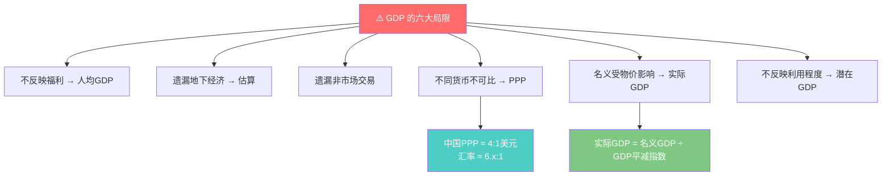
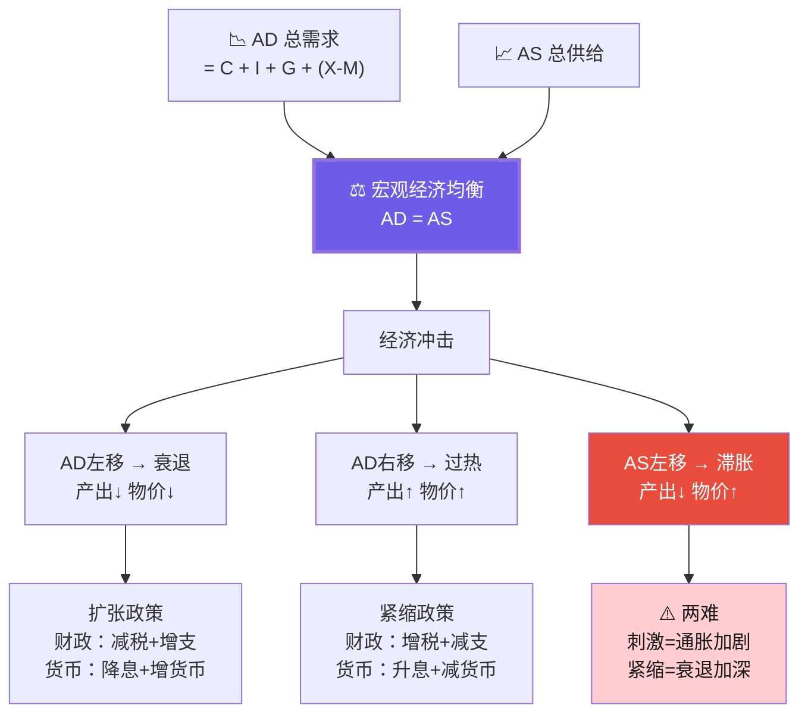
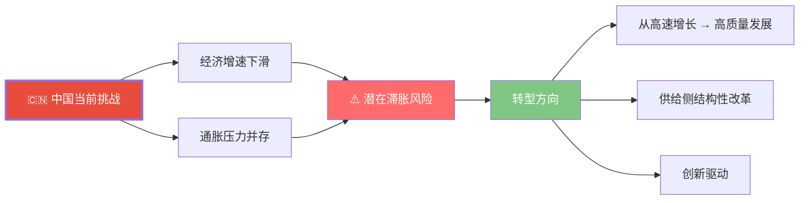

# C002 经济学原理第4课 · 记忆图

> 一张图记住宏观经济学核心：GDP 衡量总产出、CPI 衡量物价、AD-AS 模型解释经济波动、财政与货币政策双调控

---

## 一、宏观经济学全景

---

## 二、GDP · 五特征 + 三核算

---

## 三、GDP vs GNP · 增加值法

---

## 四、GDP 的局限与补充

---

## 五、AD-AS 模型 · 经济波动与调控

---

## 六、中国宏观经济核心挑战

---

## ⚡ 速查卡片

| 指标 | 衡量什么 | 核算公式 | 中国现状 |
|------|----------|----------|----------|
| GDP | 总产出 | C+I+G+(X-M) | 产业结构：7.3/39.3/53.3 |
| 人均GDP | 福利水平 | GDP/人口 | ≈1.25万美元 |
| CPI | 物价水平 | 一篮子商品价格变动 | — |
| 三驾马车 | 增长动力 | 消费+投资+净出口 | 消费占比待提升 |
| 实际GDP | 真实增长 | 名义GDP/平减指数 | — |

> 🎓 **老师金句记忆**：
> - "GDP ≠ 福利，但仍是衡量经济最重要的单一指标"
> - "生产的东西最终要卖出去——支出法最重要"
> - "温州经济不行了，但温州人经济还行"
> - "短期看外部，长期看内部——打铁还需自身硬"
> - "中国经济核心挑战：增速下滑 + 通胀压力 → 滞胀风险"
