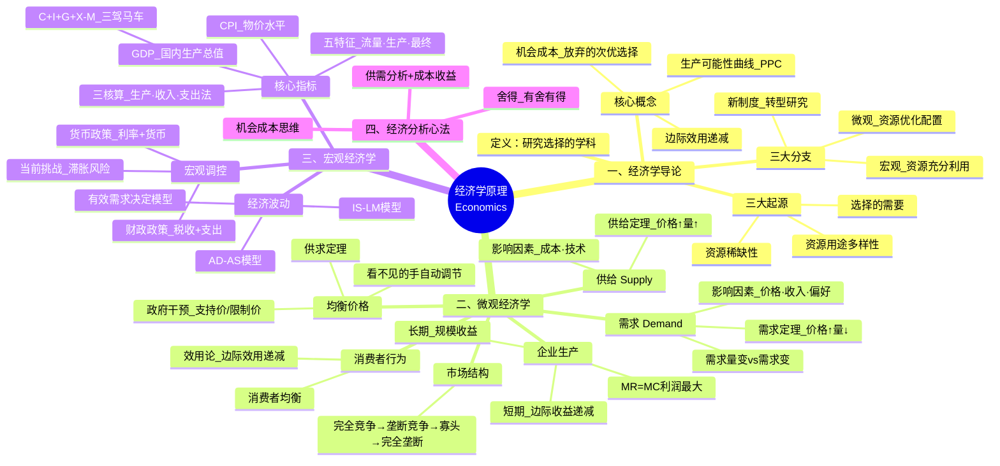

# 经济学原理知识汇总

> 基于 C002 经济学原理 4 课笔记整合而成，涵盖微观经济学与宏观经济学的全部核心内容。

---

## 总览：经济学原理知识体系思维脑图

---

## 模块一：经济学导论——选择与机会成本

### 1.1 经济学是什么

> 经济学是一门研究**选择**的学科。

**完整定义**：经济学是一门研究人和社会如何将具有多种用途的资源有效配置，以生产商品和劳务，来最大限度满足人类现在和将来各种需要的科学。

### 1.2 经济学产生的三大原因

| 原因 | 说明 |
|------|------|
| 资源的稀缺性 | 资源/要素有限，能生产出的商品和劳务也有限 |
| 资源用途的多样性 | 一种资源有多种用途，选择=放弃其他用途 |
| 选择的需要 | 稀缺+多样 → 必须做出选择 |

> 稀缺性 ≠ 贫穷。人的欲望无穷而资源有限，即使富裕社会也存在稀缺性。

### 1.3 机会成本

> 用一定资源生产 X 商品的机会成本 = 所放弃的 Y 产品的数量。

当资源有多种用途时：**机会成本 = 放弃的次优选择本应获得的收益**（不是所有放弃选项之和）。

**机会成本是经济学最具穿透力的概念之一**——它改变了我们看问题的方式。

### 1.4 生产可能性曲线（PPC）

| 点位 | 含义 | 启示 |
|------|------|------|
| 线上的点 | 资源充分利用 | 不同组合代表不同选择 |
| 线内 F 点 | 资源闲置/浪费 | F→线 = 粗放式增长（靠要素投入） |
| 线外 H 点 | 现有资源达不到 | 线右移 = 集约式增长（靠科技+开放） |

### 1.5 经济学三大分支

| 分支 | 研究重点 | 前提假设 |
|------|----------|----------|
| 微观经济学 | 资源优化配置 | 资源已充分利用 |
| 宏观经济学 | 资源充分利用 | 资源已优化配置 |
| 新制度经济学 | 制度对经济的影响 | 转型国家研究 |

---

## 模块二：微观经济学——供需与市场

### 2.1 三大基本问题

| 问题 | 市场经济的答案 |
|------|---------------|
| 生产什么？ | 价格信号引导——什么赚钱就生产什么 |
| 如何生产？ | 企业自主选择（劳动密集型 vs 资本技术密集型） |
| 为谁生产？ | 按要素提供量和要素价格决定报酬 |

### 2.2 需求（Demand）

**需求定理**：价格越高，需求量越少；价格越低，需求量越多。需求曲线**向右下方倾斜**。

| 概念 | 原因 | 图形表现 |
|------|------|----------|
| 需求量的变动 | 自身价格变化 | 沿同一曲线移动 |
| 需求的变动 | 价格以外因素变化 | 整条曲线平移 |

**影响因素**：自身价格、替代品价格、互补品价格、收入、预期、偏好、人口/政策

### 2.3 供给（Supply）

**供给定理**：价格越高，供给量越多；价格越低，供给量越少。供给曲线**向右上方倾斜**。

**影响因素**：自身价格、生产成本、技术进步、生产者预期、自然条件

### 2.4 均衡价格

需求曲线与供给曲线的交点决定**均衡价格**和**均衡数量**。

| 变动来源 | 对价格影响 | 对数量影响 |
|----------|-----------|-----------|
| 需求↑ | 价格↑ | 数量↑ |
| 需求↓ | 价格↓ | 数量↓ |
| 供给↑ | 价格↓ | 数量↑ |
| 供给↓ | 价格↑ | 数量↓ |

> 记忆口诀：需求同向、供给反向（对价格而言）

### 2.5 政府干预

| 类型 | 位置 | 结果 | 连锁反应 |
|------|------|------|----------|
| 支持价格（最低限价） | 高于均衡价 | 供过于求·过剩 | 政府收购储存 |
| 限制价格（最高限价） | 低于均衡价 | 供不应求·短缺 | 抢购→排队→黑市 |

### 2.6 消费者行为（效用论）

**边际效用递减规律**：随着消费量增加，每增加一单位消费带来的边际效用递减。

> 这解释了为什么需求曲线向右下方倾斜——消费者愿意支付的价格取决于边际效用的大小。

**对管理学的启发**：收入越高的员工，最后一元钱的边际效用越低，激励方式和力度应分层设计。

---

## 模块三：微观经济学——企业生产与市场结构

### 3.1 企业 = 生产函数

经济学把企业看作**生产函数**：投入→产出（黑箱过程是管理学领域）。

### 3.2 短期生产：边际收益递减

| 指标 | 公式 | 含义 |
|------|------|------|
| 总产量 TP | TP = f(L) | 一定劳动投入下的总产出 |
| 平均产量 AP | AP = TP / L | 每单位劳动的平均产出 |
| 边际产量 MP | MP = ΔTP / ΔL | 增加一单位劳动所增加的产出 |

**边际收益递减规律**：短期中，技术和其它要素给定，不断追加一种可变要素，边际产量最终必然递减。

> 反证法：如果边际产量不递减，一亩地就能养活 14 亿人——这不可能。

### 3.3 长期生产：规模收益

| 阶段 | 含义 |
|------|------|
| 规模收益递增 | 产量增幅 > 要素投入增幅 |
| 规模收益不变 | 产量增幅 = 要素投入增幅 |
| 规模收益递减 | 产量增幅 < 要素投入增幅 |

### 3.4 利润最大化条件

> **MR = MC**（边际收益 = 边际成本）

- MR > MC → 增产（多产多赚）
- MR < MC → 减产（多产多亏）
- MR = MC → 最优产量

### 3.5 四种市场结构

| 市场结构 | 企业数量 | 产品差异 | 定价权 | 典型行业 |
|----------|----------|----------|--------|----------|
| 完全竞争 | 无数 | 同质 | 价格接受者 | 农产品 |
| 垄断竞争 | 较多 | 有差异 | 一定定价权 | 餐饮、服装 |
| 寡头垄断 | 少数 | 可有可无 | 相互依存 | 电信、石油 |
| 完全垄断 | 一家 | 唯一 | 最强定价权 | 公用事业 |

---

## 模块四：宏观经济学——GDP 与宏观经济

### 4.1 GDP 的定义与五大特征

> 一定时期内，在一国范围内，生产要素所生产的**全部最终产品和服务**的市场价格总额。

| 特征 | 说明 |
|------|------|
| ① 流量而非存量 | 一段时期内的变化量 |
| ② 生产而非销售 | 今年生产没卖掉也计入 |
| ③ 最终产品非中间 | 用增加值法区分 |
| ④ 不含非市场交易 | 自产自销、家务不计入 |
| ⑤ 国土原则 | 在一国领土内生产的全计入 |

### 4.2 GDP 三种核算方法

| 方法 | 思路 | 公式/别名 |
|------|------|-----------|
| 生产法 | 各产业增加值求和 | 一产+二产+三产 |
| 收入法 | 全部要素报酬求和 | 工资+利息+租金+利润+税+折旧 |
| 支出法 | 最终产品去向 | **C + I + G + (X-M)** ——三驾马车 |

### 4.3 GDP vs GNP

| 指标 | 原则 | 含义 |
|------|------|------|
| GDP | 国土原则 | 在一国领土内创造的产值 |
| GNP | 国民原则 | 一国国民在世界范围内创造的产值 |

### 4.4 GDP 的局限与补充

| 局限 | 补充指标 |
|------|----------|
| 不能反映福利 | 人均 GDP |
| 遗漏地下经济 | 地下经济估算 |
| 不同货币不可比 | 购买力平价 PPP |
| 名义受物价影响 | 实际 GDP = 名义 GDP ÷ 平减指数 |
| 不反映利用程度 | 潜在 GDP |

### 4.5 通货膨胀与 CPI

- **通货膨胀**：物价总水平持续上涨
- **CPI**：一篮子商品和服务的价格指数
- 中国面临的独特挑战：**经济增速下滑 + 通胀压力并存 → 潜在滞胀风险**

### 4.6 AD-AS 模型

| 冲击类型 | 原因 | 结果 |
|----------|------|------|
| AD 左移 | 总需求萎缩 | 衰退：产出↓ 物价↓ |
| AD 右移 | 总需求过热 | 过热：产出↑ 物价↑ |
| AS 左移 | 供给冲击 | 滞胀：产出↓ 物价↑（最危险） |

### 4.7 宏观调控

| 政策 | 工具 | 扩张方向 | 紧缩方向 |
|------|------|----------|----------|
| 财政政策 | 税收 + 政府支出 | 减税 + 增支 | 增税 + 减支 |
| 货币政策 | 利率 + 货币供给 | 降息 + 增货币 | 升息 + 减货币 |

---

## 跨模块主题：经济分析核心思维

### 1. 供需分析 + 成本收益

> 遇到任何经济问题，先想：需求是什么？供给是什么？做这件事的机会成本是什么？

### 2. 舍得思维

> 有舍才有得。选择 A = 放弃 B 的最好收益。

### 3. 边际思维

> 理性人考虑边际量。不是"要不要做"，而是"多做一点还是少做一点"。

### 4. 均衡思维

> 市场机制（看不见的手）会自动引导价格回归均衡。

---

## 附录

### 附录A：核心概念词汇表

| 概念 | 定义 |
|------|------|
| 经济学 | 研究选择的学科——资源稀缺+用途多样→选择 |
| 机会成本 | 放弃的次优选择本应获得的收益 |
| 生产可能性曲线 | 资源充分利用时能产生的最大组合连线 |
| 需求定理 | 价格↑ → 需求量↓（向右下方倾斜） |
| 供给定理 | 价格↑ → 供给量↑（向右上方倾斜） |
| 均衡价格 | 需求曲线与供给曲线的交点 |
| 边际效用递减 | 消费越多，每增一单位带来的满足感越小 |
| 边际收益递减 | 短期追加一种要素，边际产量最终递减 |
| 规模收益 | 所有要素同比例扩大时产出的变化 |
| GDP | 国内生产总值：C+I+G+(X-M) |
| CPI | 消费者物价指数 |
| 通货膨胀 | 物价总水平持续上涨 |
| 滞胀 | 经济停滞 + 通货膨胀并存 |
| 财政政策 | 政府通过税收和支出调控经济 |
| 货币政策 | 央行通过利率和货币供给调控经济 |

### 附录B：易混概念辨析

| 易混点 | 正确认识 |
|---|---|
| 稀缺性 = 贫穷 | 错。稀缺是相对的，富裕社会也稀缺 |
| 机会成本 = 所有放弃选项之和 | 错！只等于次优选择的价值 |
| 需求量变 vs 需求变 | 自身价格→沿曲线；其他因素→曲线平移 |
| 需求同向、供给反向 | 对价格而言，需求与价格同向变，供给与价格反向变 |
| 微观 vs 宏观 | 微观看个体（优化配置），宏观看整体（充分利用） |
| GDP = GNP | GDP 国土原则，GNP 国民原则 |
| 名义 GDP = 实际 GDP | 实际 GDP = 名义 GDP ÷ 平减指数 |
| 经济增长 = 经济发展 | 增长是量的增加，发展包含质的提升 |
| 粗放 vs 集约 | 粗放靠要素投入，集约靠科技进步 |

### 附录C：核心公式汇总

| 公式 | 含义 |
|------|------|
| 机会成本 = 次优选择的收益 | 选择时放弃的最好替代方案 |
| MR = MC | 利润最大化条件 |
| GDP = C + I + G + (X-M) | 支出法核算·三驾马车 |
| 实际 GDP = 名义 GDP / GDP 平减指数 | 剔除物价影响 |
| 利润 = 收入 - 费用 + 利得 - 损失 | 企业利润构成 |
| 保本量 = 固定成本 / 单位贡献毛利 | 盈亏平衡点 |

### 附录D：应用检查清单

1. 这个决策涉及哪些选择？各自的成本和收益是什么？
2. 最优选择的机会成本是什么？（放弃的次优选择是什么？）
3. 供需分析：需求方是谁？供给方是谁？均衡在哪？
4. 市场结构如何？是完全竞争还是不完全？
5. 如果衡量宏观影响：对 GDP、就业、物价有何影响？
6. 可以用什么政策工具来调节？

---

> **文档说明**：本文档整合了 C002 经济学原理 4 课的笔记内容，按学科知识体系重新组织，便于系统复习和快速查阅。每课详细内容请参见对应的单课笔记文件。
