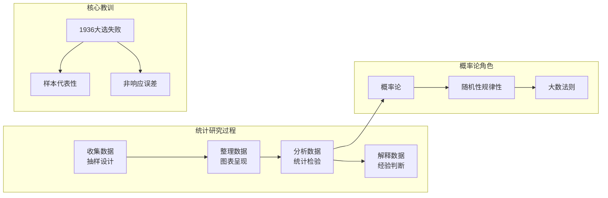

# C003 第 1 课：统计与概率入门

## 一句话总结

统计学是收集、整理、分析数据并得出不确定结论的方法论，概率论是其三大基石之一——研究随机性中的规律性。

## 课程大纲

1. 课程导入：概率论为商务统计打基础，无考试、听故事
2. 统计在生活中的应用：保修期设定、广告效果、显著性概念
3. 概率入门例子：抛硬币、掷骰子、彩票、老虎机、世界杯魔咒
4. 统计学的定义与研究过程：收集→整理→分析→解释数据
5. 1936年美国大选民调失败案例：抽样偏误与非响应误差
6. 随机性与规律性：抛硬币实验演示大数法则雏形

## 核心概念

| 概念 | 定义与解释 |
|------|-----------|
| **统计学 (Statistics)** | 收集、整理、分析数据并从中得出不确定结论的方法论；源自"State"（国家统计） |
| **描述性统计** | 通过图表（直方图、条形图等）对数据进行初步呈现 |
| **统计检验** | 通过概率计算统计量，判断差异是否"显著"（t检验、F检验等） |
| **显著性 (Significance)** | 1%显著=99%确定；5%显著=95%确定；统计允许不确定性存在 |
| **小概率事件** | Fisher 定义：概率小于 5% 的事件；正常情况下不太发生，但一旦发生就发生了 |
| **原始数据（一手数据）** | 通过调查问卷等形式直接采集的数据 |
| **二手数据** | 政府、国际组织（IMF、世界银行）公布的统计数据 |
| **三手数据** | 基于一手或二手数据得出的分析报告（如咨询公司报告） |
| **抽样** | 从总体中选取样本的方法；核心是选取有代表性的样本 |
| **随机性** | 不能预测某一特定事件的结果；每次抛硬币的结果无法预知 |
| **规律性** | 从大量事件/数据中发现的模式（pattern）；需要大数据量才能呈现 |
| **大数法则** | 实验次数越多，统计概率（相对频率）越趋近于数学概率 |

## 老师重点强调

1. ⭐ **统计学允许犯错、允许不确定性**：不像数学 1+1=2 是 100%，统计只能说 95% 或 99% 确定
2. ⭐ **SPSS/工具只是手段，解释数据靠的是经验和知识**：不要为了用复杂方法而用，简单方法够用就好
3. ⭐ **样本代表性比样本量更重要**：1936 年大选民调发 1000 万份问卷却预测错误，因为只寄给有电话有车的人
4. ⭐ **不要迷信统计结果**：有时可信有时不可信，需要自己的判断
5. ⭐ **统计研究的四个过程**：收集数据 → 整理数据 → 分析数据 → 解释数据
6. ⭐ **随机性 vs 规律性**：个体事件不可预测（随机），大量重复下呈现规律
7. ⭐ **概率研究的就是随机性中的规律性**

## 关键例子

| 例子 | 对应概念 | 要点 |
|------|----------|------|
| **三年保修 vs 一年保修** | 统计决策 | 根据故障率数据决定保修期，一年故障仅 2/500，三年达 300/500 |
| **奔驰"97%仍在跑"广告** | 统计解读需谨慎 | 不了解 15 年销售数据分布，可能第一年卖 1 台、去年卖 100 万台 |
| **360 软件"XX%用户已优化"** | 频数分析 | 用户点击即传回公司，通过频数和相对频率计算 |
| **摇号中签率 1.94%** | 小概率事件 | 小于 5%，属于小概率事件，但中签了就发生了 |
| **世界杯魔咒** | 随机性与规律性 | 14 届世界杯股市 3 涨 11 跌（78.5% 下跌概率），但西班牙输球后股市反涨 |
| **1936 年罗斯福 vs Landon** | 抽样偏误 | 只调查有电话有车的人（大萧条时期少数人），79% 无车无电话者支持罗斯福却未被抽样 |
| **抛硬币实验（1000 次→10000 次）** | 大数法则 | 次数越多，正反面概率越趋近 0.5 |

## 易混/易错点

| 易混点 | 正确理解 |
|--------|---------|
| **统计 = 100% 确定？** | ❌ 统计永远有不确定性，只能说"95% 的把握" |
| **样本量大就一定能代表总体？** | ❌ 1936 年发了 1000 万份问卷照样预测错——样本代表性更重要 |
| **"连续 9 次正面，第 10 次必出反面"？** | ❌ 每次抛硬币都是独立事件，概率恒为 0.5（赌徒谬误） |
| **彩票有"容易中奖的号码"？** | ❌ 每次号码出现完全随机，不可预测 |
| **"我一直输下去总会赢"？** | 玩就有机会赢，但次数不确定——需要计算概率 |
| **Statistics 单数 vs 复数** | 作"数据/数字"讲是复数，作"统计学"讲是单数 |
| **统计检验说明什么** | 大样本（>30）下才比较可信；样本量太小差异不可靠 |
| **数据来源三层次** | 一手（原始）、二手（官方统计）、三手（分析报告） |

## 知识图谱

