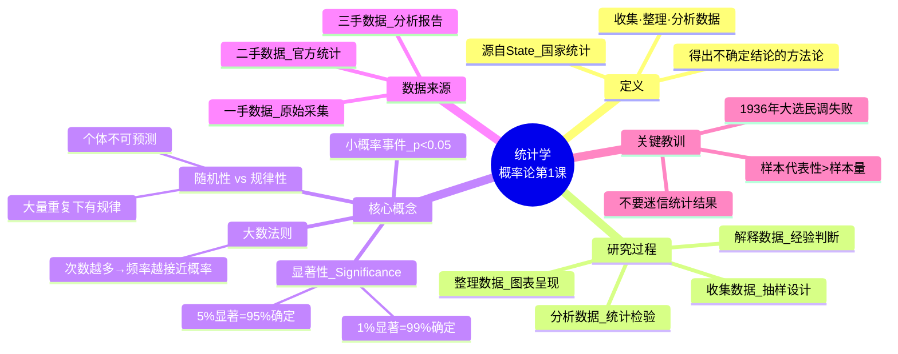
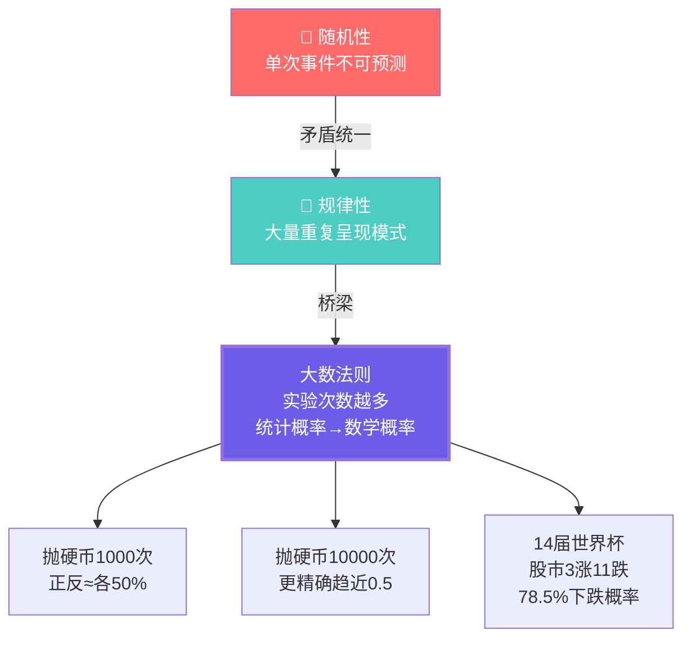
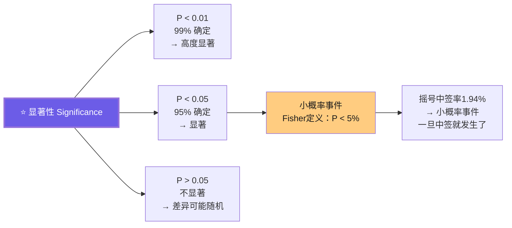
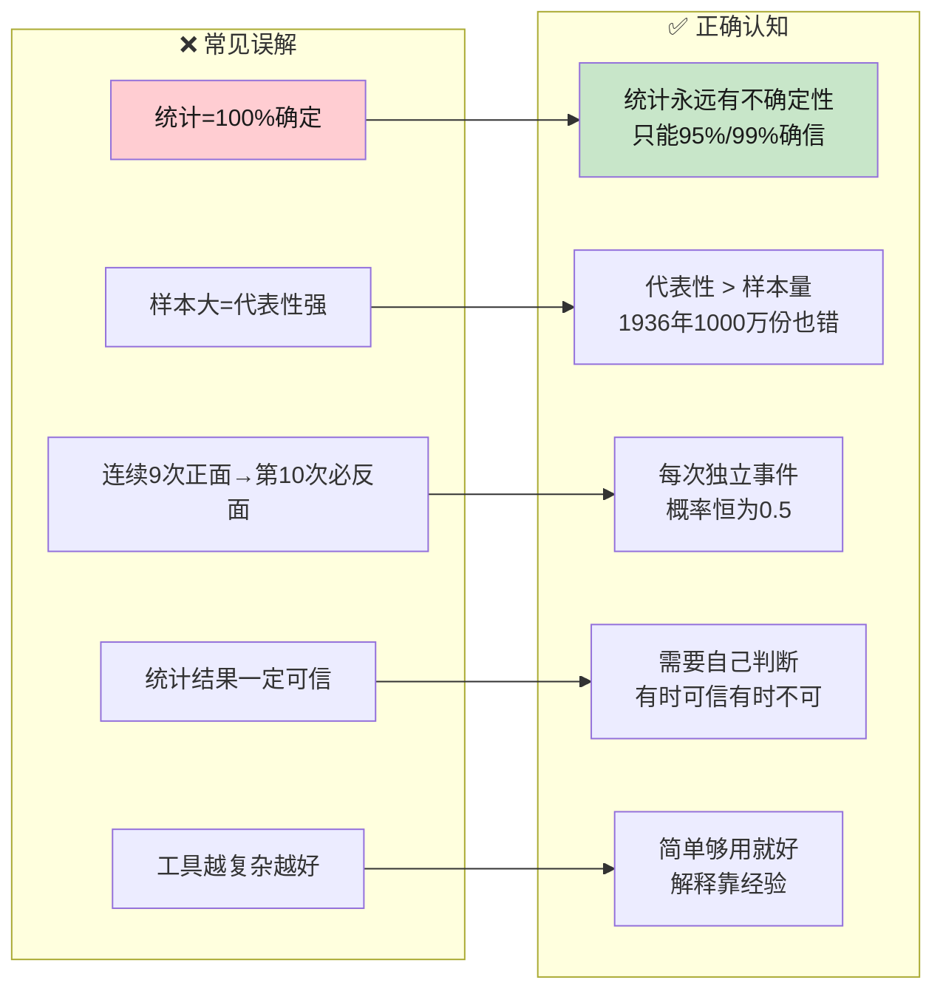

# C003 概率论第1课 · 记忆图

> 一张图记住统计学本质：在不确定性中找规律——收集→整理→分析→解释，核心是随机中的规律性

---

## 一、统计学全景

---

## 二、统计学四大过程

```mermaid
graph LR
    A["📥 收集数据<br/>抽样设计"] -->|"最关键"| B["📊 整理数据<br/>图表呈现"]
    B --> C["🔬 分析数据<br/>统计检验<br/>t检验·F检验"]
    C --> D["💡 解释数据<br/>经验+知识判断"]
    D --> E["⚠️ 不是100%确定<br/>95%或99%把握"]

    A --> SAMPLE["抽样核心"]
    SAMPLE --> S1["代表性 > 样本量"]
    SAMPLE --> S2["1936年：1000万份→预测错"]
    SAMPLE --> S3["原因：只寄给有电话有车的人"]

    style A fill:#ff6b6b,color:#fff
    style D fill:#81c784,color:#fff
    style E fill:#ffcdd2,color:#1a1a1a
    style SAMPLE fill:#ffcc80,color:#1a1a1a
```

---

## 三、随机性 vs 规律性

---

## 四、显著性 · 小概率事件

---

## 五、易错提醒

---

## ⚡ 速查卡片

| 概念 | 一句话 | 易错提醒 |
|------|--------|----------|
| 统计学 | 在不确定中找规律 | ≠ 100%确定的数学 |
| 大数法则 | 次数越多越接近理论概率 | 不是"一定会发生" |
| 小概率事件 | P < 0.05 | ≠ 不可能发生 |
| 显著性 | 差异是否可靠 | 样本<30 差异不可靠 |
| 抽样 | 选有代表性的样本 | 代表性 > 样本量 |

> 🎓 **老师金句记忆**：
> - "统计学允许犯错、允许不确定性"
> - "样本代表性比样本量更重要"
> - "不要迷信统计结果——需要自己的判断"
> - "概率研究的就是随机性中的规律性"
