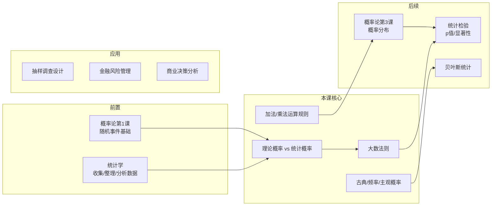

# C003 第 2 课：概率基础

## 一句话总结

概率论是用数学语言量化"不确定性"的工具，核心在于区分理论概率（数学公式推导）与统计概率（实际重复实验观测），二者通过大数法则在大样本下趋同。

## 课程大纲

1. 统计学回顾：抽样（随机 vs 非随机）、数据整理与呈现
2. 概率的定义与历史：费马与帕斯卡的赌注分配问题
3. 概率的三种获得方式：古典概率 / 相对频率法 / 主观概率
4. 概率的运算规则：加法法则（互斥事件）、乘法法则（独立事件）
5. 生活中的概率应用：彩票、老虎机、短信诈骗、猜拳、天气预报

## 核心概念

| 概念 | 定义与解释 |
|------|-----------|
| **概率 (Probability)** | 对事件发生可能性大小的度量，取值范围 [0, 1]，用 p 表示 |
| **随机抽样** | 总体中每个个体被抽中的概率相等；需要先有完整名单（抽样框） |
| **非随机抽样** | 包括随意抽样/判断抽样、滚雪球抽样（通过朋友圈不断扩散） |
| **理论概率（数学概率）** | 通过等可能假设用公式直接计算得出的概率，如抛硬币的 0.5 |
| **统计概率（实验概率）** | 通过不断重复实验，观测事件发生的相对频率得到的概率 |
| **大数法则** | 实验次数越多，统计概率越趋近于理论概率——"实际与理论在大样本下趋同" |
| **古典概率（等可能事件）** | 所有可能结果出现概率相等 |
| **相对频率法** | 用历史数据中事件出现次数 ÷ 所有可能结果总数 |
| **主观概率** | 基于个人判断和信念给出的概率，引出贝叶斯统计分支 |
| **互斥事件** | 不可能同时发生的事件，概率可用加法合并 |
| **独立事件** | 一个事件的发生不影响另一个事件，概率可用乘法合并 |
| **小概率事件** | Fisher 定义为 5%（即 p < 0.05），可能发生但概率低，不代表不可能 |
| **离散型 vs 连续型变量** | 离散型 → 条形图（分类变量）；连续型 → 直方图（数值变量） |

## 老师重点强调

1. ⭐ **理论概率 ≠ 实际概率**：理论是公式推导，实际是观测得到，只有在大样本下趋同（课上强调10次以上）
2. ⭐ **大数法则必须记住**："实验次数越多，统计概率越接近数学概率"
3. ⭐ **概率取值 0 到 1**：必然事件 = 1，不可能事件 = 0。"成功率 120%" 是门外汉错误
4. ⭐ **小概率事件不是不可能发生**：5% 是 Fisher 主观定的标准，摇号中签率 1.94% 就是小概率事件
5. ⭐ **加法法则**：互斥事件概率可直接相加，各事件概率之和必为 1（穷尽性原则）
6. ⭐ **乘法法则**：独立事件同时发生的概率相乘
7. ⭐ **数据解读必须有前提假设**：任何统计分析结果都建立在特定假设条件之下

## 关键例子

| 例子 | 对应概念 | 要点 |
|------|----------|------|
| **费马与帕斯卡的赌注分配** | 概率的起源 | 赌局中断时按获胜概率比例分配赌注（3:1） |
| **老虎机中奖** | 统计概率、大数法则 | 中奖率 1/400，玩 2000 次理论中奖 99.3%，但不保证一定中 |
| **短信诈骗** | 概率设计思维 | 骗子利用 1/10 概率分批发送"预测"制造连续命中的假象 |
| **猜拳必胜策略** | 独立事件与心理 | 大多数人不会连续出同一种拳，利用此规律可立于不败 |
| **彩票号 123456** | 主观判断误区 | 所有号码组合中奖概率完全相同 |
| **"五朵金花"** | 乘法法则 | 连生五个女儿概率 = (1/2)⁵ = 1/32 ≈ 3.125%，小概率事件 |
| **求雨舞** | 统计规律 | 不断重复直到事件发生——不是求雨舞的作用，是大数法则 |
| **天气预报降水概率** | 概率区间 | "降水概率 0%" 实际是 0%-4%，仍可能下雨 |

## 易混/易错点

| 易混点 | 正确理解 |
|--------|---------|
| **理论概率 = 实际概率？** | ❌ 二者不同！小样本下有波动，大样本下趋同 |
| **降水概率 0% = 绝对不下雨？** | ❌ 实际可能是 0%-4%，仍然可能下雨 |
| **连续失败后下一次更容易成功？** | ❌ 独立事件！每次概率不变（赌徒谬误） |
| **小概率事件 = 不可能发生？** | ❌ 小概率事件只是概率低（<5%），但完全可能发生 |
| **玩 2000 次老虎机一定中奖？** | ❌ 理论 99.3% ≠ 保证中奖，你可能是那 0.7% |
| **彩票号 123456 更难中奖？** | ❌ 所有组合中奖概率完全相等 |
| **离散变量 vs 连续变量** | 离散用条形图（分开），连续用直方图（连在一起） |
| **概率可以 > 1 吗？** | ❌ 概率只能在 [0, 1] 之间 |
| **加法 vs 乘法** | 互斥事件用加法（"或"），独立事件用乘法（"且"） |
| **"加总不等于 1"说明什么？** | 列出的事件不完备（不穷尽），遗漏了某些可能结果 |

## 知识图谱

## 我的待解决问题

1. 贝叶斯统计的具体方法是什么？如何将先验概率与数据结合进行推断？
2. 大数法则的数学证明是怎样的？趋同的速率（收敛速度）如何？需要多少样本才算"大样本"？
3. 降水概率的具体算法？天气预报用哪种统计模型？
4. Odds（优势）与 Probability（概率）的转换公式是什么？
5. 如何在非随机抽样下做统计推断？
6. 帕累托法则（80/20法则）与概率论的关系？

## 复习题

1. 理论概率与统计概率的区别是什么？在什么条件下二者趋于一致？
2. 解释大数法则，并举一个生活中的例子。
3. 掷两个均匀骰子，同时出现两个 1 的概率是多少？为什么用乘法？
4. 掷一个骰子，出现"3 点或偶数点"的概率是多少？为什么用加法？
5. 连生三个女儿的概率是多少？这属于小概率事件吗（以 5% 为界）？
6. 为什么"天气预报降水概率 0%"仍然可能下雨？
7. 费马与帕斯卡的赌注分配问题中，费马赢的概率为什么是 0.75？请画出概率树。
8. 短信诈骗中，骗子如何利用概率原理制造"连续准确预测"的假象？
9. 彩票号 1234567 和 4857392，哪个更容易中奖？为什么？
10. 概率加法法则中，如果各事件概率之和 ≠ 1，说明什么问题？

## 行动清单

- [ ] 手算费马-帕斯卡赌注分配问题的概率树，验证 0.75 的计算过程
- [ ] 用 Excel 模拟抛硬币实验（100/1000/10000 次），观察统计概率趋近 0.5
- [ ] 梳理概率加法法则和乘法法则的适用条件（互斥 vs 独立）
- [ ] 预习第 3 课"概率分布"
- [ ] 思考：在自己的工作/生活中，有哪些决策可以用概率思维来优化？
