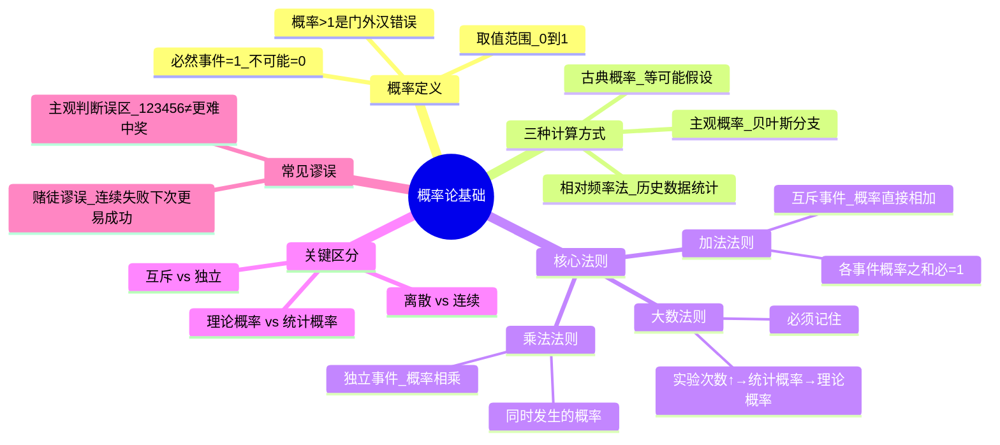
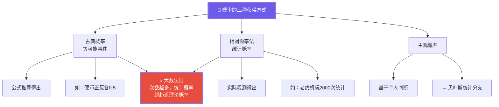
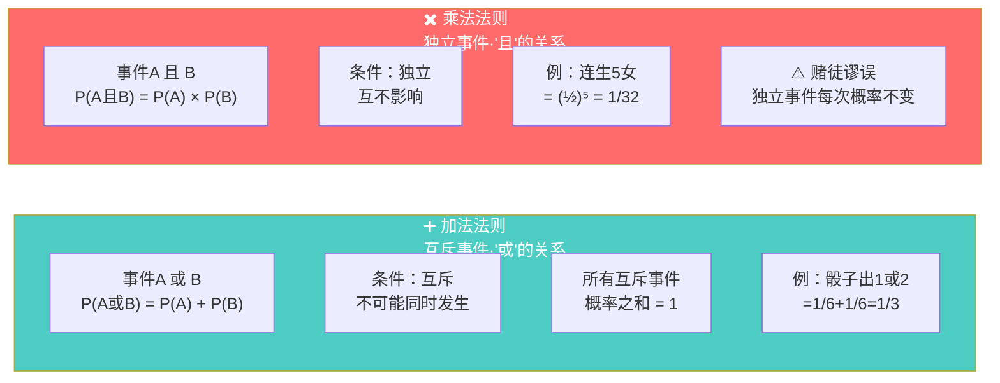
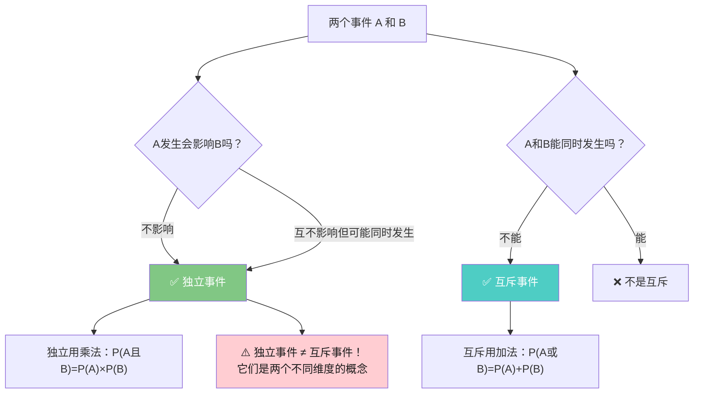
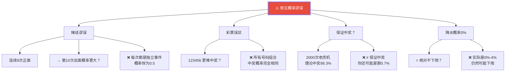

# C003 概率论第2课 · 记忆图

> 一张图记住概率论三大基石：概率定义（0~1）、加法法则（互斥相加）、乘法法则（独立相乘）+ 大数法则贯穿始终

---

## 一、概率论全景

---

## 二、三种概率 + 大数法则

---

## 三、加法法则 vs 乘法法则

---

## 四、互斥 vs 独立 · 易混概念

---

## 五、常见概率谬误

---

## ⚡ 速查卡片

| 场景 | 用什么法则 | 公式 | 条件 |
|------|-----------|------|------|
| A 或 B 发生 | 加法 | P(A)+P(B) | A、B互斥 |
| A 且 B 同时发生 | 乘法 | P(A)×P(B) | A、B独立 |
| 各事件概率之和 | 加法穷尽 | ΣP = 1 | 事件完备 |
| 理论→实际趋近 | 大数法则 | — | 次数足够多 |

> 🎓 **老师金句记忆**：
> - "概率取值0到1——成功率120%是门外汉错误"
> - "大数法则必须记住：实际与理论在大样本下趋同"
> - "小概率事件不是不可能发生"
> - "加法是'或'，乘法是'且'——互斥用加法，独立用乘法"
> - "赌徒谬误：独立事件每次概率都不变！"
