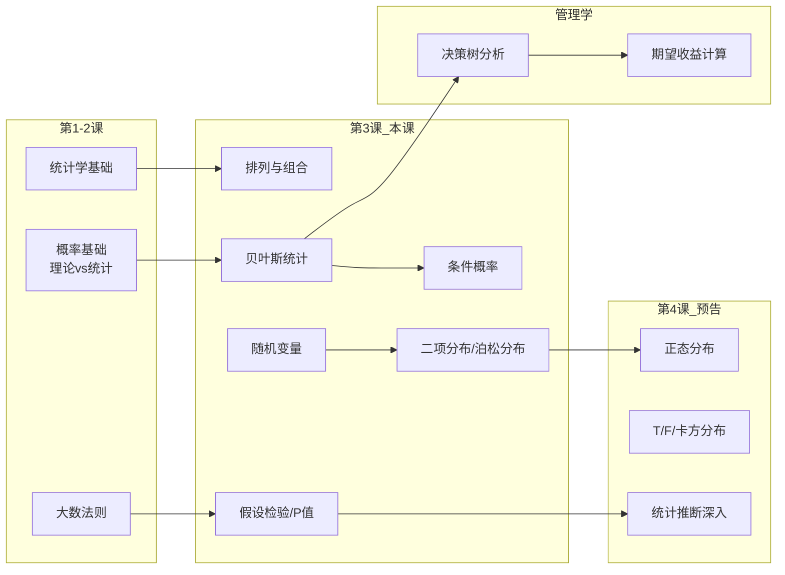

# C003 第 3 课：概率分布

## 一句话总结

本课从排列组合出发，引入贝叶斯统计学派与经典统计学派的对立，系统讲解离散型与连续型随机变量及其概率分布（二项分布、泊松分布），并初步建立"假设检验—P值判断显著性"的统计推断思维框架。

## 课程大纲

1. 课前回顾：统计学是什么、大数法则、规律性 vs 随机性
2. 排列与组合：阶乘、排列（有顺序）、组合（无顺序）、Excel 函数
3. 贝叶斯统计：主观概率 → 条件概率 → 贝叶斯定理 → 决策树分析
4. 随机变量：离散型 vs 连续型、条形图 vs 直方图
5. 描述性统计：均值、中位数、众数、方差、标准差、四分位数
6. 概率分布：二项分布、泊松分布（正态分布预告）
7. 假设检验初步：原假设 vs 备择假设、P值判断、显著性水平 0.05

## 核心概念

| 概念 | 定义与说明 |
|------|-----------|
| **阶乘** | n! = n×(n-1)×...×1，Excel:`=FACT(n)` |
| **排列 (Permutation)** | **有顺序**：A→B ≠ B→A，Excel:`=PERMUT(n,k)` |
| **组合 (Combination)** | **无顺序**：A+B = B+A，Excel:`=COMBIN(n,k)` |
| **贝叶斯统计** | 从**结果反推原因**（逆向概率）；先给主观概率 → 通过观测数据修正 |
| **经典统计 vs 贝叶斯统计** | 经典：先观察后推断（频率学派）；贝叶斯：先主观后修正（结果导向） |
| **条件概率** | 事件B发生的概率受事件A影响；与独立事件的核心区别 |
| **随机变量** | 离散型（取值孤立整数）→ 条形图；连续型（可无限细分）→ 直方图 |
| **均值 (Mean)** | 所有数值的平均，受极端值影响大 |
| **中位数 (Median)** | 从低到高排列中间的数值，更能反映"中间水平" |
| **众数 (Mode)** | 出现频数最多的数值 |
| **方差 (σ²)** | 每个值与期望之差的平方的加权平均，衡量波动程度 |
| **标准差 (σ)** | 方差的平方根，更直观的离散程度度量 |
| **二项分布** | 离散型；两个条件：①每次两种结果 ②各次独立；适用于小样本（n<30） |
| **泊松分布** | 二项分布的一般化：大样本、小概率事件；适用于固定时间/空间内事件发生次数 |
| **期望值 E(X)** | 离散型：Σ xᵢ·p(xᵢ)；连续型：积分 |
| **原假设 (H₀)** | 希望是"好的"假设（如治安稳定） |
| **备择假设 (H₁)** | 与原假设对立 |
| **P值判断** | P < 0.05 → 拒绝原假设（有显著差异）；P > 0.05 → 不能拒绝 |

## 老师重点强调

1. ⭐ **大数法则非常重要**：样本量足够大时统计概率趋近理论概率
2. ⭐ **统计学允许犯错误**：不存在 100% 的结论，通常说"95% 置信区间"
3. ⭐ **排列有顺序，组合没顺序**——两者最重大的区别
4. ⭐ **不需要手算，用 Excel/SPSS 即可**：`FACT`、`PERMUT`、`COMBIN`
5. ⭐ **贝叶斯统计和经典统计两个学派一直在"掐架"**
6. ⭐ **所有统计分析都建立在某种假设条件成立的基础上**
7. ⭐ **P值是最简单的判断显著性方法**：与 0.05 比较
8. ⭐ **不能从单一数值本身判断显著性**，必须通过统计检验
9. ⭐ **均值损失了很多信息**，中位数有时更能反映真实水平（尤其是收入分布）
10. ⭐ **理论概率 ≠ 一定出现**：即使 99% 中奖概率也不能保证一定中

## 关键例子

| 例子 | 讲解概念 | 要点 |
|------|----------|------|
| 🏈 **足球队 11 人选 5 人点球** | 排列（有顺序） | P₁₁⁵ = 11×10×9×8×7 |
| 👥 **10 人选 3 人负责人** | 组合（无顺序） | C₁₀³，B+C = C+B 算一种 |
| 🎫 **连续 2 次彩票中奖** | 条件概率 | 第一次 30% → 两次 6.67% |
| 📦 **AB 两家公司特殊货物** | 贝叶斯定理 | 已知收到特殊货物，反推来自 A 公司概率 = 8/17 |
| 🚚 **物流提供商决策** | 贝叶斯 + 决策树 | 期望收益 370 万，应更换供应商 |
| 👶 **四个孩子家庭** | 二项分布 | 生女概率 0.49，求 3 女 1 男概率 |
| 🥫 **水果罐头库存** | 泊松分布 | 每周卖 2 个，存 4 个→95% 不缺货 |
| 🔫 **美国校园枪击案** | 泊松 + 卡方检验 | P=0.18>0.05，2012 年并非显著恶化 |
| 🎰 **老虎机** | 期望值/概率 | 1/400 中奖率，2000 次到 99% 但不保证一定中 |

## 易混/易错点

| 易混概念 | 区别说明 |
|----------|----------|
| **排列 vs 组合** | 排列有顺序（AB≠BA），组合无顺序（AB=BA） |
| **理论概率 vs 统计概率** | 理论是推导值，统计是观测值；小样本有波动，大样本趋同 |
| **条件概率 vs 独立事件概率** | 条件概率受前次事件影响，独立事件互不影响 |
| **经典统计 vs 贝叶斯统计** | 经典：先观察后推断；贝叶斯：先主观后修正 |
| **离散型 vs 连续型** | 离散取值孤立（条形图有空隙），连续可无限细分（直方图无空隙） |
| **总体 vs 样本** | 总体参数是固定常数（μ, σ），样本统计量在总体周围波动 |
| **均值 vs 中位数** | 均值受极端值影响大，中位数更能反映"中间水平" |
| **方差 vs 标准差** | 方差是平方量纲，标准差是开根号后的原量纲 |
| **二项分布 vs 泊松分布** | 二项：小样本、成功概率大；泊松：大样本、成功概率极小 |
| **拒绝原假设 vs 接受原假设** | P<0.05 拒绝（有显著差异），P>0.05 不拒绝（差异不显著） |

## 知识图谱

## 我的待解决问题

1. 贝叶斯公式的具体数学推导：P(A|B) = P(B|A)·P(A) / P(B)
2. 泊松分布的完整公式：P(X=k) = λᵏe^(-λ) / k!
3. 卡方检验的具体计算过程和自由度概念
4. 正态分布、T分布、F分布的具体内容（第4课）
5. σ（总体标准差）和 s（样本标准差）的区别及自由度 n-1 问题
6. 贝叶斯修正的具体算法——"背后有一套贝叶斯推断"
7. 决策树中"风险中性/风险偏好/风险厌恶"三者的具体区别

## 复习题

1. 排列和组合的核心区别是什么？Excel 中对应的函数是什么？
2. 贝叶斯统计与经典统计的根本区别是什么？各举一个应用场景。
3. 条件概率与独立事件概率有何不同？给出一个条件概率的例子。
4. 离散型和连续型随机变量的区别是什么？在图形表示上有什么不同？
5. 均值、中位数、众数分别代表什么？为什么收入分布中中位数比均值更可信？
6. 方差和标准差衡量的是什么？方差越大说明什么？
7. 二项分布的两个必要条件是什么？
8. 泊松分布适用于什么类型的场景？举出 3 个实际例子。
9. 期望值如何计算？离散型和连续型各用什么方式？
10. P值的判断法则是什么？P=0.18 意味着什么结论？
11. 物流公司考虑换供应商：三种结果概率 70%/20%/10%，收益 +650/-50/-750 万，计算期望收益。
12. 10 张彩票中 3 张中奖，连续抽 2 张都中奖的概率是多少？

## 行动清单

- [ ] 在 Excel 中实操 `=FACT()`、`=PERMUT()`、`=COMBIN()` 函数
- [ ] 推导贝叶斯公式的数学形式，结合 AB 公司特殊货物的例子
- [ ] 查阅泊松分布的完整公式，理解参数 λ 的含义
- [ ] 预习下一课的正态分布、T分布、F分布、卡方分布
- [ ] 用 Excel 或 SPSS 尝试做描述性统计
- [ ] 复习决策树分析方法，练习不同风险偏好下的期望收益计算
- [ ] 理解 P 值判断逻辑：原假设 → P 值与 0.05 比较 → 拒绝/不拒绝
