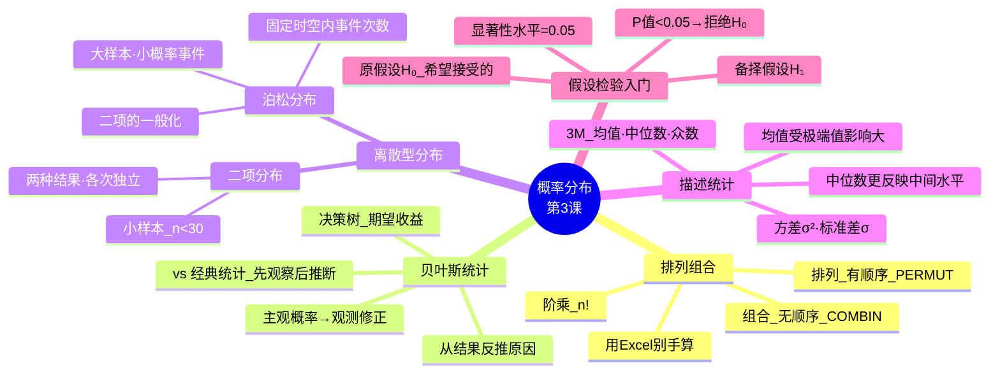
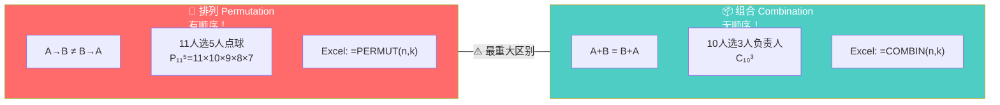
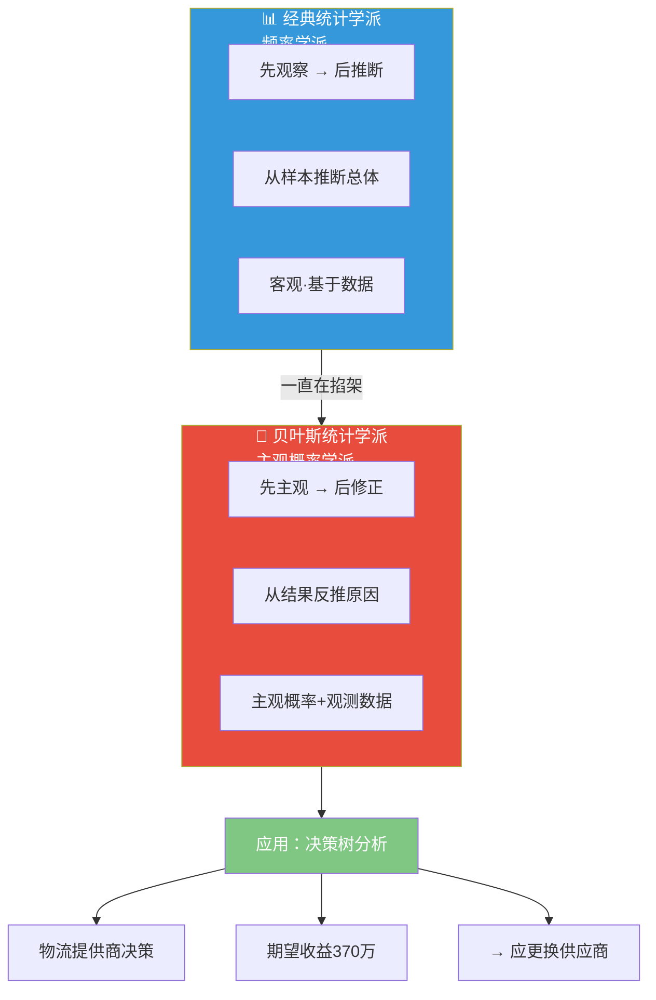
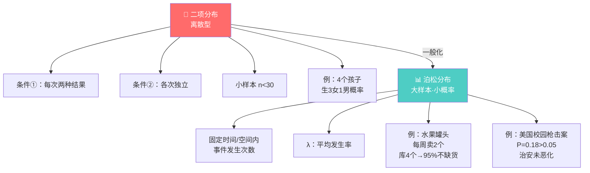
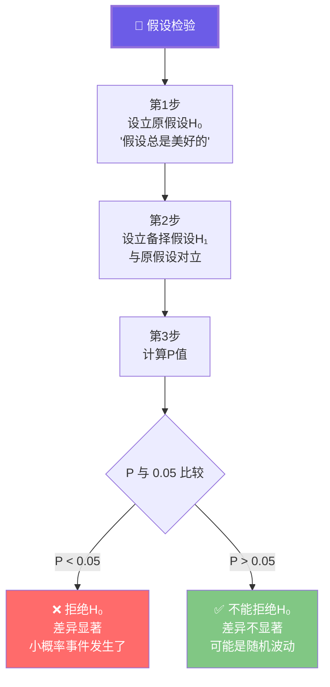

# C003 概率论第3课 · 记忆图

> 一张图记住排列组合→贝叶斯→分布→假设检验的统计推断逻辑链

---

## 一、概率分布全景

---

## 二、排列 vs 组合 · 最重大的区别

---

## 三、贝叶斯统计 vs 经典统计

---

## 四、二项分布 vs 泊松分布

---

## 五、假设检验 · P值决策规则

---

## ⚡ 速查卡片

| 概念 | 一句话 | 易错提醒 |
|------|--------|----------|
| 排列 | 有顺序 AB≠BA | PERMUT 函数 |
| 组合 | 无顺序 AB=BA | COMBIN 函数 |
| 贝叶斯 | 从结果反推原因 | 先主观后修正 |
| 二项分布 | 两种结果·独立 | 小样本 n<30 |
| 泊松分布 | 大样本·小概率 | 二项的一般化 |
| P值 | <0.05→拒绝H₀ | 不是"接受H₀" |
| 均值 vs 中位数 | 均值怕极端值 | 收入分布看中位数 |

> 🎓 **老师金句记忆**：
> - "排列有顺序，组合没顺序——最重大的区别"
> - "不需要手算，用Excel/SPSS即可"
> - "贝叶斯和经典统计两个学派一直在掐架"
> - "P值是最简单的判断显著性方法"
> - "不能从单一数值本身判断显著性，必须通过统计检验"
