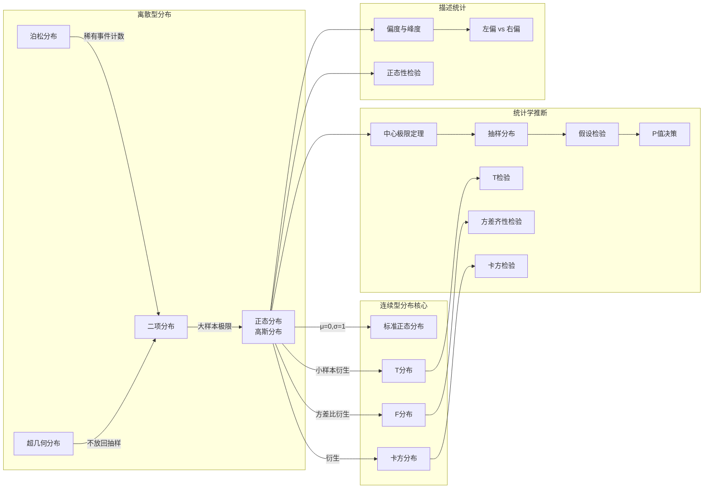

# C003 第 4 课：连续型分布与统计推断基础

## 一句话总结

本课从离散型分布过渡到连续型分布的核心——正态分布及其衍生分布族（T分布、F分布、卡方分布），引入抽样分布与假设检验的基本逻辑，并建立中心极限定理与 P 值决策规则，为统计学推断奠定基石。

## 课程大纲

1. 离散型分布续：泊松分布回顾、超几何分布
2. 连续型概率分布核心——正态分布（高斯分布）
   - 历史：De Moivre → Laplace → Gauss → K.Pearson 命名之争
   - 概率密度函数特征（对称、钟形、由 μ 和 σ 决定）
   - 标准正态分布（μ=0, σ=1）
   - 68% / 95% / 99% 区间规则
3. 正态性检验：直方图法 → PP图/QQ图 → 偏度与峰度
4. 左偏与右偏分布：均值 vs 中位数 vs 众数（3M）的位置关系
5. 正态分布的衍生分布族：T分布（学生分布）、F分布、卡方分布
6. 抽样与样本分布：中心极限定理、大样本 vs 小样本（分水岭 n=30）
7. 假设检验初步：单样本T检验、独立样本T检验、方差齐性检验（F检验）
8. 描述统计核心度量：集中趋势（3M）、离散程度（极差/方差/标准差）

## 核心概念

| 概念 | 定义/说明 |
|------|-----------|
| **超几何分布** | 适用于总量很小、分类变量的不放回抽样场景 |
| **正态分布（高斯分布）** | 连续型分布之王，钟形对称曲线，由均值 μ 和标准差 σ 决定；大样本下几乎所有分布趋近正态 |
| **标准正态分布** | μ=0，σ=1 的正态分布 |
| **68-95-99 规则** | μ±1σ ≈ 68%；μ±2σ ≈ 95%（精确 1.96σ）；μ±3σ ≈ 99% |
| **P值** | 落在置信区间之外的概率面积；P < 0.05 → 小概率事件发生 → 拒绝原假设 |
| **中心极限定理** | 样本量足够大时，样本均值的分布近似正态分布，无论原始分布形态如何（De Moivre & Laplace） |
| **T分布（学生分布）** | 正态分布衍生，小样本时使用；William Gosset 以 "Student" 匿名发表 |
| **F分布** | 方差比值的分布，用于方差齐性检验 |
| **卡方分布（χ²）** | 非对称分布，小样本时偏态，大样本时趋近正态 |
| **左偏 / 右偏** | 左偏：均值 < 中位数（低值拖低均值）；右偏：均值 > 中位数（极端高值拉高均值） |
| **偏度 (Skewness)** | 分布不对称程度的度量 |
| **峰度 (Kurtosis)** | 分布尖峭或平坦程度的度量 |
| **PP图 / QQ图** | 正态性检验图形工具：数据点均匀分布在理论直线两侧即可能服从正态 |
| **总体参数 vs 样本统计量** | μ/σ/π 是固定值；x̄/S/p 围绕总体参数波动 |
| **3M** | Mean（均值）、Median（中位数）、Mode（众数） |

## 老师重点强调

1. ⭐ **正态分布是统计学的核心分布**："如果学统计不知道正态分布，基本就是白学了"
2. ⭐ **68%-95%-99% 三个区间的图形必须记住**
3. ⭐ **中心极限定理**：当样本量足够大时，所有分布都趋近正态分布——从离散到连续的桥梁
4. ⭐ **P值决策规则**：P > 0.05 不能拒绝原假设；P < 0.05 拒绝原假设
5. ⭐ **大样本与小样本的分水岭是 n=30**：小于30是小样本
6. ⭐ **样本量不是越大越好**：500 和 700 结果差不多时选 500（成本考虑）
7. ⭐ **原假设总是放你希望接受的结论**："假设总是美好的"
8. ⭐ **变量的类型决定了你能做什么分析**：分类变量只能做频数分析
9. ⭐ **数据分析第一步永远是画图**：先看图，再做检验
10. ⭐ **左偏/右偏看均值和中位数的相对位置**

## 关键例子

| 例子 | 对应概念 | 要点 |
|------|----------|------|
| **美国枪击案** | 泊松分布、P值 | P=0.18 > 0.05，治安未变坏 |
| **10人选4人委员会（男女各5人）** | 超几何分布 | 4人全女概率=0.02（小概率），怀疑并非随机选择 |
| **马克上的高斯像与正态分布曲线** | 正态分布历史 | 德国10马克纸币上的高斯+正态分布曲线 |
| **De Moivre → Laplace → Gauss → K.Pearson** | 命名之争 | 各国都想以本国人命名，最终定为 "Normal" |
| **高尔顿（达尔文表弟）** | 正态分布美感 | "几乎不曾见过像误差成正态分布这么激发想象力的宇宙秩序" |
| **William Gosset（Student）** | T分布起源 | 因公司保密协议匿名 "Student" 发表 |
| **游客平均年龄25岁 T检验** | 单样本T检验 | T=0.958, P=0.363>0.05，不能拒绝原假设 |
| **男女对酒店服务评价差异** | 独立样本T检验 + F检验 | 先看F检验（P=0.865），方差无差异，再看T检验 |
| **沙特阿拉伯国民收入** | 左偏分布 | 左偏：低值较多拉低均值 |
| **全班年收入中有一个1000万的** | 右偏分布 | 极端值把均值拉高 |
| **整匹布 vs 碎布片** | 持续经营假设 | 碎布片金额更大（多了工序成本） |
| **1936年《文学摘要》选举预测失败** | 抽样重要性 | 样本要有代表性、样本量要够大 |

## 易混/易错点

| 易混点 | 正确理解 |
|--------|---------|
| **泊松分布概率值是否可变？** | 给定 X 取值后概率值不变，但不同地方的 λ 不同 |
| **超几何分布 vs 二项分布** | 超几何是不放回抽样，二项是每次试验独立（有放回） |
| **左偏 = 均值在左 vs 右偏 = 均值在右** | "偏"指均值相对于中位数的偏离方向 |
| **PP图 vs QQ图** | 反映同一件事，不同表达形式 |
| **T分布不是只有一种** | T分布是一个 family，不同自由度对应不同形态 |
| **中心极限定理发现者不是高斯** | 是 De Moivre 和 Laplace，高斯将其一般化 |
| **标准差（σ）= 方差（σ²）的平方根** | 两者不同 |
| **P > 0.05 是"不能拒绝"不是"接受"** | 精确说法是 fail to reject |
| **样本量 n=30 分水岭不是绝对的** | 大样本通常 300 以上，具体看分析方法要求 |
| **正态性检验：看图只是初步判断** | 需要统计检验（偏度/峰度指标）才能确定 |

## 知识图谱

## 我的待解决问题

1. 泊松分布的 λ 参数如何从数据估计？
2. 超几何分布的概率公式具体怎么写？
3. PP图和QQ图到底怎么精确判读？量化标准是什么？
4. 偏度和峰度的具体计算公式和判断阈值是什么？
5. T分布、F分布、卡方分布的自由度是什么意思？
6. 中心极限定理中"足够大"的精确数学条件是什么？
7. 贝叶斯统计 vs 经典频率统计的具体区别？
8. SPSS 如何进行正态性检验的完整操作流程？
9. 右偏分布中"均值 > 中位数"与左偏的逻辑是否完全对称？
10. "不能拒绝原假设"和"接受原假设"是同一个意思吗？

## 复习题

1. 泊松分布适用于什么场景？X=0 的概率是否可以改变？
2. 超几何分布与二项分布的核心区别是什么？
3. 正态分布为什么被称为"高斯分布"？命名历史中各人贡献是什么？
4. 标准正态分布的 μ 和 σ 分别等于多少？μ±1σ/2σ/3σ 对应多大区间？
5. P值的含义是什么？P=0.18 和 P=0.02 分别意味着什么决策？
6. T分布为什么叫"学生分布"？发现者是谁？
7. 左偏和右偏分布中，均值、中位数、众数的相对位置关系是什么？
8. 中心极限定理的核心内容是什么？意义是什么？
9. 小样本和大样本的分水岭大致是多少？样本量是越大越好吗？
10. 数据分析的第一步应该做什么？为什么？
11. T分布、F分布、卡方分布在大样本下趋近于什么分布？
12. 假设检验中原假设应该怎么设置？P值决策的通用标准是什么？
13. 总体参数（μ, σ, π）和样本统计量（x̄, S, p）的本质区别是什么？
14. 正态性检验有哪些方法？PP图和QQ图怎么看？
15. 集中趋势的三个度量（3M）分别是什么？离散程度的度量有哪些？

## 行动清单

- [ ] 整理本课笔记，关联前三课概率论概念，建立完整体系
- [ ] 下载/安装 SPSS（如有条件），尝试老师展示的界面操作
- [ ] 用 Excel 做一次正态性检验：找一组数据画直方图
- [ ] 记住 68%-95%-99% 三个关键区间
- [ ] 预习统计学：T检验、F检验、卡方检验的基本逻辑
- [ ] 理解"中心极限定理"的直观含义，用自己的话复述一遍
- [ ] 完成复习题，至少能回答 80% 的题目
