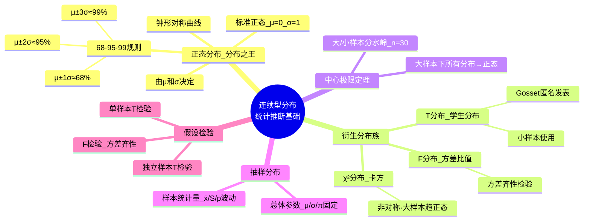
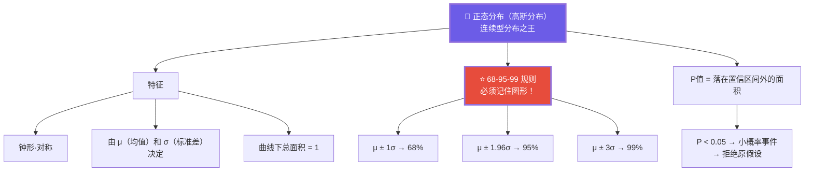
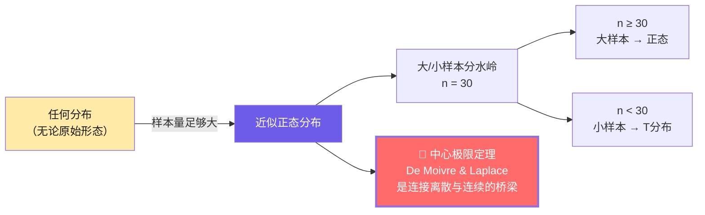
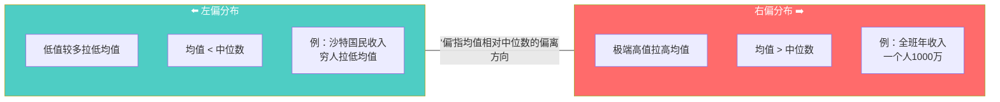
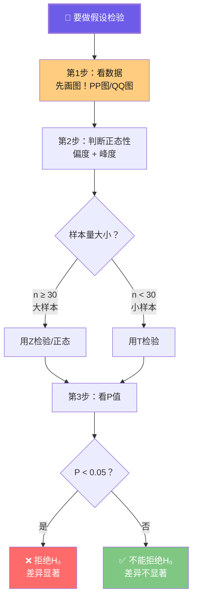
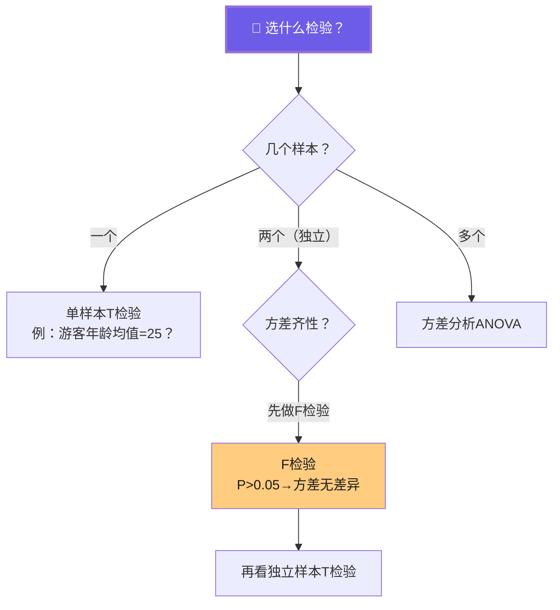

# C003 概率论第4课 · 记忆图

> 一张图记住正态分布（分布之王）→ 抽样分布 → 假设检验的完整统计推断链路

---

## 一、连续型分布全景

---

## 二、正态分布 · 68-95-99 规则

---

## 三、中心极限定理 · 从离散到连续的桥梁

---

## 四、左偏 vs 右偏

---

## 五、假设检验 · 三步实战

---

## 六、检验方法选择决策树

---

## ⚡ 速查卡片

| 分布 | 用途 | 关键特征 |
|------|------|----------|
| 正态分布 | 连续数据·大样本 | 钟形·68-95-99规则 |
| T分布 | 小样本 | 自由度决定形态 |
| F分布 | 方差比较 | 方差齐性检验 |
| χ²分布 | 分类数据 | 非对称·大样本趋正态 |
| 超几何分布 | 不放回抽样 | 总量小·分类变量 |

| 检验类型 | 场景 | 前提 |
|----------|------|------|
| 单样本T检验 | 一个样本 vs 已知值 | 正态·小样本 |
| 独立样本T检验 | 两组比较 | 先看F检验 |
| F检验 | 方差齐性 | — |

> 🎓 **老师金句记忆**：
> - "正态分布是统计学的核心分布——不知道它就白学了"
> - "68%-95%-99% 三个区间的图形必须记住"
> - "数据分析第一步永远是画图"
> - "大样本与小样本的分水岭是 n=30"
> - "左偏/右偏看均值和中位数的相对位置"
> - "变量的类型决定了你能做什么分析"
