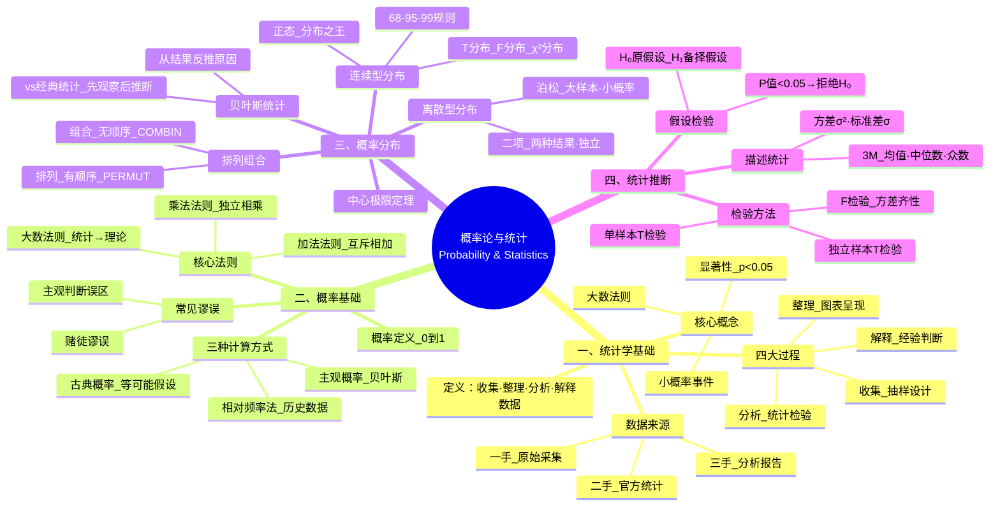

# 概率论知识汇总

> 基于 C003 概率论 4 课笔记整合而成，涵盖概率论与统计学全部核心内容。

---

## 总览：概率论与统计知识体系思维脑图



---

## 模块一：统计学基础

### 1.1 统计学是什么

> 统计学是收集、整理、分析数据并从中得出**不确定结论**的方法论。

| 过程 | 内容 | 关键 |
|------|------|------|
| 收集数据 | 抽样设计 | 代表性 > 样本量 |
| 整理数据 | 图表呈现（直方图、条形图等） | 先画图再看 |
| 分析数据 | 统计检验（t检验、F检验等） | 选择合适的检验 |
| 解释数据 | 经验 + 知识判断 | 不要迷信统计结果 |

### 1.2 显著性

| 显著性水平 | 确定性 |
|-----------|--------|
| P < 0.01 | 99% 确定（高度显著） |
| P < 0.05 | 95% 确定（显著） |
| P > 0.05 | 差异不显著（不能拒绝 H₀） |

> 统计学允许犯错、允许不确定性。不像数学 1+1=2 是 100%，统计只能说 95% 或 99% 确定。

### 1.3 小概率事件

Fisher 定义：**概率小于 5%（P < 0.05）的事件**。

- 正常情况下不太发生
- 但一旦发生就发生了
- 小概率事件 ≠ 不可能发生

### 1.4 随机性 vs 规律性

| 概念 | 特征 | 例子 |
|------|------|------|
| 随机性 | 单次事件不可预测 | 每次抛硬币的结果 |
| 规律性 | 大量重复下呈现模式 | 10000次抛硬币≈各50% |

> 概率研究的就是**随机性中的规律性**。

### 1.5 1936 年大选民调失败的教训

| 错误 | 教训 |
|------|------|
| 只寄问卷给有电话有车的人 | 样本没有代表性 |
| 发了 1000 万份问卷 | 样本量再大也不能弥补代表性不足 |
| 79% 无车无电话者支持罗斯福 | 却被排除在抽样之外 |

> **样本代表性 > 样本量**。这是统计学最重要的教训之一。

---

## 模块二：概率基础

### 2.1 概率的定义

> 概率是对事件发生可能性大小的度量，取值范围 **[0, 1]**。

- 必然事件 = 1
- 不可能事件 = 0
- "成功率 120%" 是门外汉错误

### 2.2 概率的三种获得方式

| 方式 | 方法 | 适用场景 |
|------|------|----------|
| 古典概率 | 等可能假设 + 公式推导 | 抛硬币、掷骰子 |
| 相对频率法 | 历史数据中事件次数/总数 | 老虎机中奖率统计 |
| 主观概率 | 基于个人判断和信念 | → 引出贝叶斯统计分支 |

### 2.3 大数法则（必须记住！）

> 实验次数越多，统计概率（相对频率）越趋近于理论概率（数学概率）。

**理论概率 ≠ 实际概率**：小样本下有波动，大样本下趋同。

### 2.4 加法法则与乘法法则

| 法则 | 适用条件 | 公式 | 口诀 |
|------|----------|------|------|
| 加法法则 | 互斥事件（不能同时发生） | P(A或B) = P(A) + P(B) | "或"→加法 |
| 乘法法则 | 独立事件（互不影响） | P(A且B) = P(A) × P(B) | "且"→乘法 |

> 各互斥事件概率之和必为 1（穷尽性原则）。

### 2.5 互斥 vs 独立（重要区分！）

| 概念 | 定义 | 法则 |
|------|------|------|
| 互斥 | 不可能同时发生 | 加法法则 |
| 独立 | 一个发生不影响另一个 | 乘法法则 |

> 互斥事件和独立事件是**两个不同维度的概念**——不是一回事！

### 2.6 常见概率谬误

| 谬误 | 表现 | 正确认知 |
|------|------|----------|
| 赌徒谬误 | 连续 9 次正面→第10次必反面 | 独立事件！每次概率恒为 0.5 |
| 彩票误区 | "123456 更难中奖" | 所有组合中奖概率完全相同 |
| 降水概率 0% | "绝对不会下雨" | 实际是 0%-4%，仍可能下雨 |
| 保证中奖？ | 2000 次老虎机 99.3%→一定中奖 | ≠ 保证中奖，还可能是那 0.7% |

---

## 模块三：概率分布

### 3.1 排列 vs 组合

| 概念 | 特征 | Excel 函数 | 例子 |
|------|------|-----------|------|
| 排列 | 有顺序 AB≠BA | PERMUT(n,k) | 11人选5人点球顺序 |
| 组合 | 无顺序 AB=BA | COMBIN(n,k) | 10人选3人负责人 |

> **排列有顺序，组合没顺序**——两者最重大的区别。不需要手算，用 Excel 即可。

### 3.2 贝叶斯统计 vs 经典统计

| 学派 | 逻辑方向 | 方法 |
|------|----------|------|
| 经典统计（频率学派） | 先观察 → 后推断 | 从样本推断总体 |
| 贝叶斯统计 | 先主观 → 后修正 | 从结果反推原因 |

> 两个学派一直在"掐架"。经典统计更主流，贝叶斯在需要主观判断时更有优势。

### 3.3 离散型分布

| 分布 | 条件 | 适用场景 | 特征 |
|------|------|----------|------|
| 二项分布 | ①两种结果 ②各次独立 | 小样本 n<30 | 生4个孩子3女1男概率 |
| 泊松分布 | 大样本·小概率事件 | 固定时空内事件次数 | 每周卖2个库存4个→95%不缺货 |
| 超几何分布 | 不放回抽样 | 总量小·分类变量 | 10人选4人委员会 |

### 3.4 连续型分布

#### 正态分布（分布之王）

| 特征 | 说明 |
|------|------|
| 形态 | 钟形对称曲线 |
| 决定参数 | μ（均值）和 σ（标准差） |
| 标准正态 | μ = 0，σ = 1 |

**⭐ 68-95-99 规则（必须记住图形！）**

| 区间 | 概率 |
|------|------|
| μ ± 1σ | ≈ 68% |
| μ ± 1.96σ | ≈ 95% |
| μ ± 3σ | ≈ 99% |

#### 衍生分布族

| 分布 | 用途 | 特征 |
|------|------|------|
| T 分布（学生分布） | 小样本（n<30） | Gosset 匿名"Student"发表 |
| F 分布 | 方差比值检验 | 方差齐性检验 |
| χ² 分布（卡方） | 分类数据分析 | 非对称·大样本趋正态 |

### 3.5 中心极限定理

> 样本量足够大时，样本均值的分布近似正态分布，**无论原始分布形态如何**。

**大样本与小样本的分水岭：n = 30**

- n ≥ 30：大样本 → 用正态分布
- n < 30：小样本 → 用 T 分布

### 3.6 描述统计

| 度量 | 含义 | 特征 |
|------|------|------|
| 均值 Mean | 所有数值平均 | 受极端值影响大 |
| 中位数 Median | 中间值 | 更能反映"中间水平" |
| 众数 Mode | 出现最多 | — |
| 方差 σ² | 离散程度平方 | 量纲是平方 |
| 标准差 σ | 方差开根号 | 原量纲·更直观 |

**左偏 vs 右偏**："偏"指均值相对于中位数的偏离方向。

| 类型 | 关系 | 常见场景 |
|------|------|----------|
| 左偏 | 均值 < 中位数 | 低值较多拉低均值 |
| 右偏 | 均值 > 中位数 | 极端高值拉高均值 |

---

## 模块四：统计推断——假设检验

### 4.1 假设检验基本逻辑

| 步骤 | 内容 |
|------|------|
| ① 设立假设 | H₀ 原假设（希望接受的） vs H₁ 备择假设 |
| ② 选择检验 | 根据数据类型和样本量 |
| ③ 计算 P 值 | 落在置信区间外的概率面积 |
| ④ 决策 | P < 0.05 → 拒绝 H₀；P > 0.05 → 不能拒绝 H₀ |

> **原假设总是放你希望接受的结论**——"假设总是美好的"。

### 4.2 检验方法选择

| 场景 | 检验方法 |
|------|----------|
| 一个样本 vs 已知值 | 单样本 T 检验 |
| 两个独立组比较 | 先 F 检验（方差齐性）→ 再独立样本 T 检验 |
| 多个组比较 | 方差分析 ANOVA |
| 大样本（n>30） | Z 检验 / 正态检验 |
| 小样本（n<30） | T 检验 |

### 4.3 数据分析的正确流程

> **第一步永远是画图**！先看图，再做检验。

```
画图（直方图/PP图/QQ图）→ 判断正态性 → 选择检验 → 看P值 → 下结论
```

### 4.4 重要原则

| 原则 | 说明 |
|------|------|
| 变量类型决定分析方法 | 分类变量只能做频数分析 |
| 数据来源决定可靠性 | 一手 > 二手 > 三手 |
| 大数法则贯穿始终 | 样本量越大越可靠 |
| 统计 ≠ 100% 确定 | 允许犯错，但要知道犯错概率 |
| 不要迷信复杂方法 | 简单够用就好 |

---

## 附录

### 附录A：核心概念词汇表

| 概念 | 定义 |
|------|------|
| 统计学 | 收集、整理、分析数据并得出不确定结论的方法论 |
| 概率 | 事件发生可能性大小的度量，[0, 1] |
| 大数法则 | 次数越多，统计概率越趋近理论概率 |
| 小概率事件 | P < 0.05 的事件 |
| 显著性 | 差异是否可靠——P < 0.05 为显著 |
| 互斥事件 | 不可能同时发生的事件 |
| 独立事件 | 一个发生不影响另一个的事件 |
| 排列 | 有顺序的选择方式 |
| 组合 | 无顺序的选择方式 |
| 贝叶斯统计 | 从结果反推原因，主观概率+数据修正 |
| 正态分布 | 钟形对称连续分布，由 μ 和 σ 决定 |
| 中心极限定理 | 大样本下所有分布趋近正态 |
| P 值 | 假设检验中落在置信区间外的概率面积 |
| 左偏/右偏 | 均值相对于中位数的偏离方向 |
| 3M | Mean（均值）、Median（中位数）、Mode（众数） |

### 附录B：易混概念辨析

| 易混点 | 正确认识 |
|---|---|
| 统计 = 100% 确定 | ❌ 统计永远有不确定性 |
| 样本量大 = 代表性强 | ❌ 代表性 > 样本量 |
| 理论概率 = 实际概率 | ❌ 小样本下有波动 |
| 连续9次正面→第10次必反面 | ❌ 赌徒谬误！独立事件概率不变 |
| 小概率事件 = 不可能 | ❌ 只是概率低，完全可能发生 |
| 排列 = 组合 | ❌ 排列有顺序，组合无顺序 |
| 互斥 = 独立 | ❌ 两个不同维度的概念 |
| P > 0.05 → 接受 H₀ | ❌ 只能说"不能拒绝"，不能说"接受" |
| 均值 > 中位数 = 一定好 | ❌ 右偏可能是极端值拉高 |
| 拒绝 H₀ = 证明 H₁ 正确 | ❌ 只是有证据反对 H₀ |

### 附录C：核心公式汇总

| 公式/规则 | 含义 |
|-----------|------|
| P(A或B) = P(A) + P(B) | 互斥事件加法法则 |
| P(A且B) = P(A) × P(B) | 独立事件乘法法则 |
| μ ± 1σ ≈ 68% | 正态分布第一区间 |
| μ ± 1.96σ ≈ 95% | 正态分布第二区间 |
| μ ± 3σ ≈ 99% | 正态分布第三区间 |
| P < 0.05 | 拒绝原假设 |
| n = 30 | 大/小样本分水岭 |
| 期望 E(X) = Σ xᵢ·p(xᵢ) | 离散型期望值 |

### 附录D：检验方法速查

| 你要做什么？ | 用什么方法？ | 前提条件 |
|-------------|-------------|----------|
| 比较样本均值与已知值 | 单样本 T 检验 | 正态+小样本 |
| 比较两组均值 | 独立样本 T 检验 | 先 F 检验看方差齐性 |
| 比较两组方差 | F 检验 | 正态 |
| 比较多组均值 | 方差分析 ANOVA | 正态+方差齐性 |
| 分类变量关联 | χ² 卡方检验 | 频数>5 |

---

> **文档说明**：本文档整合了 C003 概率论 4 课的笔记内容，按学科知识体系重新组织，便于系统复习和快速查阅。每课详细内容请参见对应的单课笔记文件。
