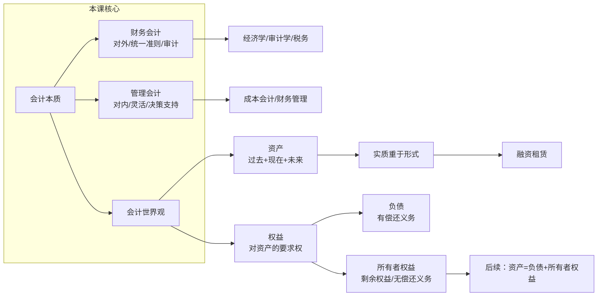

# C004 第 1 课：什么是会计 & 会计如何看世界

## 一句话总结

会计是以货币为计量尺度、从价值角度综合反映企业经济活动的一种"商业语言"，核心在于建立"会计如何看世界"的思维框架——所有经济交易最终都可归结为资产与权益的变动。

## 课程大纲

**第一章：什么是会计**
- 会计是"商业语言"（传递财务信息）
- 会计信息的特征：综合性、敏感性
- 会计的三种定义视角：信息系统 / 管理活动 / 艺术
- 财务会计 vs 管理会计（核心二分法）
  - 财务会计三大特点：遵守统一准则、统一格式报表定期提供、主要反映已发生经济活动
  - 中国会计准则与国际准则"趋同"（2007年起）
  - 独立审计保证准则被遵循
- 会计与相关课程的关系：税务会计、成本会计、经济学 vs 会计学

**第二章：会计如何看世界（资产与权益）**
- 会计的三要素概念：主体、交易、价值
- 核心洞察：一切交易 = 资产与权益的变动
- 资产的定义与确认条件（过去形成 + 现在拥有/控制 + 未来经济利益）
- "控制"的深层含义 → 实质重于形式原则
- 权益 = 对资产的要求权：负债（债权人权益） vs 所有者权益（剩余权益）
- 权责按性质区分，不按身份区分

## 核心概念

| 概念 | 定义 / 说明 |
|------|------------|
| **会计** | 在经济社会中以货币表现传递财务信息的活动；普遍认为是**经济信息系统** |
| **财务信息** | 以货币表现的、反映价值方面的信息 |
| **综合性** | 以货币为尺度将不同资产综合为"多少元"，三四张报表浓缩企业关键信息 |
| **敏感性** | 会计信息直接涉及经济利益（税务基础、分红依据），对信息质量要求极高 |
| **财务会计** | 对外提供信息的分支，必须遵守统一准则，采用统一格式报表，定期提供，主要反映过去 |
| **管理会计** | 对内提供信息的分支，为内部管理决策服务，不需要统一准则 |
| **企业会计准则** | 由财政部发布，保证信息统一、客观、公正、可比 |
| **独立审计** | 注册会计师通过事务所对财务报表进行审计，保证准则被遵循 |
| **资产 (Asset)** | 企业**过去**交易形成的、由企业**拥有或控制**的、**预期**带来经济利益的资源 |
| **控制** | 法律形式上没有所有权，但经济实质上拥有（享有经济利益、承担风险、拥有支配权） |
| **实质重于形式** | 会计大原则——当经济实质与法律形式脱节时，以经济实质为准 |
| **融资租赁** | "控制"的典型例子：租期覆盖资产大部分寿命、租金接近买价，租入即确认为自有资产 |
| **经济利益** | 直接或间接导致现金及现金等价物流入企业的潜力 |
| **资产确认两条件** | ①未来经济利益很可能流入 ②成本或价值能可靠计量 |
| **权益 (Equity/Claims)** | 所有把资源投入企业的人对资产提出的要求权和主张权 |
| **负债 (Liability)** | 过去交易形成的现时义务，预期导致经济利益流出；有偿还义务 |
| **所有者权益** | 资产扣除负债后的剩余权益；持续经营前提下无偿还义务 |

## 老师重点强调

1. 🔴 **会计信息的综合性与敏感性导致对信息质量的高要求**：信息必须可靠
2. 🔴 **财务会计三大特点必须记住**：统一准则 → 统一格式 → 反映过去
3. 🔴 **"实质重于形式"是会计的大原则**：融资租赁是典型场景
4. 🔴 **资产的三维时间结构**：过去形成 → 现在拥有/控制 → 未来经济利益，缺一不可
5. 🔴 **所有者权益 = 剩余权益**：资产减去负债后剩下的才属于所有者
6. 🔴 **权益按性质不按身份区分**：同一个人既可以是所有者又可以是债权人
7. 🔴 **会计的局限性**：人力资源、创新能力因无法可靠计量而不能入表
8. 🔴 **会计准则需要审计来保证执行**：准则 + 审计 = 完整制度保障
9. 🔴 **会计 500 年长盛不衰**，原因在于它对世界的看法抓住了本质

## 关键例子

| 例子 | 说明的概念 |
|------|-----------|
| **CEO 多从财务出身** | 会计综合性帮助全面了解企业 |
| **甲卖商品给乙** | 核心交易模型：一切复杂交易都可还原为资产与权益的此消彼长 |
| **机器寿命10年，租期8年** | 融资租赁：法律上无所有权，实质上全部经济利益和风险由承租方承担 |
| **生产设备 → 产品 → 卖出现金** | 间接经济利益流入链条 |
| **人力资源/创新能力** | 符合资产定义但无法可靠计量 → 不能入表 |
| **企业卖东西就欠税务局税** | 负债产生的常见场景 |
| **老板既是所有者又是债权人** | 权益按性质区分 |

## 易混/易错点

| 易混/易错点 | 正确理解 |
|------------|---------|
| **"会计是商业语言"不是正式定义** | 只是形象比喻，正式定义倾向"经济信息系统" |
| **会计定义不统一** | 美国会计准则体系也没有统一定义 |
| **财务会计 ≠ 全部会计** | 分财务会计（对外）和管理会计（对内） |
| **"控制"≠ 法律所有权** | 控制是实质上有所有权（利益+风险+支配权） |
| **实质重于形式 ≠ 形式不重要** | 多数情况下形式与实质统一，脱节时才以实质为准 |
| **符合定义 ≠ 可以确认入表** | 还需满足：概率高 + 能可靠计量 |
| **负债 vs 所有者权益** | 负债必须偿还，所有者权益无偿还义务 |
| **所有者权益 ≠ 所有者身份** | 按资本性质区分，不按人区分 |
| **会计制度 ≠ 会计准则** | 制度是计划经济产物（非常细），准则更原则性 |
| **税务会计归属灵活** | 对外提供→财务会计；对内避税决策→管理会计 |
| **成本会计跨越两界** | 对外报告存货成本→财务会计；内部管理→管理会计 |

## 知识图谱

## 我的待解决问题

1. 会计的"艺术性"具体体现在哪些方面？
2. 中国会计准则与 IFRS "趋同"但具体还有哪些差异？
3. "现金等价物"的精确定义是什么？
4. 除了融资租赁，还有哪些常见的"实质重于形式"应用场景？
5. 资产确认条件中"概率很高"有没有量化标准？
6. 人力资源不能入表，那员工培训支出在会计上如何处理？
7. 融资租赁的会计处理具体怎么做——借方资产、贷方负债？
8. 会计制度在计划经济下"非常细"——具体有多细？

## 复习题

1. 为什么说会计是"商业语言"？它传递什么信息？有什么特征？
2. 财务会计与管理会计的核心区别是什么？各有什么特点？
3. 财务会计为什么必须遵守统一的会计准则？
4. 中国会计准则与国际会计准则是什么关系？什么时候开始趋同的？
5. 资产的完整定义是什么？请从"过去-现在-未来"三个时间维度解释。
6. "拥有或控制"中的"控制"是什么意思？请用融资租赁的例子说明。
7. 什么是"实质重于形式"原则？它在会计中为什么重要？
8. 符合资产定义的资源就一定能记入财务报表吗？请举例说明。
9. 负债和所有者权益的根本区别是什么？
10. "所有者权益是剩余权益"这句话怎么理解？
11. 为什么同一个人可以既是企业的所有者又是债权人？
12. 请用自己的话解释：为什么说一切经济交易本质上都是"资产和权益的变动"？

## 行动清单

- [ ] 熟记资产的三维定义及两个确认条件
- [ ] 熟记财务会计三大特点，能随口说出
- [ ] 理解并能举例说明"实质重于形式"原则
- [ ] 搞清资产、负债、所有者权益三者的定义和经济关系
- [ ] 能画出 资产 = 负债 + 所有者权益 的基本等式
- [ ] 对比经济学课程中"价值"概念与会计学中"价值"的异同
- [ ] 为第2课做准备：预习会计要素的构成及会计等式的具体展开
