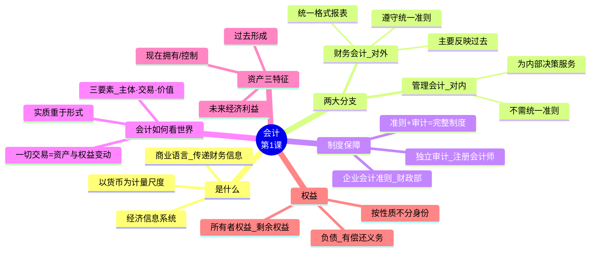
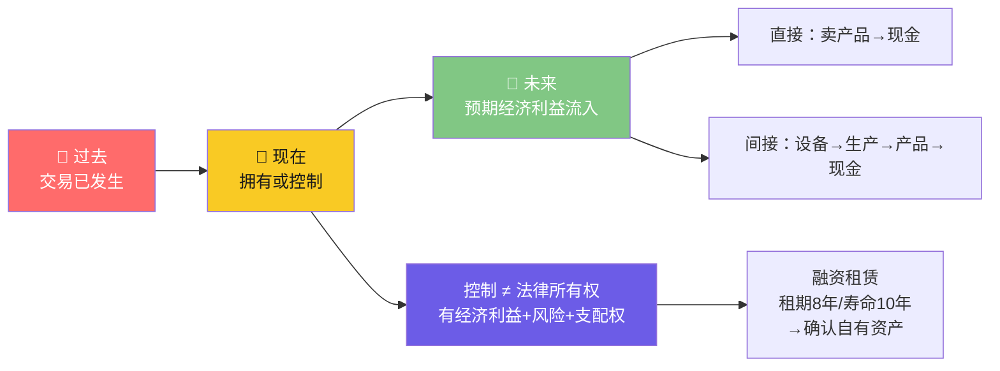
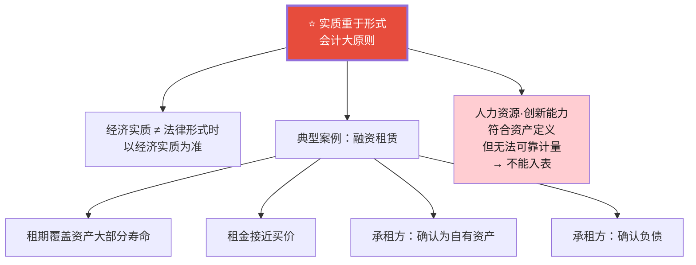
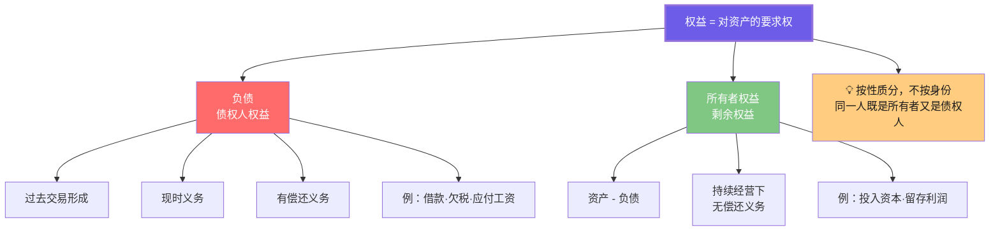
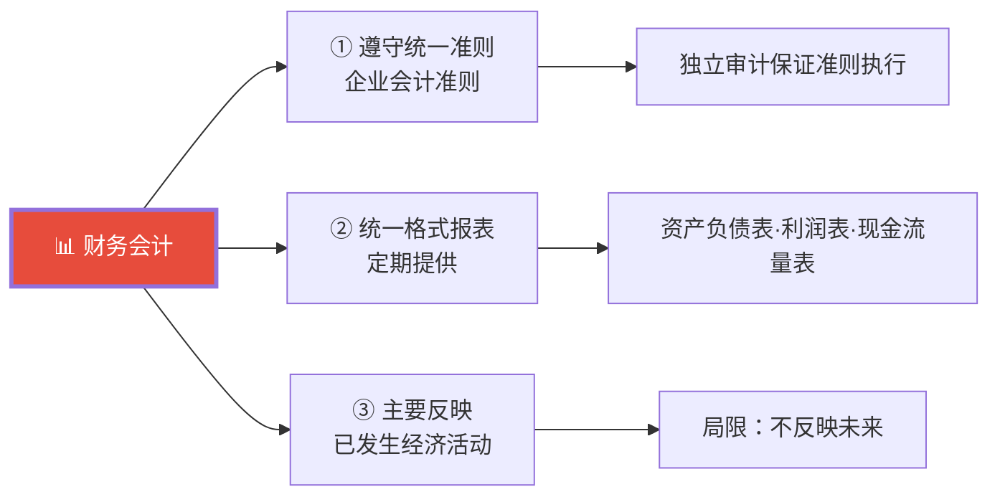

# C004 会计学基础第1课 · 记忆图

> 一张图记住会计的本质：以货币为尺度的商业语言——核心是"资产 = 权益"，遵循"实质重于形式"

---

## 一、会计是什么 · 全景图

---

## 二、资产三维时间结构

---

## 三、实质重于形式

---

## 四、权益的两类区分

---

## 五、财务会计三大特点

---

## ⚡ 速查卡片

| 概念 | 一句话 | 关键点 |
|------|--------|--------|
| 会计 | 以货币为尺度的商业语言 | 综合性 + 敏感性 |
| 资产 | 过去形成·现在控制·未来利益 | 三维时间缺一不可 |
| 控制 | 实质上拥有（利益+风险+支配权） | ≠ 法律所有权 |
| 负债 | 有偿还义务 | 过去交易·现时义务 |
| 所有者权益 | 资产 - 负债 = 剩余 | 无偿还义务 |
| 实质重于形式 | 经济实质优先 | 融资租赁是经典案例 |

> 🎓 **老师金句记忆**：
> - "会计是商业语言——500年长盛不衰"
> - "实质重于形式是会计的大原则"
> - "资产的三维时间结构：过去→现在→未来"
> - "会计信息的综合性与敏感性 → 对质量要求极高"
> - "准则 + 审计 = 完整的制度保障"
