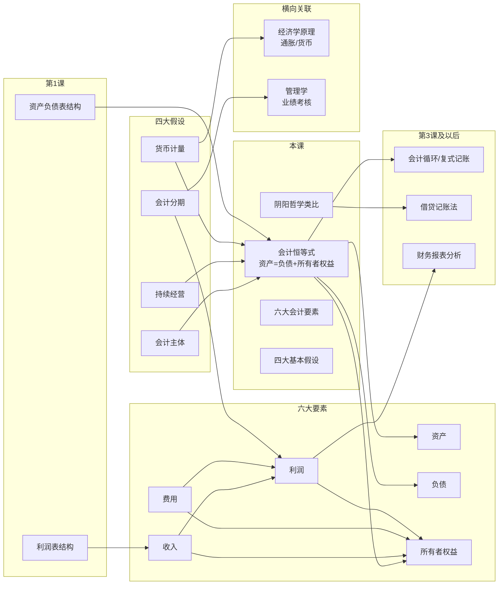

# C004 第 2 课：会计恒等式与基本假设

## 一句话总结

会计用"资产 = 权益（负债 + 所有者权益）"这个恒等式来观察和记录企业的全部经济活动，本质上是把万事万物的经济现象都抽象为"资产"和"权益"两面——如同阴阳——并在此基础上引入收入、费用、利润等概念，再通过会计主体、持续经营、会计分期、货币计量四大基本假设构建完整的数据处理框架。

## 课程大纲

1. **重温资产负债表与会计恒等式**
   - 资产端：现金、应收应付、对外投资、固定资产、在建工程、生产性生物资产、无形资产、开发支出、商誉
   - 权益端：借款、欠职工/税务/投资者款项、所有者权益
   - 核心等式：资产 = 权益 = 负债 + 所有者权益（永远相等）

2. **阴阳哲学类比 + 张先生商店案例系列**
   - 会计思想 = 阴阳：资产与权益是同一件事的两面
   - 四类经济业务对等式的影响演示

3. **收入、费用与利润**
   - 收入（Revenue）：日常活动、导致权益增加、总流入（毛额）
   - 费用（Expense）：日常活动、导致权益减少、总流出（毛额）
   - 利润 = 收入 − 费用 + 利得 − 损失
   - 利得/损失：非日常活动、以净额列示
   - 长虹电器利润表分析

4. **会计四大基本假设**
   - 会计主体、持续经营、会计分期、货币计量

5. **会计是最古老的数据处理系统**

## 核心概念

| 概念 | 定义与要点 |
|------|-----------|
| **资产 = 负债 + 所有者权益** | 会计第一恒等式，永远相等，如同一枚硬币的两面 |
| **收入 (Revenue)** | 日常活动中形成的、导致所有者权益增加的、与投入资本无关的经济利益**总流入**（毛额） |
| **费用 (Expense)** | 日常活动中发生的、导致所有者权益减少的、与利润分配无关的经济利益**总流出**（毛额） |
| **利得与损失** | 非日常活动形成的，以**净额**列示（如卖房子：买60万卖80万，利得20万） |
| **利润** | 一定期间的经营成果 = 收入 − 费用 + 利得 − 损失 |
| **会计主体** | 会计只报告"主体"范围内的事，主体外的交易不管 |
| **持续经营** | 假定企业持续经营，资产按成本计价（而非清算价值） |
| **会计分期** | 将连续经营活动硬性切分为会计期间（年/季/月），可能失真 |
| **货币计量** | 以名义货币为计量单位，不考虑通胀（局限性） |
| **生产性生物资产** | 如奶牛（产奶）、果树（产果实）——特殊固定资产 |
| **商誉 (Goodwill)** | 创新能力、人力资源等，平时不可单独计量，企业合并时才体现 |

## 老师重点强调

1. ⭐ **"资产等于权益，永远相等，不可能不等"**——会计最核心的思想，反复强调多次
2. ⭐ **阴阳类比是理解会计的钥匙**：万事万物最终都可归结为两面——如同《红楼梦》史湘云解释阴阳
3. ⭐ **"收入本身就是毛的"**——收入没有"毛收入"概念，收入本身就是 Gross
4. ⭐ **收入必须与所有者投入资本无关**：张先生投入的资本不是收入！
5. ⭐ **利得和损失以净额列示**——与收入/费用分开列报的最大区别
6. ⭐ **会计利润 ≠ 应纳税所得额**：亏损也可能要交税
7. ⭐ **毛利率极其重要**：毛利率高底气足，毛利率低经不起费用波动
8. ⭐ **会计主体概念是绝对前提**：个人钱在投入商店之前，会计完全不管
9. ⭐ **持续经营假设决定了资产按成本计价**：整匹布 vs 碎布片的例子
10. ⭐ **会计是最古老的"数据处理"**：世界上第一个专门做数据处理的行业

## 关键例子

| 例子 | 说明的概念 |
|------|-----------|
| **张先生用2万现金开商店** | 第一类业务：资产与权益同增 |
| **商店用1000元现金买货架** | 第二类业务：资产内部一增一减，总量不变 |
| **商店向甲商场赊购商品15000元** | 第三类业务：资产和负债同增 |
| **商店用现金8000元归还货款** | 资产和负债同减 |
| **张先生将个人商品4000元投入商店** | 会计主体概念：投入前不管，投入后才记录 |
| **张先生用私房钱替商店还债** | 这是两笔交易：先投入（投资增加），再还款 |
| **张先生抽回投资2000元** | 第四类业务：资产与权益同减 |
| **张先生转让一半投资给李四** | 主体边界：两人间的交易价格会计不管 |
| **出售商品成本7000元，收现金11000元** | 引出收入与费用：收入11000，费用7000，利润3000 |
| **整匹布 vs 碎布片** | 持续经营假设：碎布片金额更大（多了工序成本） |
| **卖房子：成本60万，售价80万** | 利得20万，以净额列示 |
| **长虹电器利润表** | 毛利率约20%，营业利润亏损，毛利率低导致经不起费用波动 |
| **20世纪70年代全球通胀** | 货币计量假设的缺陷 |

## 易混/易错点

| 易混概念 | 区别要点 |
|----------|---------|
| **收入 vs 所有者投入** | 收入是"赚"来的（日常活动），投入是"投"进来的——绝对不是收入 |
| **收入是"毛额" vs 利润有"毛利/净利"** | 收入本身就是 Gross，没有"毛收入"说法；利得/损失是 Net |
| **利得/损失 vs 收入/费用** | 非日常活动 vs 日常活动；净额列示 vs 总额列示 |
| **利润 vs 净利润** | 利润总额还要扣除所得税才是净利润；会计亏损 ≠ 不交税 |
| **持续经营 vs 清算假设** | 持续经营按成本计价；清算按脱手价/可变现净值计价 |
| **会计主体 vs 法律主体** | 法律主体一定是会计主体，但会计主体更灵活 |
| **会计分期 vs 持续经营** | 两回事！不持续经营也可以分期 |
| **母公司报表 vs 合并报表** | 母公司只报自身；合并报表报整个集团，内部交易不计算 |
| **名义货币 vs 实际购买力** | 会计按名义货币计量，不考虑通胀 |

## 知识图谱

## 我的待解决问题

1. 商誉（Goodwill）在企业合并时具体怎么计算？支付对价超过可辨认净资产公允价值的差额？
2. 利得与损失在中国 vs 美国报表中列示有什么具体不同？
3. 研发支出、广告费、员工培训费——会计准则如何处理跨期费用？是否有资本化选项？
4. 70年代后研究的通胀会计具体是什么方法？现行准则有要求吗？
5. 生产性生物资产的折旧/摊销怎么处理？奶牛老了之后怎么计量？
6. 应纳税所得额 vs 会计利润的具体差异？亏损也交税的例子？

## 复习题

1. 为什么说"资产 = 权益"永远相等？请用阴阳思想解释。
2. 张先生用个人私房钱替商店还债，会计上应该记录几笔交易？为什么？
3. 收入与所有者投入的最本质区别是什么？
4. "收入是总流入（毛额），利得是净额"——这句话怎么理解？
5. 持续经营假设下，为什么碎布片比整匹布金额更大？
6. 会计主体假设的边界在哪里？合并报表和母公司报表的主体边界有何不同？
7. 会计分期假设可能导致哪些信息失真？对管理者行为有何影响？
8. 货币计量假设的局限性是什么？
9. 请列举经济业务的四种类型，并各举一例。
10. 长虹电器利润表显示营业利润亏损、毛利率约20%。为什么说毛利率低的企业"稍微费用多一点就亏了"？

## 行动清单

- [ ] 复习第1课笔记，确认资产负债表和利润表的基本结构已掌握
- [ ] 将张先生商店的全部交易用 T 型账户画一遍，体会四类业务对等式的影响
- [ ] 找一家 A 股上市公司的最新年报，验证"资产 = 负债 + 所有者权益"
- [ ] 看该公司利润表，区分营业收入/营业成本 vs 利得/损失
- [ ] 计算该公司的毛利率，与长虹（≈20%）做对比
- [ ] 阅读年报附注中关于"持续经营"的声明
- [ ] 思考：如果自己开一家小店，会计主体边界在哪里？
- [ ] 预习：下一课将讲"会计循环"——报表是怎么一步步加工出来的
