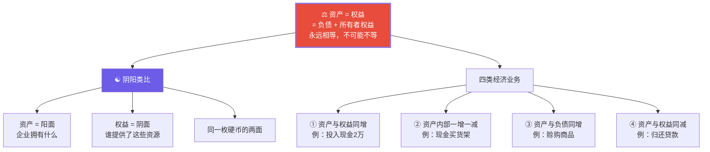
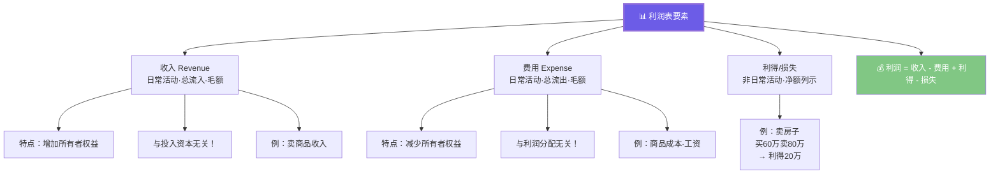
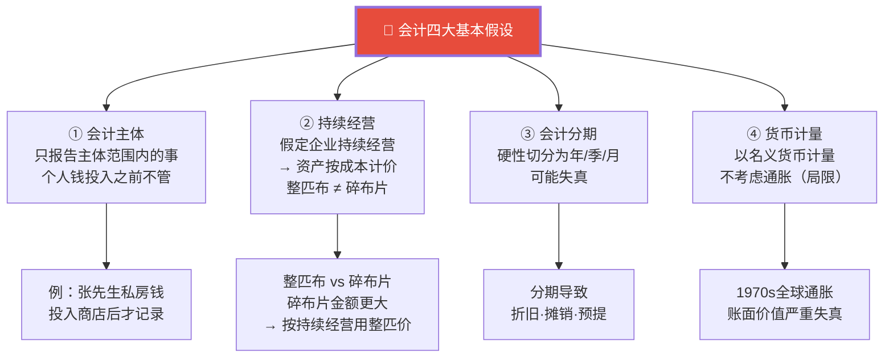
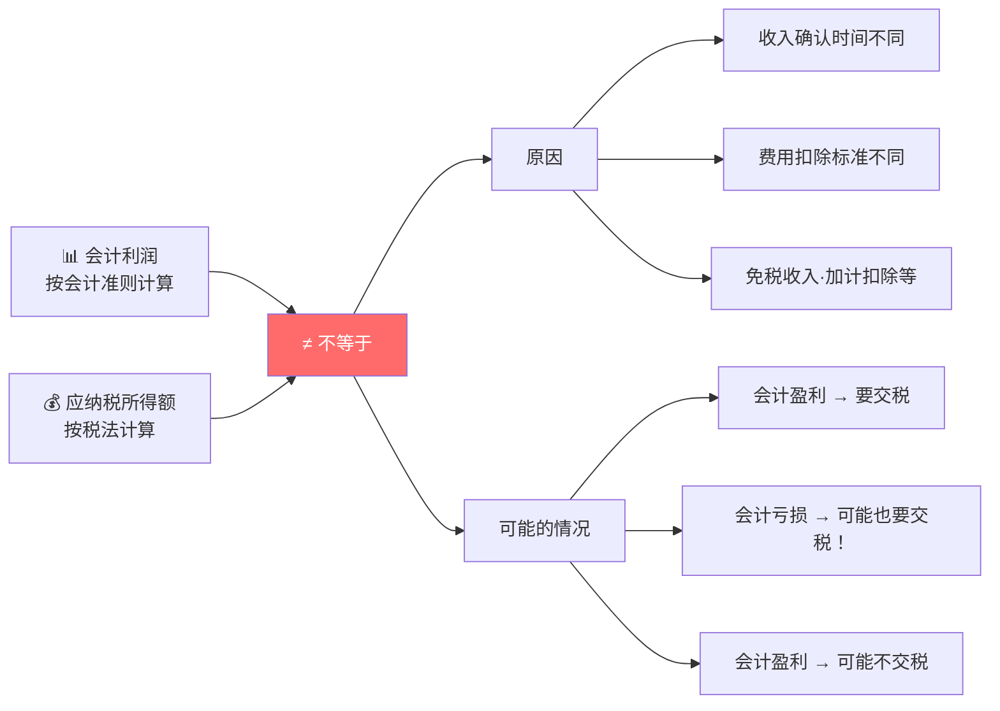

# C004 会计学基础第2课 · 记忆图

> 一张图记住会计恒等式（资产=负债+所有者权益）+ 阴阳思维 + 四大基本假设

---

## 一、会计恒等式 · 阴阳思维

---

## 二、收入 vs 费用 vs 利得 vs 损失

---

## 三、会计四大基本假设

---

## 四、会计利润 ≠ 应纳税所得额

---

## 五、资产负债表全景

```mermaid
graph TD
    BS["📋 资产负债表"]

    BS --> ASSETS["资产端"]
    ASSETS --> A1["流动资产：现金·应收·存货"]
    ASSETS --> A2["非流动资产"]
    A2 --> A2A["固定资产·在建工程"]
    A2 --> A2B["无形资产·开发支出"]
    A2 --> A2C["对外投资·商誉"]
    A2 --> A2D["生产性生物资产<br/>（奶牛·果树）"]

    BS --> EQUITY2["权益端"]
    EQUITY2 --> E1["负债"]
    E1 --> E1A["借款·应付账款"]
    E1 --> E1B["欠职工薪酬·欠税务"]
    EQUITY2 --> E2["所有者权益"]
    E2 --> E2A["投入资本·留存利润"]

    BS --> BALANCE["⚖️ 永远相等"]

    style BS fill:#6c5ce7,color:#fff,stroke-width:3px
    style BALANCE fill:#e74c3c,color:#fff
```

---

## ⚡ 速查卡片

| 概念 | 一句话 | 易错提醒 |
|------|--------|----------|
| 资产 = 权益 | 永远相等 | 同一硬币的两面 |
| 收入 | 日常·总流入·毛额 | 与投入资本无关！ |
| 费用 | 日常·总流出·毛额 | 与利润分配无关！ |
| 利得/损失 | 非日常·净额 | 卖房子赚20万是利得 |
| 会计主体 | 只报告主体内 | 个人钱投入前不管 |
| 持续经营 | 按成本计价 | 整匹布≠碎布片 |

> 🎓 **老师金句记忆**：
> - "资产等于权益，永远相等，不可能不等"
> - "阴阳类比是理解会计的钥匙"
> - "收入本身就是毛的——没有'毛收入'的说法"
> - "会计是最古老的数据处理行业"
> - "毛利率极其重要：毛利率高底气足，毛利率低经不起费用波动"
