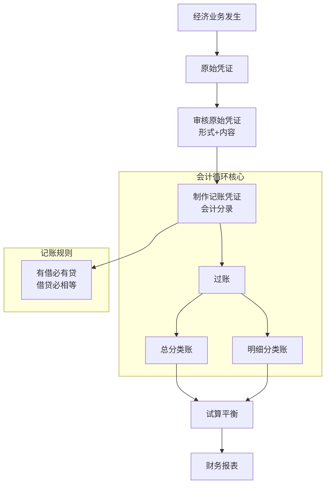

# C004 第 3 课：会计循环——凭证、账户与复式记账

## 一句话总结

会计循环是从原始凭证到财务报表的完整数据处理流程，核心是复式记账（有借必有贷、借贷必相等），通过账户和记账凭证实现对经济业务的系统化记录。

## 课程大纲

**第一章：原始凭证**
- 原始凭证的定义：证明经济业务发生/完成的书面文件
- 凭证要素（7项）：名称、填制单位、日期、接受单位、金额、经办人签章等
- 原始凭证的审核：形式审核（要素齐全）+ 内容审核（合理合法）
- 常见原始凭证：增值税发票、收据、现金支票、领料单、货运单

**第二章：账户与复式记账**
- 账户：对会计要素具体内容的分类，是记录单元
- 账户结构：横向左右两方（借方/贷方）
- 复式记账：每笔业务以相等金额在两个或以上相互联系的账户中记录
- 借贷记账法的历史：1494 年意大利数学家记载，最早在佛罗伦萨银行使用
- 借贷记账符号：借 = 资产增加/权益减少；贷 = 资产减少/权益增加
- 余额（Balance）：增减相抵后的差额，资产一般有借方余额，权益一般有贷方余额

**第三章：记账凭证与会计分录**
- 记账凭证 = 记载会计分录的单据
- 会计分录三要素：账户、方向、金额
- 简单分录：一借一贷
- 复合分录：一借多贷 / 一贷多借（多借多贷尽量避免）

**第四章：分类账与过账**
- 总分类账：按一级科目设置
- 明细分类账：按明细等级设置（如库存商品→食品→具体规格）
- 过账：从记账凭证抄录到分类账，环环相扣

## 核心概念

| 概念 | 定义 / 说明 |
|------|------------|
| **原始凭证** | 证明经济业务发生/完成、明确经济责任、用作记账原始依据的书面文件 |
| **记账凭证** | 记载会计分录的单据；是原始凭证与分类账之间的过渡环节 |
| **账户 (Account)** | 对会计要素具体内容的分类，是记录和确认的单元 |
| **科目** | 会计账户的名称 |
| **复式记账** | 每笔业务以相等金额在两个或以上相互联系的账户中记录 |
| **借贷记账法** | 以"借""贷"为记账符号的复式记账法，目前唯一使用的复式记账方法 |
| **借 (Debit)** | 资产增加、权益减少的记账方向 |
| **贷 (Credit)** | 资产减少、权益增加的记账方向 |
| **会计分录** | 指明一笔会计事项应涉及的账户、借贷方向和金额的记录（记账公式） |
| **简单分录** | 一借一贷的会计分录 |
| **复合分录** | 一借多贷或一贷多借的分录；多借多贷应尽量避免 |
| **对应账户** | 一笔分录中借贷方向相反、互为因果的两个账户 |
| **发生额** | 记录在账户中每一笔增加或减少的金额 |
| **余额 (Balance)** | 增减相抵后的差额，资产类一般在借方，权益类一般在贷方 |
| **总分类账** | 按一级科目设置的分类账簿 |
| **明细分类账** | 按明细等级（二、三级科目）设置的分类账簿 |
| **过账** | 将记账凭证上的分录抄录到分类账的过程 |
| **日記账** | 按时间顺序逐笔记录会计分录的账簿（功能等同记账凭证） |

## 老师重点强调

1. 🔴 **借贷记账法下，借贷已无原始字面意义，纯粹是符号**：借代表资产增加/权益减少，贷代表资产减少/权益增加——规定而已
2. 🔴 **有借必有贷，借贷必相等**：这是记账规则，每笔业务都满足
3. 🔴 **会计分录三要素**：账户 + 方向 + 金额，缺一不可
4. 🔴 **会计分录比直接登账更好**：分录完整描述一件事的来龙去脉（因果关系），登到各账户后就分散了
5. 🔴 **环环相扣**：报表←分类账←记账凭证←原始凭证，每一步都可追溯
6. 🔴 **计算机没有改变会计的基本原理**：只是节省了人工，数据结构处理思路完全一致
7. 🔴 **一借一贷是最简单的分录**，复合分录（一借多贷/一贷多借）也可拆成简单分录
8. 🔴 **余额在哪方有经济含义**：资产不应出现贷方余额（不能有"负商品"），权益不应出现借方余额

## 关键例子

| 例子 | 说明的概念 |
|------|-----------|
| **张三理事商店（完整分录）** | 投入、购设备、赊购、还债、再投资、抽回、销售等全部做成分录演示 |
| **借：现金 2万 / 贷：张三投资 2万** | 最简单的一借一贷；资金"从哪里来→到哪里去" |
| **借：现金 2万 / 贷：张三投资 1.1万、理事投资 9千** | 一借多贷（复合分录），可拆为两个简单分录 |
| **用三辆汽车换一栋房子** | 历史成本=付出对价的公允价值 |
| **1494 年意大利数学家** | 借贷记账法第一次被文字记载（《几何》专著中的一章） |
| **佛罗伦萨银行 12-13 世纪账本** | 借贷记账法更早的实际使用证据 |
| **"借""贷"是日本人翻译的** | 从 Debit/Credit 翻成汉字，翻得很到位 |
| **文革时期"增减记账法"** | 试图用增减替代借贷，但方向性太强，最终被淘汰 |

## 易混/易错点

| 易混/易错点 | 正确理解 |
|------------|---------|
| **借=借钱、贷=贷款？** | ❌ 记账符号已无原始字面意义，纯粹是符号 |
| **资产增加一定是借？** | ✅ 对；权益增加一定是贷 |
| **借贷方向记反了怎么办？** | 等于把增减弄反，余额会错，经济含义完全颠倒 |
| **可以直接从原始凭证登分类账吗？** | ❌ 应先做记账凭证（会计分录），再登账；否则分散后难以查错 |
| **账户 = 账簿？** | 账户是分类单元（Account），账簿是按账户开设的本子（Ledger），两者不同 |
| **明细账可以有多少级？** | 按需要设置，如库存商品→食品→饮料→品牌→规格 |
| **银行存款/现金日记账** | 既是序时记录，也起明细账作用（因现金敏感需逐笔记录） |
| **为什么不能用多借多贷？** | 不是技术不允许，而是来龙去脉不清楚，描述水平不高 |

## 知识图谱

