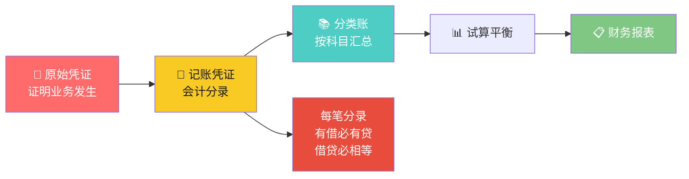
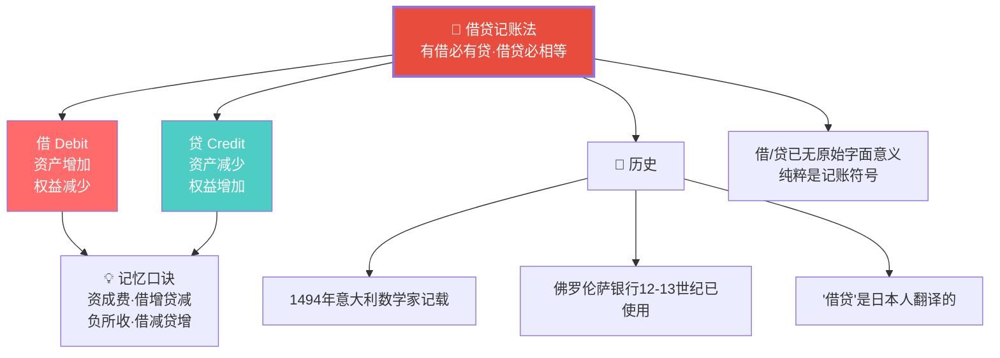
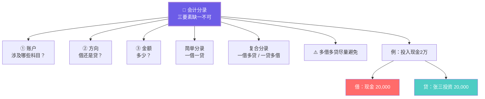
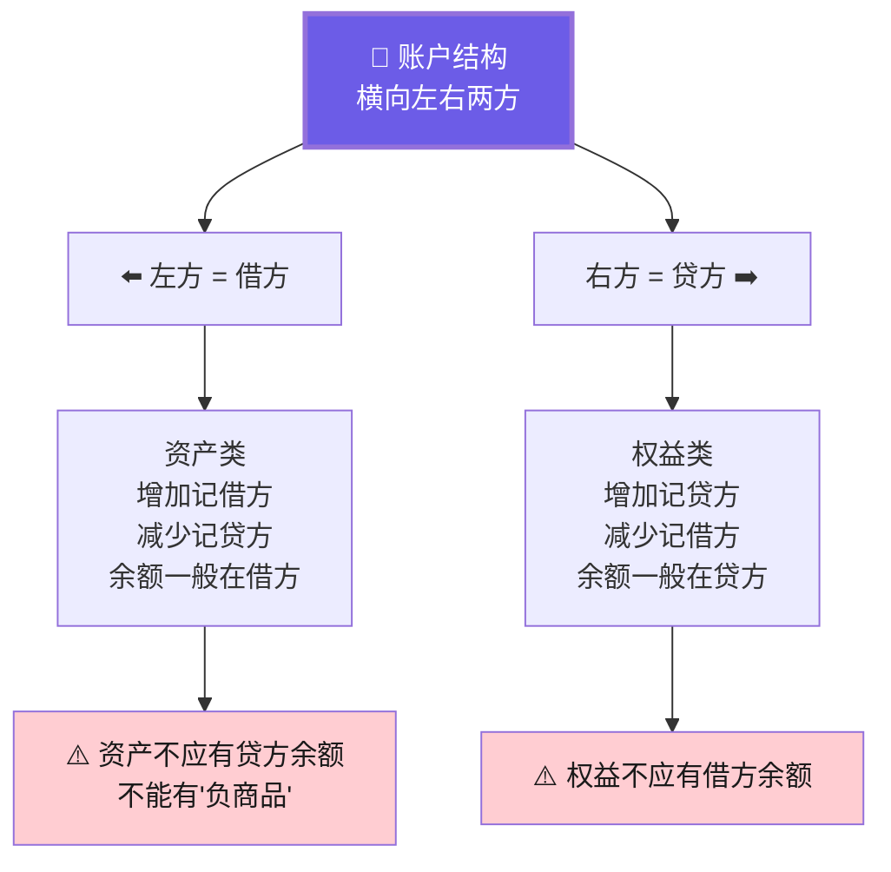

# C004 会计学基础第3课 · 记忆图

> 一张图记住会计循环的核心引擎：有借必有贷、借贷必相等——复式记账让每一笔业务的来龙去脉清清楚楚

---

## 一、会计循环全景

---

## 二、借贷记账法 · 核心规则

---

## 三、会计分录 · 三要素

---

## 四、分录 vs 分类账

---

## 五、账户结构与余额

---

## ⚡ 速查卡片

| 环节 | 功能 | 关键要点 |
|------|------|----------|
| 原始凭证 | 证明业务发生 | 7要素齐全·审核合规 |
| 记账凭证 | 做会计分录 | 三要素：账户+方向+金额 |
| 分类账 | 按科目汇总 | 总分类账 + 明细分类账 |
| 试算平衡 | 检查借贷相等 | 不等=有错 |
| 财务报表 | 最终产出 | 三张主表 |

| 借/贷 | 资产 | 权益 |
|--------|------|------|
| 借 | 增加 ↑ | 减少 ↓ |
| 贷 | 减少 ↓ | 增加 ↑ |

> 🎓 **老师金句记忆**：
> - "有借必有贷，借贷必相等——记账铁律"
> - "借贷已无原始字面意义，纯粹是符号"
> - "会计分录三要素：账户 + 方向 + 金额，缺一不可"
> - "分录比直接登账更好——保留了来龙去脉"
> - "计算机没有改变会计的基本原理"
