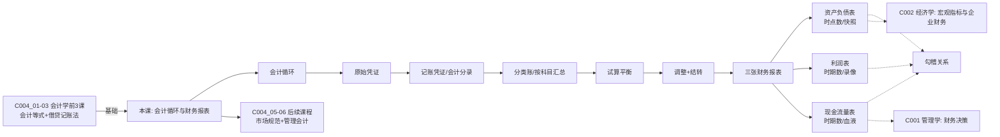

# C004 第 4 课：会计循环与财务报表体系

## 一句话总结

会计的核心是"凭证→账簿→报表"的循环：原始凭证证明业务发生，记账凭证做借贷分录，分类账按科目汇总，最终产出资产负债表、利润表、现金流量表三张核心报表。

## 课程定位

本课是会计学基础第 4 课（共 6 课），重点讲会计循环中的数据流转、从记账凭证到分类账再到财务报表的完整链条，以及三张主要财务报表的结构、关系和编制要点。

---

## 一、会计循环：凭证→账簿→报表

### 整体流程

```
原始凭证 → 记账凭证（会计分录）→ 过账 → 分类账 → 试算平衡 → 调整 → 财务报表
```

### 记账凭证与分类账的关系

| 环节 | 功能 | 特点 |
|---|---|---|
| 记账凭证 | 按时间顺序记录每笔业务（流水账/日记账） | 来龙去脉清楚 |
| 分类账 | 按科目（账户）归类汇总 | 某科目增减一目了然 |

- 分类账上每一笔发生额都**来自记账凭证**，一一对应，不能少也不能多
- 改错也从记账凭证改起
- 数据环环相扣

---

## 二、会计数据处理的核心方法：账户间结转

### 常用处理方法

| 方法 | 说明 | 例子 |
|---|---|---|
| 首次确认 | 发生业务 → 编制分录（一借一贷） | 购入原材料 |
| 再次分类（结转） | 从一个账户转到另一个账户 | 原材料 → 生产成本 → 库存商品 |
| 归集 | 多个账户合到一个账户 | 收入类账户 → 本年利润 |

### 制造业的结转链

```
原材料（借）
    ↓ 领料单
生产成本（在制品）- 料 + 工 + 费
    ↓ 完工入库单
库存商品（产成品）
    ↓ 销售出库
主营业务成本
```

> 记账凭证不一定要有原始凭证——纯计算性质的结转（如结转到本年利润）就没有原始凭证。

---

## 三、财务报表体系

### 三张主表

| 报表 | 反映内容 | 时间特征 | 报表日期写法 |
|---|---|---|---|
| 资产负债表 | 资产=负债+所有者权益 | **静态**（时点数） | 2016年12月31日 |
| 利润表 | 收入-费用=利润 | **动态**（时期数） | 2016年度 |
| 现金流量表 | 现金流入-流出=净流量 | **动态**（时期数） | 2016年度 |

### 资产负债表——快照

- 反映某一**时点**的财务状况
- 就像给企业拍一张照片——定格瞬间
- 理论上每发生一笔业务就会打破平衡、重新平衡，可编无数张
- 年报编制的是**最后一笔业务完成后**的那张
- 两期资产负债表对比，能看出该时期的变化（增加了什么、减少了什么）

### 利润表——录像

- 反映**一段时期**的经营成果
- 解释两期资产负债表之间权益最重要项目（留存收益）的变化
- 是流量表

### 现金流量表——血液

- 反映**一段时期**现金的流入流出
- 说明资产负债表中最重要流动资产（现金）的变化
- 分三类活动：

| 活动类型 | 主要流入 | 主要流出 |
|---|---|---|
| 经营活动 | 销售商品、提供劳务收到的现金 | 购买商品、支付工资、缴税 |
| 投资活动 | 收回投资、处置固定资产 | 购建固定资产、对外投资 |
| 筹资活动 | 借款、发行股票 | 还贷、分红 |

> **最重要的指标**：经营活动现金流量应为正——这代表企业自己的"造血功能"。

---

## 四、资产的多维度分类

### 按流动性分（报表标准分类）

| 类别 | 内容 |
|---|---|
| 流动资产 | 现金、银行存款、应收账款、存货等（变现快，< 1年） |
| 非流动资产 | 固定资产、无形资产、长期投资等 |

### 按经营/金融属性分

| 类别 | 内容 | 特点 |
|---|---|---|
| 经营资产 | 存货、固定资产等 | 构成业务、可以赚钱 |
| 金融资产 | 股票、债券、应收账款、借款等 | 一种契约权利、可以直接或将来收现金 |

> 应收账款 → 有权收现金，是金融资产；预付账款 → 收的是货，不是金融资产。

### 按货币性分

| 类别 | 内容 | 与汇率关系 |
|---|---|---|
| 货币性资产 | 现金、应收账款（金额固定） | 直接受汇率波动影响 |
| 非货币性资产 | 存货、固定资产、股票 | 受汇率间接影响 |

---

## 五、负债的分类

| 类别 | 含义 | 例子 |
|---|---|---|
| 流动负债 | 一年内到期 | 短期借款、应付账款 |
| 非流动负债 | 一年以上到期 | 长期借款 |
| 一年内到期的非流动负债 | 本来是长期但距到期<1年 | 列入流动负债 |

> **重点**：账上"长期借款"科目不变，但编制报表时，一年内到期的部分要**重分类**到"一年内到期的非流动负债"（列在流动负债下）。

### 借款 ≠ 贷款

- **借款**一定是向银行等金融机构的**贷款**
- 向母公司借钱 → 记"其他应付款"，不能叫"借款"

---

## 六、从账户余额到财务报表——不能直接抄的情况

### 需要汇总的

| 报表项目 | 对应账户 |
|---|---|
| 货币资金 | 库存现金 + 银行存款 + 其他货币资金 |

### 需要重分类的

| 情况 | 处理 |
|---|---|
| 应收账款明细账出现贷方余额 | 报表中列到"预收账款"（不能抵扣） |
| 预付账款明细账出现贷方余额 | 报表中列到"应付账款" |
| 长期借款一年内到期 | 列到"一年内到期的非流动负债" |

> 原则：资产和负债不能互相抵扣；长期变短期要及时调整。

### 利润表编制相对简单

- 收入费用类账户的发生额直接抄
- 不存在"长期变短期"问题（利润表是当期）
- 不存在收入变费用或费用变收入的问题

---

## 七、现金流量表的特殊之处

- **没有现成的账户可直接抄**
- 现金流量表出现最晚，账户体系不是为它设计的
- 只能"账外加工"——对现有账户数据进行调整编制
- 逻辑上是"脱节"的，但计算机会计软件可以自动生成

---

## 八、各表之间的勾稽关系

```
资产负债表（期初）──→ 资产负债表（期末）
         ↑                    ↑
    利润表解释            现金流量表解释
    (留存收益变动)       (现金变动)
```

| 勾稽项 | 说明 |
|---|---|
| 现金 | 资产负债表现金期末余额 = 现金流量表期末现金及等价物余额 |
| 留存收益 | 资产负债表中留存收益变动 = 利润表净利润 - 分红 |
| 净利润 vs 经营现金流 | 两者通常不相等（权责发生制 vs 收付实现制） |

---

## 九、财务报表分析初步

### 资产结构

- 经营性资产 vs 金融资产：实业企业应以前者为主
- 轻资产企业：金融资产多、固定资产少（与行业有关）

### 资本结构（负债 vs 权益）

- 负债比重高 → 财务风险大
- 但适度负债（财务杠杆）也能放大收益
- 关键是**风险承受能力**

### 现金流健康度

- 经营活动现金流持续为正 → 造血功能好
- 投资活动现金流为负 → 有地方花钱投资（通常是好事）
- 经营活动现金流为负 → 需要警惕

---

## 十、会计信息系统

### 计算机 vs 手工

- 原理一模一样：凭证→审核→记账→试算平衡→结账→编报表
- 计算机的优势：自动过账、自动算平衡、自动生成报表
- ERP 系统打通业务与财务，实现数据联动

### 试算平衡原理

$$资产 = 负债 + 所有者权益$$

$$\sum 借方余额 = \sum 贷方余额$$

> 账不平 → 肯定做错了（借贷必相等）。

---

## 核心概念

| 概念 | 定义 |
|---|---|
| 记账凭证 | 按时间顺序记录每笔业务的分录（也叫日记账） |
| 分类账 | 按账户分类汇总所有业务的发生额和余额 |
| 结转 | 从一个账户转至另一个账户（如原材料→生产成本→库存商品） |
| 资产负债表 | 反映某时点资产、负债、所有者权益的静态报表 |
| 利润表 | 反映某时期收入、费用、利润的动态报表 |
| 现金流量表 | 反映某时期现金流入流出的动态报表 |
| 金融资产 | 通过契约获得、有权收取现金的资产 |
| 货币性资产 | 金额固定、直接可收现金的资产 |
| 重分类 | 报表编制时对账户余额的调整（如长期负债一年内到期部分） |
| 试算平衡 | 全部账户借方余额之和 = 贷方余额之和 |

---

## 老师重点强调

1. **记账凭证与分类账一一对应**——不能少也不能多，数据环环相扣。
2. **资产负债表是时点数，利润表和现金流量表是时期数**——前者不能加总，后者可以。
3. **一年内到期的非流动负债要重分类**到流动负债——账上不动，报表必须动。
4. **资产和负债不能互抵**——应收账款明细贷方余额要列预收账款。
5. **经营活动现金流最重要**——代表企业自身造血能力。
6. **现金流量表逻辑上"脱节"**——因为出现最晚，账户不是为它设计的。
7. **应收账款是金融资产，预付账款不是**——收钱 vs 收货的区别。

---

## 关键例子

| 例子 | 说明 |
|---|---|
| 2012年借5年期10万 | 2012-2015年列长期借款，2016年（距到期<1年）重分类到"一年内到期非流动负债" |
| 应收账款明细贷余2万 | 总账余额10万，但报表列应收账款12万 + 预收账款2万 |
| 库存现金+银行存款+其他货币资金 | 报表上合并为"货币资金"一项 |
| 存货（原材料+在产品+库存商品） | 报表上合并为"存货"一项 |
| 利润表没有长短期问题 | 因为是当期数据，不会出现长期变短期的情况 |

---

## 易混/易错点

| 易混点 | 正确认识 |
|---|---|
| 记账凭证 vs 分类账 | 前者按时间顺序，后者按科目归类 |
| 时点数 vs 时期数 | 资产负债表是时点（快照），利润/现金流表是时期（录像） |
| 借款 vs 欠款 | 借款 = 金融机构贷款；向非金融机构借钱 ≠ 借款 |
| 金融资产 vs 货币性资产 | 股票是金融资产但不是货币性资产（金额不固定） |
| 应收账款 vs 预付账款 | 都是债权，但应收收钱（金融资产），预付收货（非金融资产） |
| 结转 ≠ 修改 | 结转是正常的数据转移，不是改错 |

---

## 知识图谱



---

## 我的待解决问题

- 会计报表的具体编制分录如何做（尤其是现金流量表的间接法）？
- 合并报表的编制原理是什么？
- 财务比率分析（偿债能力、盈利能力、营运能力）的具体指标和计算？
- 会计学基础第 1-3 课的内容是什么？

---

## 复习题

1. 会计循环的主要环节是什么？
2. 记账凭证和分类账有什么区别和联系？
3. 资产负债表、利润表、现金流量表各自反映什么内容？
4. 资产负债表为什么是"时点数"？报表日期为什么写 12 月 31 日？
5. 长期借款距到期不足一年时，报表如何处理？
6. 为什么要对账户余额进行重分类？
7. 金融资产和经营资产的区别是什么？
8. 现金流量表为什么说在逻辑上是"脱节"的？
9. 三张报表之间的主要勾稽关系是什么？
10. 经营活动现金流为什么最重要？

---

## 行动清单

- 找一份上市公司年报（如贵州茅台），实际阅读三张主要报表。
- 练习编制简单的资产负债表和利润表（从给定账户余额数据）。
- 理解"一年内到期的非流动负债"重分类逻辑。
- 关注下一课：会计信息的市场规范 + 管理会计简介。
