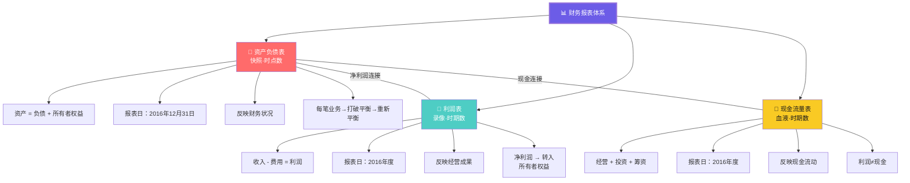
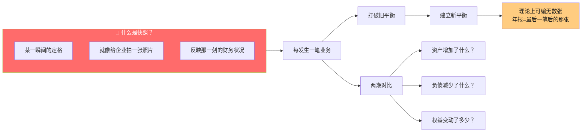
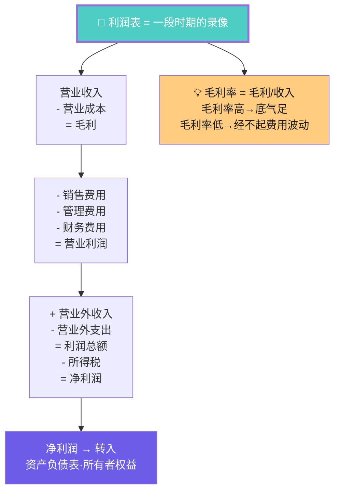
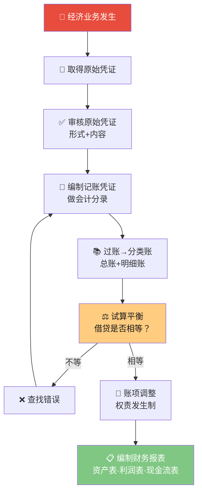

# C004 会计学基础第4课 · 记忆图

> 一张图记住三张报表的关系：资产负债表是快照（时点），利润表是录像（时期），现金流量表是血液（现金流动）

---

## 一、三张报表全景对比

---

## 二、资产负债表 · 快照逻辑

---

## 三、利润表 · 录像逻辑

---

## 四、制造业结转链 · 成本流转

---

## 五、会计循环完整流程

---

## ⚡ 速查卡片

| 报表 | 反映 | 时间特征 | 核心公式 |
|------|------|----------|----------|
| 资产负债表 | 财务状况 | 时点（快照） | 资产=负债+所有者权益 |
| 利润表 | 经营成果 | 时期（录像） | 收入-费用=利润 |
| 现金流量表 | 现金流动 | 时期（血液） | 经营+投资+筹资 |

| 结转类型 | 方法 | 例子 |
|----------|------|------|
| 首次确认 | 编制分录 | 购入原材料 |
| 再次分类 | 账户间结转 | 原材料→生产成本→库存商品 |
| 归集 | 多账户合一 | 收入类→本年利润 |

> 🎓 **老师金句记忆**：
> - "资产负债表是快照，利润表是录像"
> - "数据环环相扣——从凭证到报表，每一步都可追溯"
> - "制造业的结转链：原材料→生产成本→库存商品→主营业务成本"
> - "记账凭证不一定要有原始凭证——纯计算结转就没有"
