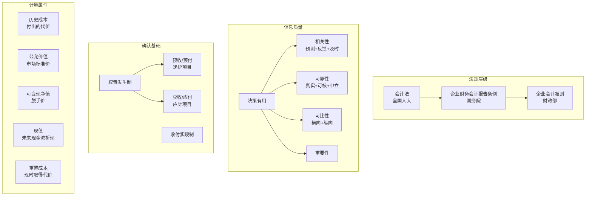

# C004 第 5 课：会计规范、信息质量与权责发生制

## 一句话总结

财务会计需要严格规范。中国已建立从会计法→准则体系→应用指南的完整框架，与 IFRS 趋同。会计信息核心质量要求是"决策有用"（可靠+相关），而权责发生制是实现这一目标的基础——不以现金收付而以权利与责任确认收入费用。

## 课程大纲

**第一章：财务会计规范体系**
- 会计法规层级：会计法（全国人大）→ 企业财务会计报告条例（国务院）→ 会计准则（财政部）
- 中国企业会计准则体系：2006年发布38号，2015年增至41号，已与IFRS趋同
- 国际会计准则理事会主席评价："几乎相同，差异可忽略"

**第二章：会计信息质量要求**
- 核心目标：决策有用 → 相关性与可靠性
- 相关性：预测价值 + 反馈价值 + 及时性
- 可靠性：反应真实性 + 可核性 + 中立性
- 可比性（横向/纵向）：不同企业可比 + 同一企业各期可比（一致性）
- 重要性：对决策影响大的信息应突出披露

**第三章：权责发生制 vs 收付实现制**
- 收付实现制（现金制）：以现金实际收付为确认标准
- 权责发生制（应计制）：以权利取得与责任完成为确认标准
- 四种不一致情况：预收、预付、应收、应付
- 账项调整：递延项目（先收付后确认）+ 应计项目（先确认后收付）

**第四章：会计要素的计量属性**
- 历史成本：取得资产实际付出的代价
- 重置成本：现在重新取得需花的钱
- 可变现净值：现在脱手能收回的现金
- 现值：未来现金流入折现
- 公允价值：市场参与者有序交易中的价格

## 核心概念

| 概念 | 定义 / 说明 |
|------|------------|
| **会计法** | 全国人大发布，最高层级会计法规 |
| **企业会计准则** | 财政部制定，分基本准则和具体准则（1-41号） |
| **国际财务报告准则 (IFRS)** | 全球通用的会计准则，中国已与其实质趋同 |
| **决策有用性** | 会计信息的最终目标：满足使用者经济决策需求 |
| **相关性** | 信息具有预测价值和反馈价值，能帮助决策 |
| **可靠性** | 信息反应真实、可验证、中立无偏向 |
| **可比性** | 不同企业信息可比 + 同一企业前后期可比（一致性/一贯性） |
| **重要性** | 对决策影响大的信息应单独突出披露 |
| **收付实现制（现金制）** | 以现金实际收付时间为收入费用确认时间 |
| **权责发生制（应计制）** | 以权利取得/责任完成为收入费用确认时间，不以现金收付为准 |
| **递延项目** | 先收付款、后确认收入费用的项目（如预收、预付） |
| **应计项目** | 先确认收入费用、后收付款的项目（如应收、应付） |
| **账项调整** | 因权责发生制导致收入费用确认与现金收付不一致时，进行的分录调整 |
| **历史成本** | 取得资产实际付出的代价（从"进"的角度） |
| **公允价值** | 市场参与者在有序交易中出售资产或转移负债的价格 |
| **现值** | 未来现金流量按一定折现率折算到现在的价值 |

## 老师重点强调

1. 🔴 **中国企业会计准则已与 IFRS 趋同**：2007 年起在上市公司执行，目前有 41 号具体准则
2. 🔴 **权责发生制是财务会计的基础**：会计准则要求必须以权责发生制为基础
3. 🔴 **权责发生制不看钱收到没收到，看权利是否取得/责任是否完成**
4. 🔴 **权责发生制带来更多信息**：应收应付、预收预付等商业信用信息，都是权责发生制"制造"出来的
5. 🔴 **如果 100% 收付实现制，企业除了现金没有其他资产**——所有支出都当费用、所有收入都当收入
6. 🔴 **权责发生制四大场景**：预收（先收后确认）、预付（先付后确认）、应收（先确认后收）、应付（先确认后付）
7. 🔴 **收入费用确认时间 ≠ 款项实际收付时间**：权责发生制下这是两个不同时间
8. 🔴 **历史成本 = 付出的代价**（从进的角度看），**公允价值 = 市场标准价格**（从出的角度看）
9. 🔴 **为什么不用收付实现制而用权责发生制？** 权责发生制提供了应收应付等更多决策相关信息

## 关键例子

| 例子 | 对应概念 | 要点 |
|------|----------|------|
| **10月15日售商品1000元，次年3月收款** | 权责发生制 vs 收付实现制 | 权责：10月确认收入（权利已取得）；收付：次年3月确认（钱收到） |
| **12月5日预付次年全年房租1200元** | 预付费用（递延项目） | 权责：房租属次年费用；分录：借预付/贷现金→次年借房租费/贷预付 |
| **用电已消耗但未付款** | 应计费用（应计项目） | 借费用/贷应付→付款时借应付/贷现金 |
| **公寓价值计量** | 历史成本 vs 公允价值 | 历史成本是一对一实际交易价；公允价值是假设市场公平交易价 |
| **用三辆汽车换房子** | 历史成本中的公允价值 | 房子的历史成本 = 三辆汽车的公允价值（不是账面成本） |

## 易混/易错点

| 易混/易错点 | 正确理解 |
|------------|---------|
| **权责发生制下收入确认=收款？** | ❌ 可能先收款后确认（预收），也可能先确认后收款（应收） |
| **收付实现制比权责发生制更可靠？** | 收付实现制确实更客观好理解，但信息量少，不利于决策 |
| **历史成本 = 公允价值？** | 取得时可能很接近，随时间推移差距变大（历史成本逐渐"历史"） |
| **公允价值适用范围** | 主要用于交易性金融资产、可供出售金融资产、投资性房地产（可选）等 |
| **准则解释 vs 准则修订** | 准则不能频繁修改，新问题通过"准则解释"解决，积累到一定程度才修订准则 |
| **权责发生制 = 复杂=不好？** | 虽然理解性差、有主观性，但提供了应收应付等商业信用信息，对决策更相关 |
| **一致性 = 可比性？** | 一致性是同一企业前后期可比（纵向），可比性还包括不同企业横向可比 |

## 知识图谱

