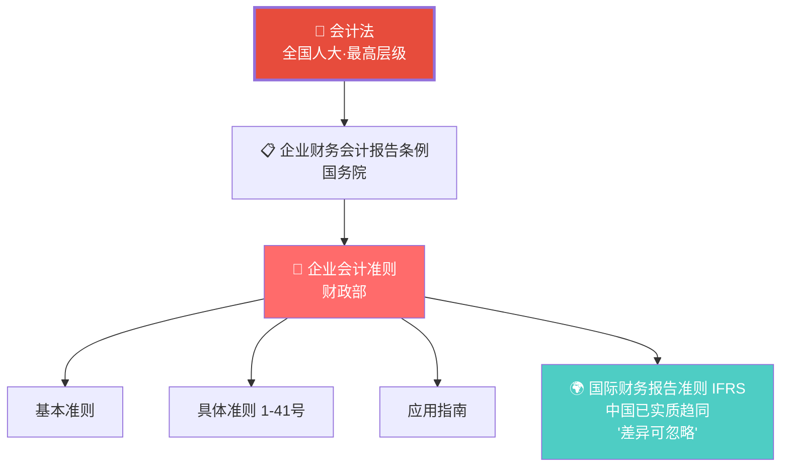
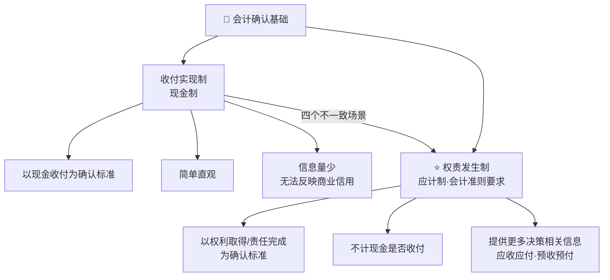
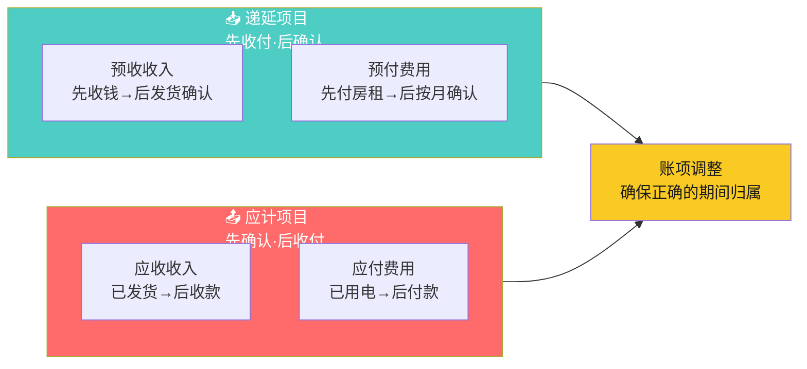
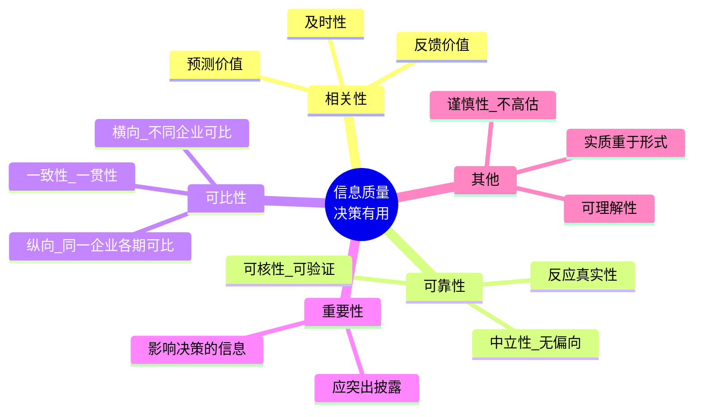
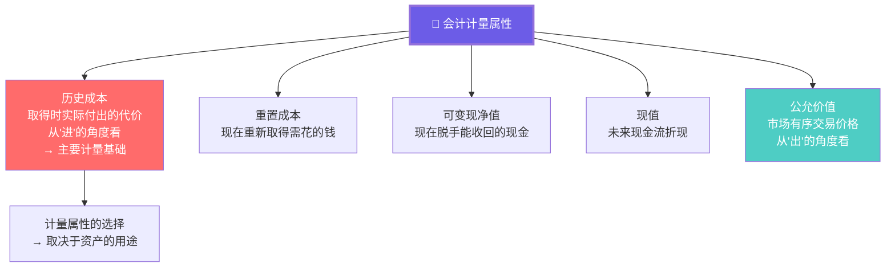

# C004 会计学基础第5课 · 记忆图

> 一张图记住权责发生制 + 信息质量要求 + 中国会计准则体系的完整知识框架

---

## 一、中国会计规范体系

---

## 二、权责发生制 vs 收付实现制

---

## 三、权责发生制四大场景

---

## 四、会计信息质量要求

---

## 五、计量属性全景

---

## ⚡ 速查卡片

| 概念 | 一句话 | 易错提醒 |
|------|--------|----------|
| 权责发生制 | 按权利/责任确认，不看现金 | 确认时间 ≠ 收付时间 |
| 收付实现制 | 按现金收付确认 | 只此一种企业没其他资产 |
| 递延项目 | 先收付，后确认 | 预收·预付 |
| 应计项目 | 先确认，后收付 | 应收·应付 |
| 历史成本 | 付出的代价（进） | 主要计量基础 |
| 公允价值 | 市场标准价（出） | 个别资产使用 |
| 相关性 | 能帮助决策 | ≠ 可靠性（有时矛盾） |

> 🎓 **老师金句记忆**：
> - "权责发生制是财务会计的基础"
> - "权责发生制不看钱收到没收到，看权利是否取得/责任是否完成"
> - "如果100%收付实现制，企业除了现金没有其他资产"
> - "历史成本 = 付出的代价，公允价值 = 市场标准价格"
> - "决策有用 = 相关性 + 可靠性"
