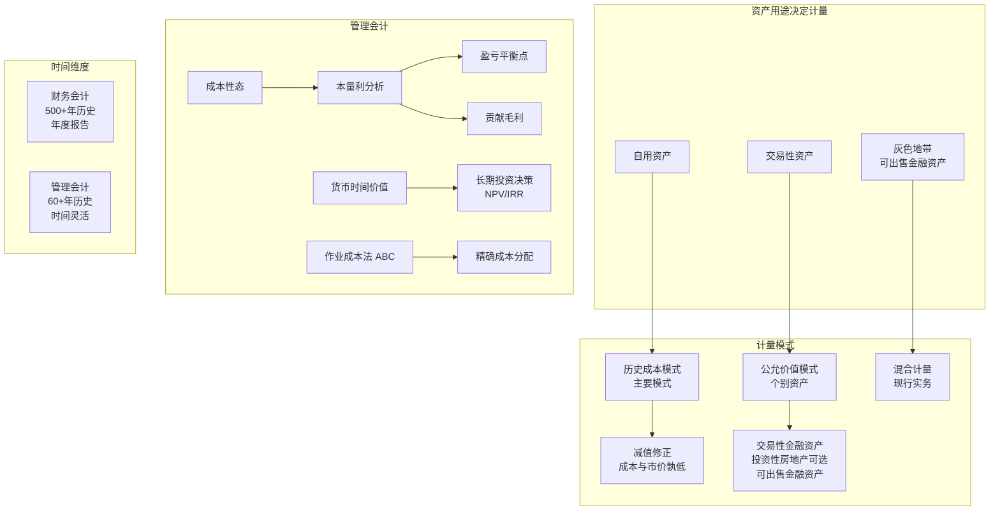

# C004 第 6 课：计量模式、资产计价与管理会计概述

## 一句话总结

会计计量主要采用历史成本模式（个别资产用公允价值），计量属性的选择取决于资产用途（自用→历史成本，交易→公允价值）；管理会计则是为企业内部预测决策服务的独立分支，核心概念包括成本性态、本量利分析、货币时间价值等。

## 课程大纲

**第一章：历史成本与公允价值计量**
- 历史成本计量模式：从取得资产付出代价的角度，从"进"看；是主要计量模式
- 公允价值计量模式：从市场标准价格的角度，从"出"看；仅用于交易性金融资产等个别资产
- 国际会计准则理事会主席的解释：历史成本与现值（公允价值）并不冲突，取决于资产用途
  - 自用资产（如厂房设备）→ 历史成本更合适
  - 交易性资产（如股票）→ 公允价值更合适
  - 对市场因素高度敏感的 → 考虑现值
- 现行实务：混合计量方法，不是统一方法

**第二章：资产的修正——减值**
- 历史成本的修正："成本与市价孰低"
- 可高不低：低于历史成本时按低值计（减值损失），高时不调增
- 这是谨慎性原则的体现

**第三章：投资性房地产的特殊处理**
- 自用房地产 → 固定资产（建筑）/ 无形资产（土地），历史成本模式
- 出租（投资性房地产）→ 可选历史成本或公允价值模式
- 但多数企业仍选历史成本（因公允价值难获取）

**第四章：可供出售金融资产**
- 介于"交易性"（随时卖）和"持有至到期"（长期持有）之间的灰色地带
- 资产用公允价值计量，但公允价值变动不计入利润（计入其他综合收益）
- "同一资产，两个计量角度"——典型混合处理

**第五章：管理会计概述**
- 管理会计历史短（仅 60 多年），不成体系，与财务管理等有交叉
- 核心概念与方法：
  - **成本性态**：成本与业务量的关系 → 固定成本 + 变动成本
  - **本量利分析**：盈亏平衡点（保本点）、贡献毛利（边际贡献）
  - **货币时间价值**：长期投资决策中计算现值、净现值
  - **作业成本法（ABC）**：按作业消耗资源来分配费用，比传统方法更精细
  - **全面预算**：战略→长期计划→预算（可执行），弹性预算用到成本性态
  - **责任会计**：分权管理，按责任中心考核
- 管理会计 vs 财务会计：按产品/部门/服务 vs 按企业整体；时间灵活 vs 以年为单位

## 核心概念

| 概念 | 定义 / 说明 |
|------|------------|
| **历史成本计量模式** | 资产从头到尾按历史成本（取得时的实际代价）计量，发生减值时修正 |
| **公允价值计量模式** | 资产从头到尾按公允价值（市场标准价格）计量，变动计入当期损益 |
| **混合计量方法** | 现行实务：不同资产用不同计量属性，不统一 |
| **资产减值** | 历史成本模式下的修正——当可收回金额低于账面值时调减，遵循"成本与市价孰低" |
| **谨慎性原则** | 只记减值不记增值——只调低不调高（保证信息不虚增） |
| **投资性房地产** | 为赚取租金或资本增值持有的房地产，可选用历史成本或公允价值模式 |
| **可供出售金融资产** | 介于交易性和持有至到期之间的金融资产；资产用公允价值计量但变动不计利润 |
| **成本性态** | 成本与业务量（产量/销量）之间的关系；分固定成本和变动成本 |
| **固定成本** | 在一定业务量范围内不随产量变化的成本（如厂房折旧、管理人员工资） |
| **变动成本** | 随业务量成正比例变化的成本（如直接材料） |
| **贡献毛利（边际贡献）** | 销售收入 - 变动成本；衡量某产品/部门对企业利润的贡献 |
| **盈亏平衡点（保本点）** | 总收入 = 总成本时的业务量；是固定成本存在的结果 |
| **作业成本法 (ABC)** | 将费用按作业（运输、加工、检验等）消耗资源情况分配到产品，比简单分摊更精确 |
| **货币时间价值** | 今天的钱比明天的钱值钱；长期投资决策必须折现为现值 |
| **全面预算** | 将战略目标分解为可执行的货币化计划 |
| **责任会计** | 按责任中心（成本中心、利润中心等）分权、考核业绩 |

## 老师重点强调

1. 🔴 **历史成本 = 付出的代价**（从"进"看），**公允价值 = 市场标准价**（从"出"看），角度根本不同
2. 🔴 **资产自用选历史成本，用于交易选公允价值**：取决于资产在企业的用途
3. 🔴 **减值只调低不调高**（谨慎性原则）：高于历史成本不调整，低于时才记减值
4. 🔴 **管理会计只有 60 多年历史**（1950 年代才正式命名），财务（会计）已有 500 多年
5. 🔴 **固定成本是企业盈亏平衡点存在的根本原因**：如果没有固定成本，每单位都赚钱就不存在"保本"概念
6. 🔴 **管理会计可以从产品/部门/服务角度分析**，而财务会计只能从企业整体看
7. 🔴 **成本性态只在短期、相关范围内有效**：把所有影响因素都剔除，只留下业务量
8. 🔴 **会计准则更侧重资产负债表**：选择计量方法时，如果对资产负债计量好但利潤不好，仍会优先选

## 关键例子

| 例子 | 对应概念 | 要点 |
|------|----------|------|
| **自用厂房 vs 出租写字楼** | 计量属性选择 | 自用=历史成本（固定+无形）；出租=投资性房地产（可选公允价值） |
| **三辆汽车（账面150万，公允价值160万）换房子** | 历史成本中的公允价值 | 房子的历史成本=汽车的现在公允价值160万（不是账面150万） |
| **可出售金融资产：股价涨了资产增但不计利润** | 混合计量 | 资产侧用公允价值，损益侧不计入利润 |
| **增加一个产品，只有变动成本增加** | 贡献毛利 | 决定是否接单：只要售价>变动成本就对利润有贡献 |
| **固定成本导致停工也有损失** | 盈亏平衡 | 不开工照样要付固定成本，所以必须做到一定量才不亏 |
| **作业成本法：运输费按重量分、电费按机时分** | ABC 法 | 比简单按工时分配更精确 |

## 易混/易错点

| 易混/易错点 | 正确理解 |
|------------|---------|
| **用了公允价值就是公允价值模式？** | ❌ 在历史成本模式中用公允价值（如换入资产定价）仍是历史成本模式 |
| **公允价值比历史成本更先进？** | 不一定，取决于资产用途——自用资产历史成本更合理 |
| **所有资产减值后都能恢复吗？** | 有些可转回，有些不可，看具体准则规定 |
| **管理会计 = 财务管理？** | ❌ 管理会计是提供内部管理决策信息的会计系统，财务管理是管理资金的学科，有重叠但不同 |
| **贡献毛利 = 利润？** | ❌ 贡献毛利=收入-变动成本，还要减去固定成本才是利润 |
| **成本性态长期有效吗？** | ❌ 只短期有效，长期所有成本都可变 |
| **投资性房地产必用公允价值？** | ❌ 可选历史成本；事实上多数企业选历史成本（公允价值难获取） |

## 知识图谱

