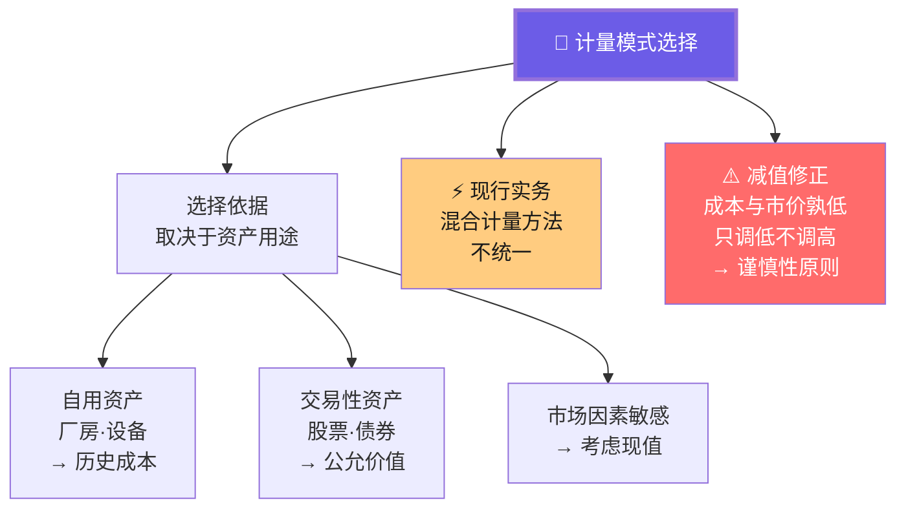
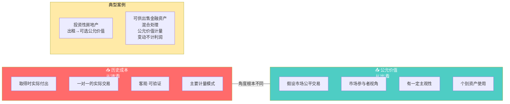
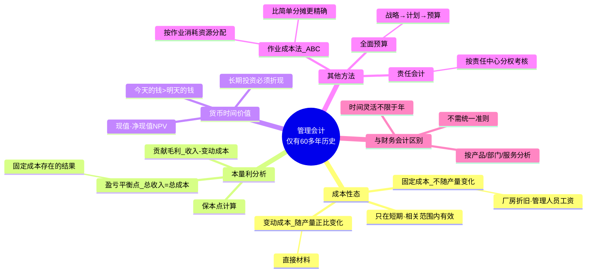
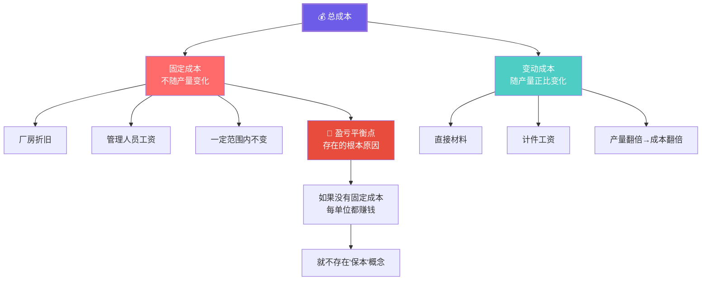
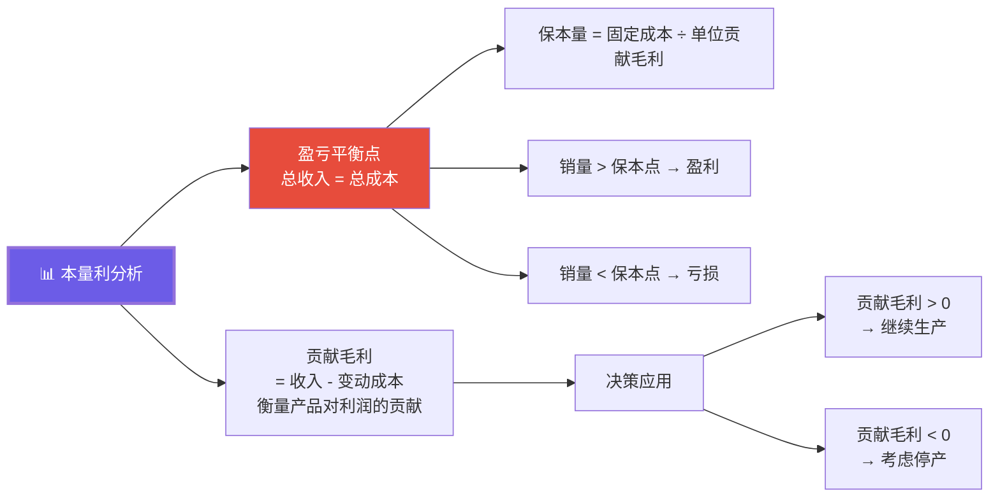
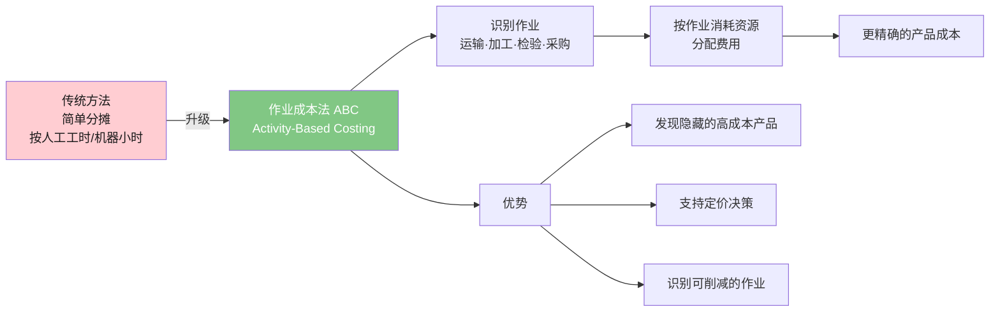

# C004 会计学基础第6课 · 记忆图

> 一张图记住混合计量模式 + 减值逻辑 + 管理会计核心方法（成本性态·本量利·时间价值）

---

## 一、计量模式全景

---

## 二、历史成本 vs 公允价值

---

## 三、管理会计全景

---

## 四、成本性态 · 核心二分法

---

## 五、本量利分析 · 盈亏平衡

---

## 六、作业成本法 ABC

---

## ⚡ 速查卡片

| 概念 | 一句话 | 关键点 |
|------|--------|--------|
| 历史成本 | 取得时付出的代价 | 主要计量模式 |
| 公允价值 | 市场标准价 | 仅交易性资产 |
| 减值 | 成本与市价孰低 | 只调低不调高 |
| 固定成本 | 不随产量变 | 盈亏平衡点存在的根源 |
| 变动成本 | 随产量正比变 | 直接材料·计件工资 |
| 贡献毛利 | 收入 - 变动成本 | 衡量产品利润贡献 |
| 盈亏平衡点 | 总收入 = 总成本 | 保本量 = 固定成本/单位贡献 |
| 货币时间价值 | 今天钱 > 明天钱 | 长期投资必须折现 |

> 🎓 **老师金句记忆**：
> - "资产自用选历史成本，用于交易选公允价值——取决于用途"
> - "减值只调低不调高——谨慎性原则"
> - "固定成本是盈亏平衡点存在的根本原因"
> - "管理会计只有60多年历史，财务（会计）已500多年"
> - "管理会计可以从产品/部门/服务角度分析，财务会计只能从整体看"
> - "会计准则更侧重资产负债表"
