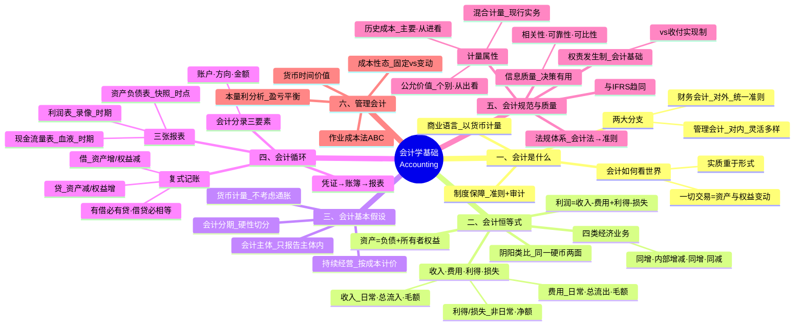

# 会计学基础知识汇总

> 基于 C004 会计学基础 6 课笔记整合而成，涵盖会计学的全部核心内容。

---

## 总览：会计学知识体系思维脑图



---

## 模块一：会计是什么——商业语言

### 1.1 会计的定义

> 会计是以货币为计量尺度、从价值角度综合反映企业经济活动的一种"商业语言"，普遍认为是**经济信息系统**。

### 1.2 会计信息的特征

| 特征 | 说明 |
|------|------|
| 综合性 | 以货币为尺度将不同资产综合为"多少元"，三四张报表浓缩企业信息 |
| 敏感性 | 会计信息直接涉及经济利益（税务基础、分红依据），对信息质量要求极高 |

### 1.3 财务会计 vs 管理会计

| 维度 | 财务会计 | 管理会计 |
|------|----------|----------|
| 服务对象 | 对外（投资者、债权人、政府） | 对内（管理者） |
| 准则要求 | 必须遵守统一准则 | 不需要统一准则 |
| 报表格式 | 统一格式、定期提供 | 灵活多样 |
| 时间特征 | 主要反映已发生的经济活动 | 面向未来预测决策 |
| 历史 | 500 多年 | 仅 60 多年 |

### 1.4 制度保障

```
会计法（全国人大）→ 企业财务会计报告条例（国务院）→ 会计准则（财政部，1-41号）
                                                              ↓
                                                     独立审计（注册会计师）
```

> 中国企业会计准则已与 IFRS（国际财务报告准则）实质趋同。

### 1.5 会计如何看世界

> **一切交易 = 资产与权益的变动**

| 三要素 | 说明 |
|--------|------|
| 主体 | 谁和谁交易 |
| 交易 | 做了什么 |
| 价值 | 金额多少 |

---

## 模块二：资产与权益

### 2.1 资产的定义与三维时间结构

| 时间维度 | 含义 |
|----------|------|
| 过去形成 | 交易已发生 |
| 现在拥有/控制 | 有经济利益+风险+支配权 |
| 未来经济利益 | 直接或间接导致现金流入 |

**确认条件**：① 未来经济利益很可能流入 ② 成本或价值能可靠计量

### 2.2 "控制"的深层含义——实质重于形式

> **实质重于形式**：当经济实质与法律形式脱节时，以经济实质为准。

**典型案例——融资租赁**：租期覆盖资产大部分寿命、租金接近买价 → 租赁物确认为自有资产。

### 2.3 权益的分类

| 类型 | 特征 | 例子 |
|------|------|------|
| 负债（债权人权益） | 过去交易形成·现时义务·有偿还义务 | 借款·应付账款·欠税 |
| 所有者权益（剩余权益） | 资产减负债的剩余·持续经营下无偿还义务 | 投入资本·留存利润 |

> **权益按性质分，不按身份分**：同一人既可以是所有者也可以是债权人。

---

## 模块三：会计恒等式——阴阳之道

### 3.1 会计第一恒等式

> **资产 = 负债 + 所有者权益**（永远相等，不可能不等）

如同《红楼梦》史湘云解释阴阳：资产与权益是同一件事的两面——**企业拥有什么（资产）= 谁提供了这些资源（权益）**。

### 3.2 四类经济业务

| 类型 | 变化 | 等号平衡？ | 例子 |
|------|------|-----------|------|
| ① 资产与权益同增 | 资产↑ 权益↑ | ✅ | 投入现金开商店 |
| ② 资产内部一增一减 | 资产 A↑ B↓ | ✅ | 现金买货架 |
| ③ 资产与负债同增 | 资产↑ 负债↑ | ✅ | 赊购商品 |
| ④ 资产与权益同减 | 资产↓ 权益↓ | ✅ | 归还贷款 |

### 3.3 收入、费用、利得与损失

| 要素 | 来源 | 列示方式 | 例子 |
|------|------|----------|------|
| 收入 Revenue | 日常活动 | 总流入（毛额） | 卖商品收入 |
| 费用 Expense | 日常活动 | 总流出（毛额） | 商品成本·工资 |
| 利得 Gain | 非日常活动 | 净额 | 卖房子赚 20 万 |
| 损失 Loss | 非日常活动 | 净额 | 自然灾害损失 |

> **利润 = 收入 − 费用 + 利得 − 损失**

### 3.4 会计利润 ≠ 应纳税所得额

会计亏损也可能要交税，会计盈利也可能不交税——两者计算规则不同。

---

## 模块四：会计四大基本假设

| 假设 | 含义 | 实际影响 |
|------|------|----------|
| ① 会计主体 | 只报告主体范围内的事 | 个人钱投入前不管 |
| ② 持续经营 | 假定企业持续经营 | 资产按成本计价（整匹布≠碎布片） |
| ③ 会计分期 | 硬性切分为年/季/月 | 导致折旧·摊销·预提 |
| ④ 货币计量 | 以名义货币计量 | 不考虑通胀（局限） |

---

## 模块五：会计循环——凭证到报表

### 5.1 整体流程

```
原始凭证 → 记账凭证（会计分录）→ 分类账 → 试算平衡 → 调整 → 财务报表
```

> 数据环环相扣——每一步都可向前追溯。

### 5.2 复式记账——借贷记账法

**铁律**：**有借必有贷，借贷必相等。**

| 方向 | 资产 | 权益 |
|------|------|------|
| 借 Debit | 增加 ↑ | 减少 ↓ |
| 贷 Credit | 减少 ↓ | 增加 ↑ |

> "借贷"已无原始字面意义，纯粹是记账符号。由日本人从 Debit/Credit 翻成汉字。

### 5.3 会计分录三要素

1. **账户**——涉及哪些科目？
2. **方向**——借还是贷？
3. **金额**——多少？

- 简单分录：一借一贷
- 复合分录：一借多贷 / 一贷多借
- ⚠️ 多借多贷尽量避免

### 5.4 三张主要报表

| 报表 | 反映 | 时间特征 | 类比 | 关键公式 |
|------|------|----------|------|----------|
| 资产负债表 | 财务状况 | 时点（快照） | 照片 | 资产 = 负债 + 所有者权益 |
| 利润表 | 经营成果 | 时期（录像） | 视频 | 收入 - 费用 = 利润 |
| 现金流量表 | 现金流动 | 时期（血液） | 血液 | 经营+投资+筹资 |

### 5.5 制造业成本结转链

```
原材料 → 生产成本（料+工+费）→ 库存商品 → 主营业务成本
```

---

## 模块六：会计规范与信息质量

### 6.1 权责发生制（应计制）⭐

> **以权利取得与责任完成为确认标准，不以现金收付为准。**

| 制度 | 确认标准 | 信息量 |
|------|----------|--------|
| 收付实现制（现金制） | 现金实际收付 | 少 |
| 权责发生制（应计制） | 权利取得/责任完成 | 多（含应收应付等商业信用信息） |

**四大不一致场景**：

| 类型 | 特征 | 例子 |
|------|------|------|
| 预收收入 | 先收钱·后确认 | 预收房租 |
| 预付费用 | 先付钱·后确认 | 预付次年保险费 |
| 应收收入 | 先确认·后收钱 | 赊销商品 |
| 应付费用 | 先确认·后付钱 | 已用电未付款 |

### 6.2 会计信息质量要求

**核心目标：决策有用性**

| 质量要求 | 含义 |
|----------|------|
| 相关性 | 预测价值 + 反馈价值 + 及时性 |
| 可靠性 | 反应真实 + 可验证 + 中立 |
| 可比性 | 横向（不同企业）+ 纵向（同一企业各期） |
| 重要性 | 对决策影响大→突出披露 |
| 谨慎性 | 不高估资产/收入，不低估负债/费用 |
| 实质重于形式 | 经济实质优先于法律形式 |

### 6.3 计量属性

| 属性 | 角度 | 适用 |
|------|------|------|
| 历史成本 ⭐ | 取得时实际付出的代价（从"进"看） | 主要计量基础 |
| 重置成本 | 现在重新取得需花的钱 | 资产评估 |
| 可变现净值 | 现在脱手能收回的现金 | 存货跌价 |
| 现值 | 未来现金流折现 | 长期资产 |
| 公允价值 | 市场有序交易价格（从"出"看） | 交易性金融资产 |

**选择依据**：取决于资产的用途。
- 自用（厂房设备）→ 历史成本
- 交易（股票）→ 公允价值

> 现行实务采用**混合计量方法**，不统一。

### 6.4 减值——历史成本的修正

- 原则：**成本与市价孰低**
- 只调低不调高（谨慎性原则）
- 当可收回金额低于账面值时，计提减值损失

---

## 模块七：管理会计概述

### 7.1 成本性态

| 类型 | 特征 | 例子 |
|------|------|------|
| 固定成本 | 不随产量变化（一定范围内） | 厂房折旧、管理人员工资 |
| 变动成本 | 随产量正比例变化 | 直接材料、计件工资 |

> **成本性态只在短期、相关范围内有效**。

### 7.2 本量利分析

| 概念 | 公式 | 含义 |
|------|------|------|
| 贡献毛利 | 收入 − 变动成本 | 衡量产品对利润的贡献 |
| 盈亏平衡点 | 总收入 = 总成本 | 保本量 = 固定成本 / 单位贡献毛利 |

> **固定成本是盈亏平衡点存在的根本原因**——如果没有固定成本，每单位都赚钱就不存在"保本"。

### 7.3 货币时间价值

> 今天的钱比明天的钱值钱。长期投资决策必须折现为现值（NPV）。

### 7.4 作业成本法（ABC）

| 传统方法 | ABC 方法 |
|----------|----------|
| 简单分摊（按工时/机时） | 按作业消耗资源精细分配 |
| 可能隐藏高成本产品 | 更精确的产品成本 |

### 7.5 管理会计 vs 财务会计（核心差异）

| 维度 | 管理会计 | 财务会计 |
|------|----------|----------|
| 分析视角 | 按产品/部门/服务 | 按企业整体 |
| 时间 | 灵活 | 以年/季/月为单位 |
| 准则 | 不需要 | 必须 |
| 历史 | 60多年 | 500多年 |

---

## 附录

### 附录A：核心概念词汇表

| 概念 | 定义 |
|------|------|
| 会计 | 以货币表现传递财务信息的经济信息系统 |
| 资产 | 过去形成、现在拥有/控制、预期带来经济利益的资源 |
| 负债 | 过去交易形成的现时义务，预期导致经济利益流出 |
| 所有者权益 | 资产减去负债后的剩余权益 |
| 收入 | 日常活动中形成的、导致所有者权益增加的总流入 |
| 费用 | 日常活动中发生的、导致所有者权益减少的总流出 |
| 利得/损失 | 非日常活动形成的净收益或净损失 |
| 复式记账 | 每笔业务以相等金额在两个或以上账户中记录 |
| 借贷记账法 | 以"借""贷"为符号的复式记账法 |
| 会计分录 | 指明账户、借贷方向和金额的记录 |
| 权责发生制 | 以权利取得/责任完成为确认标准 |
| 收付实现制 | 以现金实际收付为确认标准 |
| 实质重于形式 | 经济实质优先于法律形式 |
| 历史成本 | 取得资产实际付出的代价 |
| 公允价值 | 市场参与者在有序交易中的价格 |
| 减值 | 资产可收回金额低于账面值时调减 |
| 固定成本 | 不随业务量变化的成本 |
| 变动成本 | 随业务量正比例变化的成本 |
| 盈亏平衡点 | 总收入 = 总成本时的业务量 |

### 附录B：易混概念辨析

| 易混点 | 正确认识 |
|---|---|
| "会计是商业语言"是正式定义 | 只是形象比喻，正式定义倾向"经济信息系统" |
| 财务会计 = 全部会计 | 还有管理会计（对内） |
| "控制" = 法律所有权 | "控制"是实质上有所有权（利益+风险+支配权） |
| 所有者 = 只能有一种身份 | 同一人可以是所有者+债权人，权益按性质分 |
| 收入 = 所有者投入 | 收入必须与所有者投入资本无关！ |
| 收入 = 毛收入 | 收入本身就是毛的，没有"毛收入"概念 |
| 利润 = 应纳税所得额 | 会计利润 ≠ 应纳税所得额 |
| 借 = 借入、贷 = 贷出 | 已无原始字面意义，纯粹是记账符号 |
| 资产方余额在贷方 | 资产不应有贷方余额（不能有"负商品"） |
| 绩效评估 = 绩效管理 | 评估是手段，改进才是目的 |
| 记账凭证必有原始凭证 | 纯计算结转就没有原始凭证 |

### 附录C：核心公式与恒等式

| 公式 | 名称 |
|------|------|
| 资产 = 负债 + 所有者权益 | 会计第一恒等式 |
| 资产 = 权益 | 简化恒等式 |
| 利润 = 收入 − 费用 + 利得 − 损失 | 利润构成 |
| 有借必有贷，借贷必相等 | 记账铁律 |
| 贡献毛利 = 收入 − 变动成本 | 本量利分析 |
| 保本量 = 固定成本 / 单位贡献毛利 | 盈亏平衡点 |
| 实际 GDP = 名义 GDP / GDP 平减指数 | 去通胀 |

### 附录D：应用检查清单

分析企业财务状况时：

1. 资产负债表：资产结构合理吗？负债率高吗？
2. 利润表：毛利率多少？营业利润率多少？趋势如何？
3. 现金流量表：经营现金流为正吗？利润和现金流匹配吗？
4. 收入确认：按权责发生制吗？是否有虚增？
5. 费用确认：费用是否在正确的期间？
6. 资产计价：按历史成本还是公允价值？有减值迹象吗？
7. 关联方交易：是否有未披露的关联交易？

---

> **文档说明**：本文档整合了 C004 会计学基础 6 课的笔记内容，按学科知识体系重新组织，便于系统复习和快速查阅。每课详细内容请参见对应的单课笔记文件。
